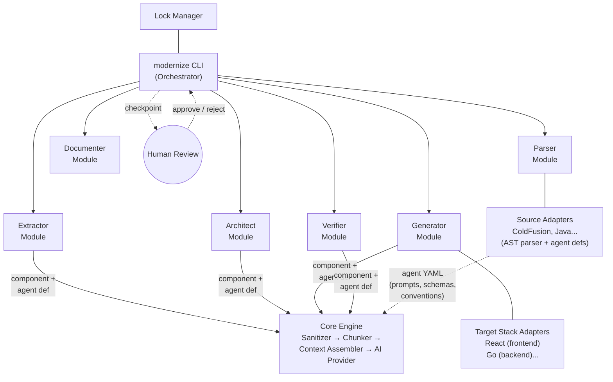
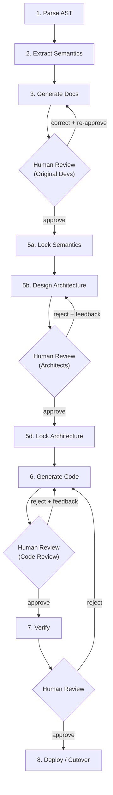

# Modernize — AI-Powered Legacy App Modernization Framework (v2)

## AST-First Deterministic Pipeline

### Problem with v1 Pipeline

The v1 pipeline (Ingest → Comprehend → Architect → Extract/Translate → Verify → Deploy) has a determinism problem: AI re-reads and re-interprets source code at multiple stages. The Translator re-interprets what the Comprehender already understood. Run the pipeline twice, get different results — not because the code changed, but because the AI interpreted it differently.

### Solution: Separate Understanding from Generation

The v2 pipeline creates a hard separation between **understanding** and **generation**, with an explicit lock step that makes the approved understanding immutable input to code generation.

```
v1:  Ingest → Comprehend → Architect → Extract/Translate → Verify → Deploy
               (AI)         (AI)         (AI)

v2:  Parse AST → Extract Semantics → Generate Docs → Review → Lock → Generate Code → Verify
     (local)     (local + min AI)     (template)     (human)  (freeze)  (AI)          (local + AI)
```

**Non-negotiables:**
- Human review gates between every stage
- Minimize AI usage — deterministic where possible
- Local-first data security model (sanitizer, audit, trust levels)
- All existing infrastructure (adapters, agents, core engine) is preserved

**First target:** ColdFusion → React (frontend) + Go (backend API)

---

## Data Security & Processing Model

*(Unchanged from v1 — sanitizer, trust levels, audit logging all preserved. See DESIGN.md for full details.)*

The key change: the sanitizer now works on **AST node values** and **semantic model fields** rather than raw source text. This makes redaction more precise — you're redacting structured data, not scanning free text.

---

## Context Management & AI-Agnostic Design

*(Unchanged from v1 — task decomposition, context budgets, AI provider interface all preserved. See DESIGN.md for full details.)*

The key change: the chunker now splits **AST nodes**, not raw code. This gives cleaner chunk boundaries — a function is one chunk, a query is one chunk, rather than splitting mid-line.

---

## High-Level Architecture



**Six layers:**

| Layer | Role | AI-Powered? |
|-------|------|-------------|
| **CLI Orchestrator** | Pipeline flow, state tracking, human checkpoints | No — deterministic |
| **Pipeline Modules** | Parser, Extractor, Documenter, Architect, Generator, Verifier — each runs a fixed pipeline of local steps, calling AI only when reasoning is needed | Partially — most steps local |
| **Lock Manager** | Lock/unlock/verify integrity of approved mappings | No — deterministic |
| **Agent Definitions** | Language-specific prompt templates + output schemas + conventions, declared by source adapters (YAML files) | No — configuration only |
| **Core Engine** | Sanitizer, chunker, context assembler (merges agent def + task + semantic data), result aggregator | No — deterministic |
| **AI Provider** | Abstract interface to any cloud LLM | Pluggable — Claude, GPT, Gemini |

---

## Pipeline Stages & Checkpoints



| Stage | What Happens | AI Usage | Output Artifact |
|-------|-------------|----------|-----------------|
| **Parse AST** | Deterministic parsing of legacy source into structured AST | **None** | `.modernize/ast/*.ast.json` |
| **Extract Semantics** | Walk AST, extract structured facts. AI only for business rule naming + implicit rules | **Minimal** | `.modernize/semantics/*.semantic.json` |
| **Generate Docs** | Template-driven docs from semantic model. AI only for prose summaries | **Minimal** | `.modernize/docs/*.md` |
| **Review** | Original developers validate extracted semantics, correct errors | **None** | `.modernize/corrections/*.json` |
| **Lock Semantics** | Freeze approved semantic model with checksums | **None** | `.modernize/locked/semantic-lock.json` |
| **Design Architecture** | Group services, define API contracts, route components (from locked semantics) | **Moderate** | Architecture blueprint + architecture decisions |
| **Lock Architecture** | Freeze architecture decisions alongside semantic lock | **None** | `.modernize/locked/architecture-lock.json` |
| **Generate Code** | AI generates target code from locked mappings + target conventions | **Heavy** | New service code per stack layer |
| **Verify** | Behavioral equivalence testing + locked mapping conformance | **Light** | Verification report + test suite |
| **Deploy** | Incremental cutover behind proxy | **None** | Routing config |

Each review checkpoint produces **templated, diagram-heavy artifacts** — not AI prose walls. A human should be able to review a module in 30 minutes.

### Execution Modes

*(Unchanged from v1 — guided/supervised/auto modes preserved. See DESIGN.md for full details.)*

In **auto mode**, the lock step still happens — but the system auto-approves based on confidence thresholds. Low-confidence semantic extractions are flagged in the summary for post-run review.

---

## Step 1 — Parse Code to AST (Fully Deterministic)

Deterministic parsing of legacy source into a structured Abstract Syntax Tree. No AI involved.

### What the AST Captures

This is richer than a typical compiler AST. It's a **semantic AST** that preserves domain-relevant structure: query names, scope writes, datasource references, table names, function call targets. The source adapter knows what's important for migration.

**ColdFusion example:**

```
File: UserService.cfc
├── Component (name: UserService, extends: BaseService)
│   ├── Property (name: dsn, type: string, scope: variables)
│   ├── Function (name: authenticate, access: public, returnType: struct)
│   │   ├── Argument (name: email, type: string, required: true)
│   │   ├── Argument (name: password, type: string, required: true)
│   │   ├── Query (name: qUser, datasource: variables.dsn)
│   │   │   ├── SQL: "SELECT id, email, password_hash, role FROM users WHERE email = ?"
│   │   │   ├── Params: [{value: arguments.email, type: cf_sql_varchar}]
│   │   │   └── Tables: [users]
│   │   ├── Conditional (if qUser.recordCount EQ 0 → throw "Invalid credentials")
│   │   ├── FunctionCall (target: hashVerify, args: [arguments.password, qUser.password_hash])
│   │   ├── ScopeWrite (scope: session, key: userId, value: qUser.id)
│   │   ├── ScopeWrite (scope: session, key: userRole, value: qUser.role)
│   │   └── Return (type: struct, keys: [id, email, role])
│   ├── Function (name: getUserById, ...)
│   │   └── ...
│   └── Function (name: updateProfile, ...)
│       └── ...
```

### AST as Single Source of Truth

The AST is persisted to `.modernize/ast/` as structured JSON. **No subsequent step re-reads raw source code.** Everything downstream works from the AST or from artifacts derived from it.

### Source Adapter Enhancement

The source adapter gains a `parseToAST(file) → AST` method. Component boundaries (previously extracted by `parseComponents()`) are now AST nodes.

**Module:** Enhanced **Parser Module** (replaces the Ingest portion of v1 Analyzer)

---

## Step 2 — Extract Semantics (Mostly Deterministic + Targeted AI)

Walk the AST and extract structured semantic facts — what the code *does*, as structured data, not prose.

### Deterministic Extraction (No AI)

| Extraction | How | Example |
|-----------|-----|---------|
| Function signatures | AST traversal | `authenticate(email: string, password: string) → struct` |
| Data access patterns | AST query nodes | `SELECT from users WHERE email = ?` (parameterized) |
| Dependencies | AST include/invoke nodes | `UserService → DatabaseService, EmailService` |
| Scope/state usage | AST scope-write nodes | `writes session.userId, session.userRole` |
| Control flow | AST conditional/loop nodes | `if recordCount == 0 → throw` |
| Call graph | AST function-call nodes | `authenticate() calls hashVerify()` |
| Table relationships | Cross-reference query nodes | `users table accessed by: authenticate, getUserById, updateProfile` |

### AI-Assisted Extraction (Targeted, Minimal)

| Extraction | Why AI is needed | Constraint |
|-----------|-----------------|-----------|
| Business rule naming | "What does this function accomplish in business terms?" | AI sees AST nodes, not raw code. Structured input → structured output. |
| Implicit rules | Business logic hidden in conditionals/calculations that static analysis can't label | AI gets the control flow graph from the AST, explains the rule |
| Data validation rules | Complex validation chains that need semantic understanding | AI gets the validation AST nodes, produces structured rule descriptions |

**Critical design decision:** AI in Step 2 receives **AST nodes**, not raw source code. This means:
- The AI's input is structured and deterministic (same AST → same input to AI)
- The sanitizer works on AST node values, not raw text (more precise redaction)
- If the AI's interpretation is wrong, you fix the semantic extraction, not re-run parsing

### Semantic Model Output

```json
{
  "module": "UserService",
  "source": "UserService.cfc",
  "functions": [
    {
      "name": "authenticate",
      "signature": {
        "inputs": [
          {"name": "email", "type": "string", "required": true},
          {"name": "password", "type": "string", "required": true}
        ],
        "outputs": {"type": "struct", "keys": ["id", "email", "role"]}
      },
      "businessRule": {
        "name": "User Authentication",
        "description": "Validates user credentials against stored hash and establishes session",
        "source": "ai",
        "confidence": 92
      },
      "dataAccess": [
        {
          "table": "users",
          "operation": "SELECT",
          "columns": ["id", "email", "password_hash", "role"],
          "filter": "email = ?",
          "parameterized": true
        }
      ],
      "stateWrites": [
        {"scope": "session", "key": "userId"},
        {"scope": "session", "key": "userRole"}
      ],
      "controlFlow": [
        {"condition": "no user found", "action": "throw InvalidCredentials"},
        {"condition": "password mismatch", "action": "throw InvalidCredentials"}
      ],
      "calls": ["hashVerify"],
      "calledBy": ["login.cfm"]
    }
  ],
  "dependencies": ["DatabaseService", "EmailService"],
  "tables": ["users", "sessions"],
  "complexity": "low"
}
```

AI-generated fields are tagged with `"source": "ai"` so reviewers know exactly what to scrutinize vs what was deterministically extracted.

**Module:** **Extractor Module** (replaces the Comprehend portion of v1 Analyzer)

---

## Step 3 — Generate Documentation (Template-Driven)

Transform the structured semantic model into human-readable documentation for review.

> **TODO**: Static reports may be hard for developers to review — they have to mentally map extracted semantics back to code they wrote years ago. Explore better review collection methods: annotated source code views, interactive browser-based review forms, question-based review flows, or structured feedback collection from multiple reviewers with conflict detection.

### Why This Differs from v1 Comprehend

- v1 Comprehend: AI reads code and produces a report — AI generates both the understanding AND the prose
- v2 Step 3: understanding is already extracted (Step 2). Docs are generated from structured data. AI is only used for rendering natural language summaries from structured facts — a much simpler, more constrained task.

### Document Template

```
┌─────────────────────────────────────────────────┐
│ Module: UserService                             │
│ Source: UserService.cfc                         │
├─────────────────────────────────────────────────┤
│ Functions (table — from semantic model)          │
│ Name          | Business Rule        | Conf.    │
│ authenticate  | User Authentication  | 92% [AI] │
│ getUserById   | User Lookup          | 98%      │
│ updateProfile | Profile Update       | 88% [AI] │
├─────────────────────────────────────────────────┤
│ Data Access (table — from semantic model)       │
│ Table  | Operations      | Parameterized?       │
│ users  | SELECT, UPDATE  | Yes                  │
├─────────────────────────────────────────────────┤
│ State Usage (from semantic model)               │
│ session.userId, session.userRole                │
├─────────────────────────────────────────────────┤
│ Dependencies (from semantic model)              │
│ → DatabaseService, EmailService                 │
│ ← login.cfm, register.cfm                      │
├─────────────────────────────────────────────────┤
│ Call Graph (mermaid — generated from AST)        │
│ [diagram]                                       │
├─────────────────────────────────────────────────┤
│ Data Flow (mermaid — generated from AST)        │
│ [diagram]                                       │
├─────────────────────────────────────────────────┤
│ Items Needing Review:                           │
│ ⚠ "User Authentication" — AI-generated,        │
│   verify this matches actual business intent    │
│ ⚠ hashVerify() — external call, verify behavior│
└─────────────────────────────────────────────────┘
```

The docs explicitly flag AI-generated interpretations vs deterministically-extracted facts. Reviewers know exactly what to scrutinize.

**Module:** **Documenter Module** (replaces v1's `generate_comprehend_report` step)

---

## Step 4 — Review with Original Developers (Human Gate)

The generated documentation goes to people who wrote or maintain the legacy code. They validate that the extracted semantics are correct.

### What Changes from v1 Review

- v1: a consultant or architect reviews AI-generated reports
- v2: **original developers** who know the code review structured extractions
- The review is more targeted — they're confirming/correcting specific semantic facts, not reading AI prose

### Review Workflow

```bash
# See what needs review
modernize review semantics

# Review a specific module
modernize review semantics UserService

# Correct an AI-generated business rule
modernize correct UserService.authenticate \
  --field businessRule.description \
  --value "Authenticates user and also logs failed attempts to audit table"

# Flag a missing rule the extraction missed
modernize add-rule UserService.authenticate \
  --name "Failed Login Auditing" \
  --description "After 3 failed attempts, locks account for 30 minutes" \
  --note "This is in a try/catch block the parser might have missed"

# Approve a module's semantics
modernize approve semantics UserService
```

### Correction Tracking

Every correction is recorded:

```json
{
  "module": "UserService",
  "corrections": [
    {
      "field": "authenticate.businessRule.description",
      "original": "Validates user credentials against stored hash and establishes session",
      "corrected": "Validates credentials + logs failed attempts. After 3 failures, locks account for 30 min.",
      "by": "john@legacy-team.com",
      "at": "2026-03-31T13:30:00Z",
      "reason": "Parser missed try/catch block with audit logging"
    }
  ],
  "addedRules": [
    {
      "function": "authenticate",
      "rule": {
        "name": "Failed Login Auditing",
        "description": "After 3 failed attempts, locks account for 30 minutes",
        "source": "human"
      },
      "by": "john@legacy-team.com",
      "at": "2026-03-31T13:35:00Z"
    }
  ]
}
```

Corrections modify the semantic model directly. Each correction is tracked for audit purposes.

---

## Step 5 — Lock Approved Mappings (Deterministic Freeze)

Once all modules' semantics are approved, the semantic model is frozen. It becomes an immutable contract that Step 6 consumes.

### The Lock Concept

The lock creates a hard boundary:
- **Before the lock:** the understanding can change (re-extract, correct, re-approve)
- **After the lock:** the understanding is fixed. Code generation works from this fixed input.

### Step 5 Sub-phases

```
Step 5a: Lock semantic mappings (what the code does)
Step 5b: Design architecture (how to restructure it) — uses locked semantics as input
Step 5c: Review architecture with architects/leads
Step 5d: Lock architecture decisions (service groups, API contracts, component routing)
Step 5e: Final lock — both semantics + architecture frozen together
```

### Semantic Lock

```json
{
  "lockVersion": "1.0",
  "lockedAt": "2026-03-31T14:00:00Z",
  "lockedBy": "koustubh",
  "modules": {
    "UserService": {
      "status": "locked",
      "approvedBy": "john@legacy-team.com",
      "approvedAt": "2026-03-31T13:45:00Z",
      "semantics": { "...full semantic model..." : "..." },
      "corrections": ["...tracked corrections..."],
      "checksum": "sha256:abc123..."
    }
  },
  "crossModule": {
    "dependencyGraph": { "...": "..." },
    "tableOwnership": { "...which modules own which tables...": "..." },
    "sharedState": { "...session/application scope dependencies...": "..." }
  }
}
```

**The checksum matters.** If anyone tries to modify a locked mapping, the system detects it. To change a locked mapping, you must explicitly **unlock → correct → re-approve → re-lock**.

### Architecture Phase (Step 5b-5d)

Architecture decisions depend on having **correct** semantics. You can't group modules into services until you know what each module does and what data it touches. The locked semantic model gives the Architect deterministic input.

**Why architecture belongs here:**
- Same semantics → same architectural recommendations (deterministic input)
- Architecture is a design decision, not an understanding — different reviewers (architects vs original devs)
- The locked semantic model is the foundation both humans and AI work from

### Architecture Lock

```json
{
  "architecture": {
    "serviceGroups": [
      {
        "name": "users-service",
        "modules": ["UserService", "login", "register", "profile"],
        "reason": "Shared users/sessions tables, tight call coupling",
        "targetStack": {
          "frontend": {"adapter": "react", "components": ["LoginPage", "RegisterPage", "ProfilePage"]},
          "backend": {"adapter": "go", "components": ["UserHandler", "AuthMiddleware", "UserStore"]}
        }
      }
    ],
    "apiContracts": [
      {
        "service": "users-service",
        "endpoint": "POST /api/auth/login",
        "request": {"email": "string", "password": "string"},
        "response": {"token": "string", "user": "User"}
      }
    ],
    "componentRouting": [
      {"source": "UserService.authenticate", "target": "UserHandler.Login", "stackLayer": "backend", "agent": "logic"},
      {"source": "login.cfm", "target": "LoginPage.tsx", "stackLayer": "frontend", "agent": "ui"}
    ],
    "approvedBy": "koustubh",
    "locked": true
  }
}
```

This preserves the v1 Architect Module's dual output:
- **Architecture blueprint** (human deliverable) — generated from locked semantics + architecture decisions
- **Component routing** (machine input) — embedded in the locked mappings, consumed by Step 6

**Module:** New **Lock Manager** + existing **Architect Module** (restructured to work from locked semantics)

---

## Step 6 — Generate New Code (AI, from Locked Mappings)

Code generation consumes the locked mapping as its sole input. **The AI never re-reads legacy source code.** It transforms structured semantic facts + architecture decisions into target code.

### Current v1 vs New v2

**v1 Translator input:**
```
Agent receives: sanitized ColdFusion source code + conventions + prompt
Agent produces: Go/React code
Problem: AI re-interprets the source, may understand it differently than Comprehend did
```

**v2 Generator input:**
```
Agent receives: locked semantic mapping + target conventions + client components + prompt
Agent produces: Go/React code
Advantage: AI doesn't interpret — it transforms structured facts into code
```

### Example: What the Logic Agent Receives

```
You are generating a Go handler function.

LOCKED SEMANTIC MAPPING:
- Function: authenticate
- Business Rule: "Validates credentials + logs failed attempts. After 3 failures, locks account for 30 min."
- Inputs: email (string, required), password (string, required)
- Output: struct {id, email, role}
- Data Access: SELECT from users WHERE email = ? (parameterized)
- State Writes: session.userId, session.userRole → (mapped to: JWT claims)
- Control Flow: no user → error, password mismatch → error + increment failed count
- Calls: hashVerify (→ mapped to: bcrypt.CompareHashAndPassword)

TARGET CONVENTIONS (Go + Chi):
- Handler signature: func (h *UserHandler) Login(w http.ResponseWriter, r *http.Request)
- Use sqlc for queries
- Return JSON responses
- JWT for auth tokens

CLIENT COMPONENTS:
- Auth: use apple-auth-middleware (see docs)
- DB: use apple-db-client (see docs)

Generate the Go handler function.
```

### Why This Is More Deterministic

- Same locked mapping → same prompt to AI → much more consistent output
- If the output is wrong, you know the mapping was correct (it was approved), so the bug is in the generator
- You can re-run generation without risk of the AI "understanding" the legacy code differently
- Debugging is binary: was the mapping wrong (go back to Step 4) or was the generation wrong (fix Step 6)?

### What Stays from v1

- Specialized agent system (DB, UI, Logic, Auth, Form, Task, Email agents)
- Target adapters (React, Go) with scaffolding and conventions
- Client component registry
- Multi-target routing (frontend/backend/workers)
- Cross-layer wiring (API client generation)
- Strangler fig proxy generation

### What Changes

- Agents receive locked semantic mappings, not sanitized source code
- Agent prompts are restructured: "transform this mapping" not "translate this code"
- The sanitizer's role shifts — it still redacts sensitive values in the semantic model, but it's working on structured data not raw code

**Module:** Restructured **Generator Module** (replaces v1 Translator Module)

---

## Post-Generation: Verify

*(Largely unchanged from v1 — see DESIGN.md for Verifier Module details.)*

The locked mapping makes verification stronger:
- Verify old and new behave the same (behavioral equivalence)
- Verify new code implements what the locked mapping specified (mapping conformance)
- AI explains behavioral differences using locked mappings as reference: "the mapping says X, but the new code does Y"

---

## Migration Strategy: Strangler Fig

*(Unchanged from v1 — see DESIGN.md for full details.)*

The strangler fig approach is orthogonal to the pipeline restructuring. Service groups are still extracted incrementally and deployed behind a proxy. The only difference is that service group boundaries are now defined in the **architecture lock** (Step 5d) rather than derived during the Architect stage.

---

## Infrastructure Changes

### Source Adapters — Enhanced, Not Replaced

| v1 Method | v2 Method | Change |
|------|------|--------|
| `detect(files)` | `detect(files)` | Same |
| `parseStructure(path)` | `parseToAST(file) → AST` | Deeper parsing, richer output |
| `parseComponents(file)` | (folded into AST) | Component boundaries are AST nodes |
| `getAgentDefinitions()` | `getAgentDefinitions()` | Same, but agents now work on AST/semantic nodes |
| `classifyComponent(component)` | `classifyASTNode(node)` | Same logic, different input type |
| `getConventions()` | `getConventions()` | Same |

### Core Engine — Mostly Unchanged

- **Sanitizer:** Now works on AST node values and semantic model fields (more precise)
- **Chunker:** Now chunks AST nodes, not raw code (cleaner boundaries)
- **Context Assembler:** Assembles from semantic model + agent def + conventions (no raw code)
- **Providers:** Unchanged
- **Aggregator:** Unchanged

### Pipeline Modules — Restructured

| v1 Module | v2 Module | What Changed |
|------|------|------|
| Analyzer (Ingest + Comprehend) | **Parser** (Step 1) + **Extractor** (Step 2) + **Documenter** (Step 3) | Split into 3 distinct sub-stages with clear boundaries |
| Architect | **Architect** (Step 5b-5d) | Now works from locked semantics, not raw comprehension |
| Translator | **Generator** (Step 6) | Works from locked mappings, not source code |
| Verifier | **Verifier** (post-Step 6) | Enhanced with locked mapping verification |

### New Components

| Component | Purpose |
|------|------|
| **AST Schema** | Per-language AST node type definitions |
| **Semantic Model Schema** | Structured schema for extracted semantics |
| **Lock Manager** | Lock/unlock/verify integrity of approved mappings |
| **Correction Tracker** | Track human corrections to semantic model |

---

## Agent System

*(Agent system is preserved from v1 — YAML-based agent definitions, language-specific prompts, output schemas. See DESIGN.md for full details.)*

### Key Change: What Agents Receive

In v1, agents receive sanitized source code. In v2, agents receive different inputs depending on the stage:

| Stage | Agent Input | Purpose |
|-------|------------|---------|
| Step 2 (Extract Semantics) | AST nodes | "What business rule does this function implement?" |
| Step 5b (Architecture) | Locked semantic model | "How should these modules be grouped into services?" |
| Step 6 (Generate Code) | Locked semantic mapping + target conventions | "Generate this Go handler from this mapping" |
| Verify | Locked mapping + behavioral diff | "Explain why these outputs differ" |

The agent's `systemPrompt` and `conventions` stay the same. The **task instruction** and **input format** change per stage.

---

## State Directory Structure

```
.modernize/
├── migration.json              # Project config, target stack, service group statuses
├── config.json                 # Provider, trust level, model settings
├── sanitizer-rules.json        # Custom redaction rules (client-specific)
├── audit/                      # Log of every AI API call
├── components/                 # Client component registry (optional)
│
├── ast/                        # Step 1 output — deterministic parse
│   ├── UserService.cfc.ast.json
│   ├── login.cfm.ast.json
│   └── ...
│
├── semantics/                  # Step 2 output — extracted semantic facts
│   ├── UserService.semantic.json
│   ├── login.semantic.json
│   └── cross-module.json       # dependency graph, table ownership
│
├── docs/                       # Step 3 output — human-readable review docs
│   ├── UserService.md
│   ├── login.md
│   └── overview.md
│
├── corrections/                # Step 4 tracking — human corrections
│   ├── UserService.corrections.json
│   └── ...
│
├── locked/                     # Step 5 output — immutable contracts
│   ├── semantic-lock.json      # Locked semantic mappings (all modules)
│   ├── architecture-lock.json  # Locked architecture decisions
│   └── lock-manifest.json      # Checksums, approval chain
│
├── architecture/               # Step 5b-5d output
│   ├── architecture-blueprint.md   # Human deliverable (consulting doc)
│   └── translation-spec.json       # Derived from locked mappings
│
├── services/                   # Step 6 output — generated code per service
│   └── users-service/
│       ├── frontend/           # React output
│       ├── backend/            # Go output
│       ├── generation-report.md
│       └── source-mapping.json
│
└── recordings/                 # Verify output
    └── users-service/
        ├── recording-001.json
        └── test-suite.spec.ts
```

---

## AI Usage Summary

| Step | AI Usage | What AI Sees |
|------|---------|-------------|
| 1. Parse AST | **None** | Nothing |
| 2. Extract Semantics | **Minimal** — business rule naming, implicit rules | AST nodes (structured) |
| 3. Generate Docs | **Minimal** — natural language summaries from structured data | Semantic model (structured) |
| 4. Review | **None** | Nothing (human-only) |
| 5a. Lock Semantics | **None** | Nothing (deterministic freeze) |
| 5b. Architect | **Moderate** — service grouping, API contracts | Locked semantic model |
| 5c-e. Review + Lock Architecture | **None** | Nothing (human + deterministic) |
| 6. Generate Code | **Heavy** — this is where AI earns its keep | Locked mappings + target conventions |
| 7. Verify | **Light** — explain behavioral diffs | Locked mappings + diff data |

AI is concentrated in Steps 2 (light), 5b (moderate), and 6 (heavy). Everything else is deterministic or human-driven.

---

## CLI Workflow

```bash
# 1. Initialize (same as v1)
modernize init ./coldfusion-app \
  --provider claude \
  --trust-level standard \
  --target-stack react:frontend,go:backend

# 2. Parse to AST (deterministic, no AI)
modernize parse
# → Produces .modernize/ast/*.ast.json

# 3. Extract semantics (mostly deterministic + targeted AI)
modernize extract
# → Produces .modernize/semantics/*.semantic.json

# 4. Generate review docs
modernize document
# → Produces .modernize/docs/*.md

# 5. Review with developers
modernize review semantics
modernize review semantics UserService
modernize correct UserService.authenticate --field businessRule.description --value "..."
modernize add-rule UserService.authenticate --name "Failed Login Auditing" --description "..."
modernize approve semantics UserService
modernize approve semantics --all

# 6. Lock semantic mappings
modernize lock semantics
# → Produces .modernize/locked/semantic-lock.json

# 7. Design architecture (from locked semantics)
modernize architect
# → Produces architecture blueprint + architecture decisions

# 8. Review + approve architecture
modernize review architect
modernize approve architect

# 9. Lock architecture
modernize lock architecture
# → Produces .modernize/locked/architecture-lock.json + final lock manifest

# 10. (Optional) Register client components before generation
modernize components register ./our-design-system/

# 11. Generate code per service group (from locked mappings)
modernize generate users-service
# → Reads locked mappings + architecture, generates React + Go code

# 12. Review generated code
modernize review generate users-service

# 13. Verify behavioral equivalence
modernize verify users-service

# 14. Check progress
modernize status

# 15. Add human knowledge at any time
modernize annotate UserService --note "Also handles CSV bulk imports"

# 16. Review audit trail
modernize audit

# --- Auto Mode ---
modernize run --all
# → Runs full pipeline, auto-locks at confidence thresholds, flags low-confidence items
modernize summary
```

---

## Adapter Plugin System

*(Unchanged from v1 — see DESIGN.md for full details on source/target adapter contracts and adding new language pairs.)*

The only adapter change: source adapters gain `parseToAST()` and `classifyASTNode()` methods. Target adapters are unchanged.

### Parsing Reality: What "Any Language" Actually Requires

Step 1 (Parse AST) is designed to be fully deterministic with no AI. In production, the parsing stack has two layers and a hard constraint: **each source language requires a dedicated adapter.**

#### Layer 1: Syntax Parsing (tree-sitter)

`py-tree-sitter` provides syntax-level ASTs for 200+ languages. It's the foundation — fast, deterministic, and well-maintained. But it produces a **syntax tree**, not the **semantic AST** this pipeline requires.

For example, tree-sitter parsing a ColdFusion `<cfquery>` tag gives you a generic tag node with child text nodes. It does not give you `Query(name: qUser, sql: "SELECT...", tables: [users], parameterized: true)`.

#### Layer 2: Language-Specific Semantic Walker (per adapter)

Each source adapter must include a **semantic walker** — Python code that traverses the tree-sitter syntax tree and extracts the rich AST nodes the pipeline depends on:

| What the pipeline needs | What tree-sitter gives | Walker responsibility |
|---|---|---|
| `Query(name, sql, tables, params)` | A `<cfquery>` tag node with child text | Extract SQL string, parse it, find table names, detect parameterization |
| `ScopeWrite(scope, key, value)` | A `<cfset>` tag node with attribute string | Parse the assignment target, resolve scope prefix (`session.`, `application.`, etc.) |
| `FunctionCall(target, args)` | A function invocation node | Resolve the target name from the call expression |
| `Conditional(condition, action)` | An `if`/`switch` block node | Interpret condition semantics, classify action (throw, return, set) |

The walker is the substantial work per language — typically 500–2000 lines of Python that encodes deep knowledge of that language's idioms (ColdFusion's scope resolution, Java's annotation semantics, COBOL's paragraph/section structure, etc.).

#### SQL Extraction: A Second Parsing Problem

Many legacy languages embed SQL in application code. Extracting structured query information (tables, operations, parameterization, columns) requires parsing the SQL string separately. Libraries like `sqlglot` or `sqlparse` handle this well in Python, but it's a distinct parsing layer that the semantic walker must invoke.

#### What This Means for Multi-Language Support

| Claim | Reality |
|---|---|
| "Parse any language" | Requires a tree-sitter grammar per language (most mainstream languages are covered, including ColdFusion, Java, COBOL, C#, VB.NET) |
| "Extract semantic AST" | Requires a custom walker per language — each is weeks of work and encodes language-specific domain knowledge |
| "Fully deterministic, no AI" | Achievable for structural extraction (signatures, queries, scope writes, control flow). Hard edge cases — implicit business logic in comments, undocumented conventions, metaprogramming — will still surface as gaps that AI (Step 2) or human review (Step 4) must fill |
| "Python as implementation language" | `py-tree-sitter` is production-grade. Python is well-suited for tree walking, JSON generation, and the rest of the pipeline |

#### Practical Constraint

**We do not promise "any language." We promise "any language we build an adapter for."** Each source adapter is a meaningful piece of work. The adapter plugin system is designed for this — `parseToAST()` is the contract, and each adapter fulfills it differently. The pipeline stages downstream of Step 1 are language-agnostic; only the adapters know about specific source languages.

**First adapter: ColdFusion** (the immediate target). Additional adapters (Java, COBOL, etc.) are added per engagement as needed.

---

## Review Artifact Templates

*(Preserved from v1 — 30-minute reviewability constraint, diagrams first, tables second, prose last. See DESIGN.md for Comprehend Report and Architecture Blueprint templates.)*

The key difference: all review docs are now generated from structured semantic data, not from AI-generated prose. The `[AI]` tag on fields tells reviewers exactly what the AI contributed vs what was deterministically extracted.

---

## Implementation Phases

### Phase 1: Foundation + Core Engine
- CLI orchestrator with `init`, `status`, `audit` commands
- State management (`.modernize/` directory)
- Adapter interface definitions (source, target, AI provider) — with new `parseToAST()` method
- AI provider interface + Claude adapter
- Sanitizer (now works on AST node values)
- Trust level configuration
- Audit logging
- Task decomposer + context budget system (now chunks AST nodes)
- Result aggregator
- **Semantic model schema definition**
- **Lock manager** (lock/unlock/verify/checksum)

### Phase 2: Parser + Extractor + ColdFusion Adapter
- Parser module (deterministic AST generation)
- ColdFusion source adapter with full AST parser
- Extractor module (deterministic extraction + AI for business rules)
- Documenter module (template-driven doc generation)
- `parse`, `extract`, `document` commands
- `review semantics`, `correct`, `add-rule`, `approve semantics` commands

### Phase 3: Lock Manager + Architect Module
- Lock manager implementation (semantic lock + architecture lock + checksums)
- Architect module (restructured to work from locked semantics)
- Architecture blueprint generator
- Architecture lock with component routing
- `lock semantics`, `architect`, `review architect`, `approve architect`, `lock architecture` commands

### Phase 4: Generator Module + React/Go Adapters
- Generator module with specialized agents (DB, UI, Logic, Auth, Form, Task, Email)
- Agent prompts restructured: "transform mapping" not "translate code"
- React target adapter (Vite scaffolder, role: frontend)
- Go target adapter (Chi scaffolder, role: backend)
- Client component registry support
- Cross-layer wiring
- Strangler fig proxy generator
- `generate`, `components register`, `review generate` commands

### Phase 5: Verifier Module
- Behavior recorder
- Replay + diff engine
- AI-powered diff analysis (using locked mappings as reference)
- Locked mapping conformance checking
- Test suite generator
- `verify` command

### Phase 6: Polish
- Human annotation system
- Confidence scoring and auto-proceed logic
- Migration dashboard
- End-to-end test with real ColdFusion codebase
- Unlock → correct → re-lock workflow
