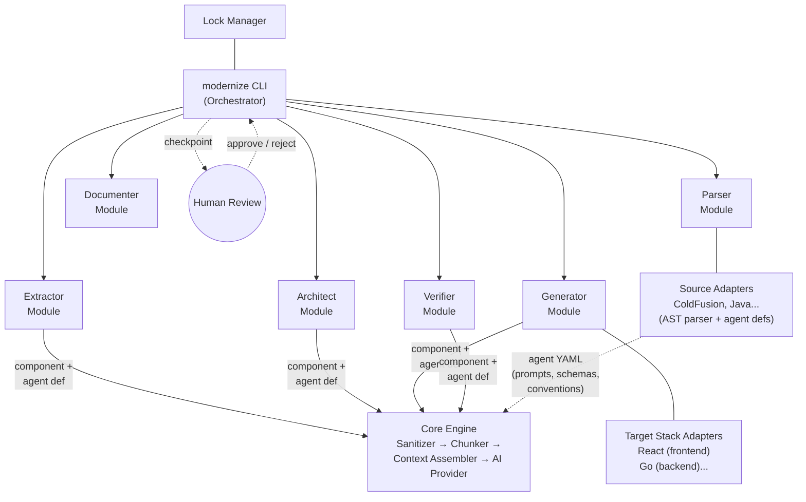
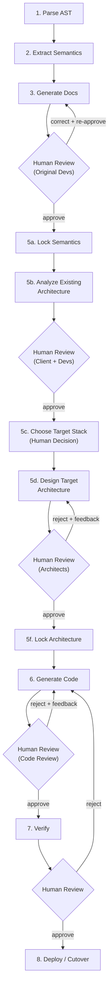

# Modernize — AI-Powered Legacy App Modernization Framework (v2)

## AST-First Deterministic Pipeline

### Problem with v1 Pipeline

The v1 pipeline (Ingest → Comprehend → Architect → Extract/Translate → Verify → Deploy) has a determinism problem: AI re-reads and re-interprets source code at multiple stages. The Translator re-interprets what the Comprehender already understood. Run the pipeline twice, get different results — not because the code changed, but because the AI interpreted it differently.

### Solution: Separate Understanding from Generation

The v2 pipeline creates a hard separation between **understanding** and **generation**, with an explicit lock step that makes the approved understanding immutable input to code generation.

```
v1:  Ingest → Comprehend → Architect → Extract/Translate → Verify → Deploy
               (AI)         (AI)         (AI)

v2:  Parse AST → Extract Semantics → Generate Docs → Review → Lock → Generate Code → Verify
     (local)     (local + min AI)     (template)     (human)  (freeze)  (AI)          (local + AI)
```

**Non-negotiables:**
- Human review gates between every stage
- Minimize AI usage — deterministic where possible
- Local-first data security model (sanitizer, audit, trust levels)
- All existing infrastructure (adapters, agents, core engine) is preserved

**First target:** ColdFusion → React (frontend) + Go (backend API)

---

## Data Security & Processing Model

*(Unchanged from v1 — sanitizer, trust levels, audit logging all preserved. See DESIGN.md for full details.)*

The key change: the sanitizer now works on **AST node values** and **semantic model fields** rather than raw source text. This makes redaction more precise — you're redacting structured data, not scanning free text.

---

## Context Management & AI-Agnostic Design

*(Unchanged from v1 — task decomposition, context budgets, AI provider interface all preserved. See DESIGN.md for full details.)*

The key change: the chunker now splits **AST nodes**, not raw code. This gives cleaner chunk boundaries — a function is one chunk, a query is one chunk, rather than splitting mid-line.

---

## High-Level Architecture



**Six layers:**

| Layer | Role | AI-Powered? |
|-------|------|-------------|
| **CLI Orchestrator** | Pipeline flow, state tracking, human checkpoints | No — deterministic |
| **Pipeline Modules** | Parser, Extractor, Documenter, Architect, Generator, Verifier — each runs a fixed pipeline of local steps, calling AI only when reasoning is needed | Partially — most steps local |
| **Lock Manager** | Lock/unlock/verify integrity of approved mappings | No — deterministic |
| **Agent Definitions** | Language-specific prompt templates + output schemas + conventions, declared by source adapters (YAML files) | No — configuration only |
| **Core Engine** | Sanitizer, chunker, context assembler (merges agent def + task + semantic data), result aggregator | No — deterministic |
| **AI Provider** | Abstract interface to any cloud LLM | Pluggable — Claude, GPT, Gemini |

---

## Pipeline Stages & Checkpoints



| Stage | What Happens | AI Usage | Output Artifact |
|-------|-------------|----------|-----------------|
| **Parse AST** | Deterministic parsing of legacy source into structured AST | **None** | `.modernize/ast/*.ast.json` |
| **Extract Semantics** | Walk AST, extract structured facts. AI only for business rule naming + implicit rules | **Minimal** | `.modernize/semantics/*.semantic.json` |
| **Generate Docs** | Template-driven docs from semantic model. AI only for prose summaries | **Minimal** | `.modernize/docs/*.md` |
| **Review** | Original developers validate extracted semantics, correct errors | **None** | `.modernize/corrections/*.json` |
| **Lock Semantics** | Freeze approved semantic model with checksums | **None** | `.modernize/locked/semantic-lock.json` |
| **Analyze Existing Architecture** | Map module coupling, data flow, shared state from locked semantics | **Moderate** | `.modernize/architecture/existing-architecture.md` |
| **Choose Target Stack** | Human/consulting decision — target languages, frameworks | **None** | Target stack config in `migration.json` |
| **Design Target Architecture** | Group services, define API contracts, route components (from locked semantics + target stack) | **Moderate** | `.modernize/architecture/target-architecture.md` + architecture decisions |
| **Lock Architecture** | Freeze architecture decisions alongside semantic lock | **None** | `.modernize/locked/architecture-lock.json` |
| **Generate Code** | AI generates target code from locked mappings + target conventions | **Heavy** | New service code per stack layer |
| **Verify** | Behavioral equivalence testing + locked mapping conformance | **Light** | Verification report + test suite |
| **Deploy** | Incremental cutover behind proxy | **None** | Routing config |

Each review checkpoint produces **templated, diagram-heavy artifacts** — not AI prose walls. A human should be able to review a module in 30 minutes.

### Execution Modes

*(Unchanged from v1 — guided/supervised/auto modes preserved. See DESIGN.md for full details.)*

In **auto mode**, the lock step still happens — but the system auto-approves based on confidence thresholds. Low-confidence semantic extractions are flagged in the summary for post-run review.

---

## Step 1 — Parse Code to AST (Fully Deterministic)

Deterministic parsing of legacy source into a structured Abstract Syntax Tree. No AI involved.

### What the AST Captures

This is richer than a typical compiler AST. It's a **semantic AST** that preserves domain-relevant structure: query names, scope writes, datasource references, table names, function call targets. The source adapter knows what's important for migration.

**ColdFusion example:**

```
File: UserService.cfc
├── Component (name: UserService, extends: BaseService)
│   ├── Property (name: dsn, type: string, scope: variables)
│   ├── Function (name: authenticate, access: public, returnType: struct)
│   │   ├── Argument (name: email, type: string, required: true)
│   │   ├── Argument (name: password, type: string, required: true)
│   │   ├── Query (name: qUser, datasource: variables.dsn)
│   │   │   ├── SQL: "SELECT id, email, password_hash, role FROM users WHERE email = ?"
│   │   │   ├── Params: [{value: arguments.email, type: cf_sql_varchar}]
│   │   │   └── Tables: [users]
│   │   ├── Conditional (if qUser.recordCount EQ 0 → throw "Invalid credentials")
│   │   ├── FunctionCall (target: hashVerify, args: [arguments.password, qUser.password_hash])
│   │   ├── ScopeWrite (scope: session, key: userId, value: qUser.id)
│   │   ├── ScopeWrite (scope: session, key: userRole, value: qUser.role)
│   │   └── Return (type: struct, keys: [id, email, role])
│   ├── Function (name: getUserById, ...)
│   │   └── ...
│   └── Function (name: updateProfile, ...)
│       └── ...
```

### AST as Single Source of Truth

The AST is persisted to `.modernize/ast/` as structured JSON. **No subsequent step re-reads raw source code.** Everything downstream works from the AST or from artifacts derived from it.

### Source Adapter Enhancement

The source adapter gains a `parseToAST(file) → AST` method. Component boundaries (previously extracted by `parseComponents()`) are now AST nodes.

**Module:** Enhanced **Parser Module** (replaces the Ingest portion of v1 Analyzer)

---

## Step 2 — Extract Semantics (Mostly Deterministic + Targeted AI)

Walk the AST and extract structured semantic facts — what the code *does*, as structured data, not prose.

### Deterministic Extraction (No AI)

| Extraction | How | Example |
|-----------|-----|---------|
| Function signatures | AST traversal | `authenticate(email: string, password: string) → struct` |
| Data access patterns | AST query nodes | `SELECT from users WHERE email = ?` (parameterized) |
| Dependencies | AST include/invoke nodes | `UserService → DatabaseService, EmailService` |
| Scope/state usage | AST scope-write nodes | `writes session.userId, session.userRole` |
| Control flow | AST conditional/loop nodes | `if recordCount == 0 → throw` |
| Call graph | AST function-call nodes | `authenticate() calls hashVerify()` |
| Table relationships | Cross-reference query nodes | `users table accessed by: authenticate, getUserById, updateProfile` |

### AI-Assisted Extraction (Targeted, Minimal)

| Extraction | Why AI is needed | Constraint |
|-----------|-----------------|-----------|
| Business rule naming | "What does this function accomplish in business terms?" | AI sees AST nodes, not raw code. Structured input → structured output. |
| Implicit rules | Business logic hidden in conditionals/calculations that static analysis can't label | AI gets the control flow graph from the AST, explains the rule |
| Data validation rules | Complex validation chains that need semantic understanding | AI gets the validation AST nodes, produces structured rule descriptions |

**Critical design decision:** AI in Step 2 receives **AST nodes**, not raw source code. This means:
- The AI's input is structured and deterministic (same AST → same input to AI)
- The sanitizer works on AST node values, not raw text (more precise redaction)
- If the AI's interpretation is wrong, you fix the semantic extraction, not re-run parsing

### Semantic Model Output

```json
{
  "module": "UserService",
  "source": "UserService.cfc",
  "functions": [
    {
      "name": "authenticate",
      "signature": {
        "inputs": [
          {"name": "email", "type": "string", "required": true},
          {"name": "password", "type": "string", "required": true}
        ],
        "outputs": {"type": "struct", "keys": ["id", "email", "role"]}
      },
      "businessRule": {
        "name": "User Authentication",
        "description": "Validates user credentials against stored hash and establishes session",
        "source": "ai",
        "confidence": 92
      },
      "dataAccess": [
        {
          "table": "users",
          "operation": "SELECT",
          "columns": ["id", "email", "password_hash", "role"],
          "filter": "email = ?",
          "parameterized": true
        }
      ],
      "stateWrites": [
        {"scope": "session", "key": "userId"},
        {"scope": "session", "key": "userRole"}
      ],
      "controlFlow": [
        {"condition": "no user found", "action": "throw InvalidCredentials"},
        {"condition": "password mismatch", "action": "throw InvalidCredentials"}
      ],
      "calls": ["hashVerify"],
      "calledBy": ["login.cfm"]
    }
  ],
  "dependencies": ["DatabaseService", "EmailService"],
  "tables": ["users", "sessions"],
  "complexity": "low"
}
```

AI-generated fields are tagged with `"source": "ai"` so reviewers know exactly what to scrutinize vs what was deterministically extracted.

**Module:** **Extractor Module** (replaces the Comprehend portion of v1 Analyzer)

---

## Step 3 — Generate Documentation (Template-Driven)

Transform the structured semantic model into human-readable documentation for review.

> **TODO**: Static reports may be hard for developers to review — they have to mentally map extracted semantics back to code they wrote years ago. Explore better review collection methods: annotated source code views, interactive browser-based review forms, question-based review flows, or structured feedback collection from multiple reviewers with conflict detection.

### Why This Differs from v1 Comprehend

- v1 Comprehend: AI reads code and produces a report — AI generates both the understanding AND the prose
- v2 Step 3: understanding is already extracted (Step 2). Docs are generated from structured data. AI is only used for rendering natural language summaries from structured facts — a much simpler, more constrained task.

### Document Template

```
┌─────────────────────────────────────────────────┐
│ Module: UserService                             │
│ Source: UserService.cfc                         │
├─────────────────────────────────────────────────┤
│ Functions (table — from semantic model)          │
│ Name          | Business Rule        | Conf.    │
│ authenticate  | User Authentication  | 92% [AI] │
│ getUserById   | User Lookup          | 98%      │
│ updateProfile | Profile Update       | 88% [AI] │
├─────────────────────────────────────────────────┤
│ Data Access (table — from semantic model)       │
│ Table  | Operations      | Parameterized?       │
│ users  | SELECT, UPDATE  | Yes                  │
├─────────────────────────────────────────────────┤
│ State Usage (from semantic model)               │
│ session.userId, session.userRole                │
├─────────────────────────────────────────────────┤
│ Dependencies (from semantic model)              │
│ → DatabaseService, EmailService                 │
│ ← login.cfm, register.cfm                      │
├─────────────────────────────────────────────────┤
│ Call Graph (mermaid — generated from AST)        │
│ [diagram]                                       │
├─────────────────────────────────────────────────┤
│ Data Flow (mermaid — generated from AST)        │
│ [diagram]                                       │
├─────────────────────────────────────────────────┤
│ Items Needing Review:                           │
│ ⚠ "User Authentication" — AI-generated,        │
│   verify this matches actual business intent    │
│ ⚠ hashVerify() — external call, verify behavior│
└─────────────────────────────────────────────────┘
```

The docs explicitly flag AI-generated interpretations vs deterministically-extracted facts. Reviewers know exactly what to scrutinize.

**Module:** **Documenter Module** (replaces v1's `generate_comprehend_report` step)

---

## Step 4 — Review with Original Developers (Human Gate)

The generated documentation goes to people who wrote or maintain the legacy code. They validate that the extracted semantics are correct.

### What Changes from v1 Review

- v1: a consultant or architect reviews AI-generated reports
- v2: **original developers** who know the code review structured extractions
- The review is more targeted — they're confirming/correcting specific semantic facts, not reading AI prose

### Review Workflow

```bash
# See what needs review
modernize review semantics

# Review a specific module
modernize review semantics UserService

# Correct an AI-generated business rule
modernize correct UserService.authenticate \
  --field businessRule.description \
  --value "Authenticates user and also logs failed attempts to audit table"

# Flag a missing rule the extraction missed
modernize add-rule UserService.authenticate \
  --name "Failed Login Auditing" \
  --description "After 3 failed attempts, locks account for 30 minutes" \
  --note "This is in a try/catch block the parser might have missed"

# Approve a module's semantics
modernize approve semantics UserService
```

### Correction Tracking

Every correction is recorded:

```json
{
  "module": "UserService",
  "corrections": [
    {
      "field": "authenticate.businessRule.description",
      "original": "Validates user credentials against stored hash and establishes session",
      "corrected": "Validates credentials + logs failed attempts. After 3 failures, locks account for 30 min.",
      "by": "john@legacy-team.com",
      "at": "2026-03-31T13:30:00Z",
      "reason": "Parser missed try/catch block with audit logging"
    }
  ],
  "addedRules": [
    {
      "function": "authenticate",
      "rule": {
        "name": "Failed Login Auditing",
        "description": "After 3 failed attempts, locks account for 30 minutes",
        "source": "human"
      },
      "by": "john@legacy-team.com",
      "at": "2026-03-31T13:35:00Z"
    }
  ]
}
```

Corrections modify the semantic model directly. Each correction is tracked for audit purposes.

---

## Step 5 — Lock Approved Mappings (Deterministic Freeze)

Once all modules' semantics are approved, the semantic model is frozen. It becomes an immutable contract that Step 6 consumes.

### The Lock Concept

The lock creates a hard boundary:
- **Before the lock:** the understanding can change (re-extract, correct, re-approve)
- **After the lock:** the understanding is fixed. Code generation works from this fixed input.

### Step 5 Sub-phases

```
Step 5a: Lock semantic mappings (what the code does)
Step 5b: Analyze existing architecture (from locked semantics) — AI + human review
Step 5c: Choose target stack (human/consulting decision — no AI)
Step 5d: Design target architecture (from locked semantics + target stack choice) — AI
Step 5e: Review target architecture with architects/leads
Step 5f: Lock architecture decisions (service groups, API contracts, component routing)
Step 5g: Final lock — both semantics + architecture frozen together
```

### Semantic Lock

```json
{
  "lockVersion": "1.0",
  "lockedAt": "2026-03-31T14:00:00Z",
  "lockedBy": "koustubh",
  "modules": {
    "UserService": {
      "status": "locked",
      "approvedBy": "john@legacy-team.com",
      "approvedAt": "2026-03-31T13:45:00Z",
      "semantics": { "...full semantic model..." : "..." },
      "corrections": ["...tracked corrections..."],
      "checksum": "sha256:abc123..."
    }
  },
  "crossModule": {
    "dependencyGraph": { "...": "..." },
    "tableOwnership": { "...which modules own which tables...": "..." },
    "sharedState": { "...session/application scope dependencies...": "..." }
  }
}
```

**The checksum matters.** If anyone tries to modify a locked mapping, the system detects it. To change a locked mapping, you must explicitly **unlock → correct → re-approve → re-lock**.

### Step 5b: Analyze Existing Architecture

The existing architecture analysis answers: *what does the legacy codebase look like?* Generated from the locked semantic model, it contains:

- **Module inventory** — every module, its complexity score, its role
- **Coupling map** — which modules call each other, how tightly coupled
- **Data flow diagram** — which modules read/write which tables
- **Shared state map** — session/application scope dependencies across modules
- **Natural service boundaries** — where the codebase already has clean seams vs tight entanglements

This is a **consulting deliverable** — it goes to the client BEFORE any target stack discussion. Many engagements may stop here: "Here's what your legacy codebase looks like. Now let's discuss where you want to go."

**Output:** `.modernize/architecture/existing-architecture.md`

### Step 5c: Choose Target Stack (Human Decision)

The target stack is a human input, not an AI recommendation. The consultant and client decide based on factors the AI can't assess: team skills, existing infrastructure, licensing constraints, organizational preferences.

```bash
# After reviewing existing-architecture.md with the client
modernize config target-stack \
  --frontend react \
  --backend go \
  --workers go
```

The framework supports any target adapter — the client picks. This decision gates Step 5d.

### Step 5d-5e: Design + Review Target Architecture

Architecture decisions depend on having **correct** semantics AND a chosen target stack. The Architect Module now works from three inputs:
1. Locked semantic model (what the code does)
2. Existing architecture analysis (how the code is structured)
3. Target stack choice (where it's going)

**Why architecture belongs here:**
- Same semantics → same architectural recommendations (deterministic input)
- Architecture is a design decision, not an understanding — different reviewers (architects vs original devs)
- The locked semantic model is the foundation both humans and AI work from
- The target stack is a known input, not a guess

**Output:** `.modernize/architecture/target-architecture.md` + architecture decisions JSON

### Architecture Lock

```json
{
  "targetStack": {
    "frontend": "react",
    "backend": "go",
    "workers": "go",
    "chosenBy": "koustubh",
    "chosenAt": "2026-03-31T15:00:00Z"
  },
  "architecture": {
    "serviceGroups": [
      {
        "name": "users-service",
        "modules": ["UserService", "login", "register", "profile"],
        "reason": "Shared users/sessions tables, tight call coupling",
        "targetStack": {
          "frontend": {"adapter": "react", "components": ["LoginPage", "RegisterPage", "ProfilePage"]},
          "backend": {"adapter": "go", "components": ["UserHandler", "AuthMiddleware", "UserStore"]}
        }
      }
    ],
    "apiContracts": [
      {
        "service": "users-service",
        "endpoint": "POST /api/auth/login",
        "request": {"email": "string", "password": "string"},
        "response": {"token": "string", "user": "User"}
      }
    ],
    "componentRouting": [
      {"source": "UserService.authenticate", "target": "UserHandler.Login", "stackLayer": "backend", "agent": "logic"},
      {"source": "login.cfm", "target": "LoginPage.tsx", "stackLayer": "frontend", "agent": "ui"}
    ],
    "approvedBy": "koustubh",
    "locked": true
  }
}
```

The `targetStack` field is now an explicit human input recorded with attribution, not an AI recommendation embedded in the architecture output.

This preserves the v1 Architect Module's dual output:
- **Architecture blueprint** (human deliverable) — generated from locked semantics + architecture decisions
- **Component routing** (machine input) — embedded in the locked mappings, consumed by Step 6

**Module:** New **Lock Manager** + existing **Architect Module** (split into existing architecture analysis + target architecture design, both working from locked semantics)

---

## Step 6 — Generate New Code (AI, from Locked Mappings)

Code generation consumes the locked mapping as its sole input. **The AI never re-reads legacy source code.** It transforms structured semantic facts + architecture decisions into target code.

### Current v1 vs New v2

**v1 Translator input:**
```
Agent receives: sanitized ColdFusion source code + conventions + prompt
Agent produces: Go/React code
Problem: AI re-interprets the source, may understand it differently than Comprehend did
```

**v2 Generator input:**
```
Agent receives: locked semantic mapping + target conventions + client components + prompt
Agent produces: Go/React code
Advantage: AI doesn't interpret — it transforms structured facts into code
```

### Example: What the Logic Agent Receives

```
You are generating a Go handler function.

LOCKED SEMANTIC MAPPING:
- Function: authenticate
- Business Rule: "Validates credentials + logs failed attempts. After 3 failures, locks account for 30 min."
- Inputs: email (string, required), password (string, required)
- Output: struct {id, email, role}
- Data Access: SELECT from users WHERE email = ? (parameterized)
- State Writes: session.userId, session.userRole → (mapped to: JWT claims)
- Control Flow: no user → error, password mismatch → error + increment failed count
- Calls: hashVerify (→ mapped to: bcrypt.CompareHashAndPassword)

TARGET CONVENTIONS (Go + Chi):
- Handler signature: func (h *UserHandler) Login(w http.ResponseWriter, r *http.Request)
- Use sqlc for queries
- Return JSON responses
- JWT for auth tokens

CLIENT COMPONENTS:
- Auth: use apple-auth-middleware (see docs)
- DB: use apple-db-client (see docs)

Generate the Go handler function.
```

### Why This Is More Deterministic

- Same locked mapping → same prompt to AI → much more consistent output
- If the output is wrong, you know the mapping was correct (it was approved), so the bug is in the generator
- You can re-run generation without risk of the AI "understanding" the legacy code differently
- Debugging is binary: was the mapping wrong (go back to Step 4) or was the generation wrong (fix Step 6)?

### What Stays from v1

- Specialized agent system (DB, UI, Logic, Auth, Form, Task, Email agents)
- Target adapters (React, Go) with scaffolding and conventions
- Client component registry
- Multi-target routing (frontend/backend/workers)
- Cross-layer wiring (API client generation)
- Strangler fig proxy generation

### What Changes

- Agents receive locked semantic mappings, not sanitized source code
- Agent prompts are restructured: "transform this mapping" not "translate this code"
- The sanitizer's role shifts — it still redacts sensitive values in the semantic model, but it's working on structured data not raw code

**Module:** Restructured **Generator Module** (replaces v1 Translator Module)

---

## Post-Generation: Verify

*(Largely unchanged from v1 — see DESIGN.md for Verifier Module details.)*

The locked mapping makes verification stronger:
- Verify old and new behave the same (behavioral equivalence)
- Verify new code implements what the locked mapping specified (mapping conformance)
- AI explains behavioral differences using locked mappings as reference: "the mapping says X, but the new code does Y"

---

## Migration Strategy: Strangler Fig

*(Core approach unchanged from v1 — see DESIGN.md for the strategic rationale. This section adds the operational details.)*

The strangler fig approach is orthogonal to the pipeline restructuring. Service groups are still extracted incrementally and deployed behind a proxy. The only difference is that service group boundaries are now defined in the **architecture lock** (Step 5d) rather than derived during the Architect stage.

### Proxy Routing Strategy

A reverse proxy (HAProxy, nginx, or cloud load balancer) sits in front of both the legacy app and the new services. Migration proceeds service-group-by-service-group:

```
Phase 1: All traffic → legacy app (proxy passthrough)
Phase 2: users-service migrated
         /api/auth/*     → new users-service (Go)
         /login, /register, /profile → new frontend (React)
         everything else → legacy app
Phase 3: reports-service migrated
         /api/reports/*  → new reports-service
         /reports/*      → new frontend
         /api/auth/*     → users-service
         everything else → legacy app
Phase N: All traffic → new services. Legacy app decommissioned.
```

### Cutover Procedure (per service group)

```
1. Deploy new service to production (not routed yet)
2. Run behavioral verification against production data (read-only)
3. Route 5% of traffic to new service (canary)
4. Monitor for 24-48 hours:
   - Response time comparison (old vs new, per endpoint)
   - Error rate delta (new service should not exceed old service's error rate)
   - Business metric validation (same number of logins, orders, etc.)
5. Ramp to 25% → 50% → 100% (each stage: monitor, validate, proceed)
6. Keep legacy route configured but inactive for 2 weeks (fast rollback)
7. Decommission legacy route
```

### Rollback

Rollback = flip the proxy route back to the legacy app. No code changes, no deployment. The legacy app is still running throughout the migration. Rollback time: seconds (proxy config change).

### Database During Cutover

During the transition period, both old and new services read/write the **same database** with no schema changes. Database migration is out of scope for this framework (see Risk 9) — it is handled as a separate engagement after all services are cut over.

### Proxy Configuration Output

The `modernize generate` command produces proxy configuration alongside the generated code:

```
.modernize/services/users-service/
├── frontend/
├── backend/
├── proxy/
│   ├── routes.yaml          # Route definitions for this service group
│   ├── nginx.conf.fragment  # nginx config fragment
│   └── haproxy.cfg.fragment # HAProxy config fragment
└── ...
```

---

## Infrastructure Changes

### Source Adapters — Enhanced, Not Replaced

| v1 Method | v2 Method | Change |
|------|------|--------|
| `detect(files)` | `detect(files)` | Same |
| `parseStructure(path)` | `parseToAST(file) → AST` | Deeper parsing, richer output |
| `parseComponents(file)` | (folded into AST) | Component boundaries are AST nodes |
| `getAgentDefinitions()` | `getAgentDefinitions()` | Same, but agents now work on AST/semantic nodes |
| `classifyComponent(component)` | `classifyASTNode(node)` | Same logic, different input type |
| `getConventions()` | `getConventions()` | Same |

### Core Engine — Mostly Unchanged

- **Sanitizer:** Now works on AST node values and semantic model fields (more precise)
- **Chunker:** Now chunks AST nodes, not raw code (cleaner boundaries)
- **Context Assembler:** Assembles from semantic model + agent def + conventions (no raw code)
- **Providers:** Unchanged
- **Aggregator:** Unchanged

### Pipeline Modules — Restructured

| v1 Module | v2 Module | What Changed |
|------|------|------|
| Analyzer (Ingest + Comprehend) | **Parser** (Step 1) + **Extractor** (Step 2) + **Documenter** (Step 3) | Split into 3 distinct sub-stages with clear boundaries |
| Architect | **Architect** (Step 5b-5d) | Now works from locked semantics, not raw comprehension |
| Translator | **Generator** (Step 6) | Works from locked mappings, not source code |
| Verifier | **Verifier** (post-Step 6) | Enhanced with locked mapping verification |

### New Components

| Component | Purpose |
|------|------|
| **AST Schema** | Per-language AST node type definitions |
| **Semantic Model Schema** | Structured schema for extracted semantics |
| **Lock Manager** | Lock/unlock/verify integrity of approved mappings |
| **Correction Tracker** | Track human corrections to semantic model |

---

## Client Component Registry

When a client has an existing design system or shared libraries, the generator should use those components instead of generating from scratch. The component registry is the bridge.

### Registering Components

```bash
modernize components register ./our-design-system/
# → Scans directory for component files
# → Generates manifests from source (props interfaces, exports)
# → Writes to .modernize/components/
```

### Component Manifest Format

Each registered component has a YAML manifest:

```yaml
# .modernize/components/manifests/DataTable.yaml
name: DataTable
package: "@acme/design-system"
import: "import { DataTable } from '@acme/design-system'"
role: data-display                # semantic role for matching
props:
  columns:
    type: "ColumnDef[]"
    required: true
  data:
    type: "T[]"
    required: true
  pagination:
    type: boolean
    default: true
  onRowClick:
    type: "(row: T) => void"
    required: false
usage: |
  <DataTable
    columns={[{ header: 'Name', accessor: 'name' }]}
    data={users}
    onRowClick={(user) => navigate(`/users/${user.id}`)}
  />
```

### How the Generator Uses Components

The generator's context packet includes the component registry. When generating a UI component:

1. The locked semantic model describes the data and behavior (e.g., "display users table with pagination")
2. The generator checks the registry for components matching the semantic role (`role: data-display`)
3. If a match exists: generate code that *uses* the client component with correct props
4. If no match: generate a standalone component from scratch using target adapter conventions

The component registry is injected into the `CLIENT COMPONENTS` section of the agent's context packet (see Step 6 example).

---

## Agent System

*(Agent system is preserved from v1 — YAML-based agent definitions, language-specific prompts, output schemas. See DESIGN.md for full details.)*

### Key Change: What Agents Receive

In v1, agents receive sanitized source code. In v2, agents receive different inputs depending on the stage:

| Stage | Agent Input | Purpose |
|-------|------------|---------|
| Step 2 (Extract Semantics) | AST nodes | "What business rule does this function implement?" |
| Step 5b (Architecture) | Locked semantic model | "How should these modules be grouped into services?" |
| Step 6 (Generate Code) | Locked semantic mapping + target conventions | "Generate this Go handler from this mapping" |
| Verify | Locked mapping + behavioral diff | "Explain why these outputs differ" |

The agent's `systemPrompt` and `conventions` stay the same. The **task instruction** and **input format** change per stage.

---

## State Directory Structure

```
.modernize/
├── migration.json              # Project config, target stack, service group statuses
├── config.json                 # Provider, trust level, model settings
├── sanitizer-rules.json        # Custom redaction rules (client-specific)
├── audit/                      # Log of every AI API call
├── components/                 # Client component registry (optional)
│   ├── registry.json           # Component index (auto-generated from scan)
│   └── manifests/              # Per-component manifests
│       ├── Button.yaml
│       ├── DataTable.yaml
│       └── AuthGuard.yaml
│
├── config-inventory.json        # Step 1 output — captured config/environment settings
├── asset-inventory.json         # Step 1 output — static asset inventory
│
├── .locks/                     # Pipeline advisory locks (concurrent access, Risk 28)
│
├── ast/                        # Step 1 output — deterministic parse
│   ├── UserService.cfc.ast.json
│   ├── login.cfm.ast.json
│   └── ...
│
├── semantics/                  # Step 2 output — extracted semantic facts
│   ├── UserService.semantic.json
│   ├── login.semantic.json
│   └── cross-module.json       # dependency graph, table ownership
│
├── docs/                       # Step 3 output — human-readable review docs
│   ├── UserService.md
│   ├── login.md
│   └── overview.md
│
├── corrections/                # Step 4 tracking — human corrections
│   ├── UserService.corrections.json
│   └── ...
│
├── locked/                     # Step 5 output — immutable contracts
│   ├── semantic-lock.json      # Locked semantic mappings (all modules)
│   ├── architecture-lock.json  # Locked architecture decisions
│   └── lock-manifest.json      # Checksums, approval chain
│
├── architecture/               # Step 5b-5d output
│   ├── existing-architecture.md    # Step 5b — what the legacy codebase looks like
│   ├── target-architecture.md      # Step 5d — how it will look in target stack
│   └── translation-spec.json       # Derived from locked mappings
│
├── services/                   # Step 6 output — generated code per service
│   └── users-service/
│       ├── frontend/           # React output
│       ├── backend/            # Go output
│       ├── generation-report.md
│       └── source-mapping.json
│
├── recordings/                 # Verify output — record-replay pairs
│   └── users-service/
│       ├── recording-001.json
│       ├── failures/           # Failed replay diffs
│       └── test-suite.spec.ts
│
└── reports/                    # Weekly/monthly progress reports
    └── week-2026-04-01.md
```

---

## AI Usage Summary

| Step | AI Usage | What AI Sees |
|------|---------|-------------|
| 1. Parse AST | **None** | Nothing |
| 2. Extract Semantics | **Minimal** — business rule naming, implicit rules | AST nodes (structured) |
| 3. Generate Docs | **Minimal** — natural language summaries from structured data | Semantic model (structured) |
| 4. Review | **None** | Nothing (human-only) |
| 5a. Lock Semantics | **None** | Nothing (deterministic freeze) |
| 5b. Analyze Existing Architecture | **Moderate** — module coupling, data flow, service boundary analysis | Locked semantic model |
| 5c. Choose Target Stack | **None** | Nothing (human/consulting decision) |
| 5d. Design Target Architecture | **Moderate** — service grouping, API contracts, component routing | Locked semantics + existing architecture + target stack |
| 5e-g. Review + Lock Architecture | **None** | Nothing (human + deterministic) |
| 6. Generate Code | **Heavy** — this is where AI earns its keep | Locked mappings + target conventions |
| 7. Verify | **Light** — explain behavioral diffs | Locked mappings + diff data |

AI is concentrated in Steps 2 (light), 5b and 5d (moderate), and 6 (heavy). Step 5c (target stack selection) is explicitly a human consulting decision. Everything else is deterministic or human-driven.

---

## CLI Workflow

```bash
# 1. Initialize
modernize init ./coldfusion-app \
  --source-adapters coldfusion,python \
  --provider claude \
  --trust-level standard \
  --target-stack react:frontend,go:backend

# 2. Parse to AST (deterministic, no AI)
modernize parse
# → Produces .modernize/ast/*.ast.json

# 3. Extract semantics (mostly deterministic + targeted AI)
modernize extract
# → Produces .modernize/semantics/*.semantic.json

# 4. Generate review docs
modernize document
# → Produces .modernize/docs/*.md

# 5. Review with developers
modernize review semantics
modernize review semantics UserService
modernize correct UserService.authenticate --field businessRule.description --value "..."
modernize add-rule UserService.authenticate --name "Failed Login Auditing" --description "..."
modernize approve semantics UserService
modernize approve semantics --all

# 6. Lock semantic mappings
modernize lock semantics
# → Produces .modernize/locked/semantic-lock.json

# 7. Analyze existing architecture (from locked semantics)
modernize architect --existing
# → Produces .modernize/architecture/existing-architecture.md

# 8. Review existing architecture with client
# → Client reviews existing-architecture.md, discusses target stack options

# 9. Choose target stack (human decision)
modernize config target-stack --frontend react --backend go --workers go

# 10. Design target architecture (from locked semantics + target stack)
modernize architect --target
# → Produces .modernize/architecture/target-architecture.md + architecture decisions

# 11. Review + approve target architecture
modernize review architect
modernize approve architect

# 12. Lock architecture
modernize lock architecture
# → Produces .modernize/locked/architecture-lock.json + final lock manifest

# 10. (Optional) Register client components before generation
modernize components register ./our-design-system/

# 11. Generate code per service group (from locked mappings)
modernize generate users-service
# → Reads locked mappings + architecture, generates React + Go code

# 12. Review generated code
modernize review generate users-service

# 13. Verify behavioral equivalence
modernize verify users-service

# 14. Check progress
modernize status

# 15. Add human knowledge at any time
modernize annotate UserService --note "Also handles CSV bulk imports"

# 16. Review audit trail
modernize audit

# --- Auto Mode ---
modernize run --all
# → Runs full pipeline, auto-locks at confidence thresholds, flags low-confidence items
modernize summary
```

---

## Adapter Plugin System

*(Unchanged from v1 — see DESIGN.md for full details on source/target adapter contracts and adding new language pairs.)*

The only adapter change: source adapters gain `parseToAST()` and `classifyASTNode()` methods. Target adapters are unchanged.

### Parsing Reality: What "Any Language" Actually Requires

Step 1 (Parse AST) is designed to be fully deterministic with no AI. In production, the parsing stack has two layers and a hard constraint: **each source language requires a dedicated adapter.**

#### Layer 1: Syntax Parsing (tree-sitter)

`py-tree-sitter` provides syntax-level ASTs for 200+ languages. It's the foundation — fast, deterministic, and well-maintained. But it produces a **syntax tree**, not the **semantic AST** this pipeline requires.

For example, tree-sitter parsing a ColdFusion `<cfquery>` tag gives you a generic tag node with child text nodes. It does not give you `Query(name: qUser, sql: "SELECT...", tables: [users], parameterized: true)`.

#### Layer 2: Language-Specific Semantic Walker (per adapter)

Each source adapter must include a **semantic walker** — Python code that traverses the tree-sitter syntax tree and extracts the rich AST nodes the pipeline depends on:

| What the pipeline needs | What tree-sitter gives | Walker responsibility |
|---|---|---|
| `Query(name, sql, tables, params)` | A `<cfquery>` tag node with child text | Extract SQL string, parse it, find table names, detect parameterization |
| `ScopeWrite(scope, key, value)` | A `<cfset>` tag node with attribute string | Parse the assignment target, resolve scope prefix (`session.`, `application.`, etc.) |
| `FunctionCall(target, args)` | A function invocation node | Resolve the target name from the call expression |
| `Conditional(condition, action)` | An `if`/`switch` block node | Interpret condition semantics, classify action (throw, return, set) |

The walker is the substantial work per language — typically 500–2000 lines of Python that encodes deep knowledge of that language's idioms (ColdFusion's scope resolution, Java's annotation semantics, COBOL's paragraph/section structure, etc.).

#### SQL Extraction: A Second Parsing Problem

Many legacy languages embed SQL in application code. Extracting structured query information (tables, operations, parameterization, columns) requires parsing the SQL string separately. Libraries like `sqlglot` or `sqlparse` handle this well in Python, but it's a distinct parsing layer that the semantic walker must invoke.

#### What This Means for Multi-Language Support

| Claim | Reality |
|---|---|
| "Parse any language" | Requires a tree-sitter grammar per language (most mainstream languages are covered, including ColdFusion, Java, COBOL, C#, VB.NET) |
| "Extract semantic AST" | Requires a custom walker per language — each is weeks of work and encodes language-specific domain knowledge |
| "Fully deterministic, no AI" | Achievable for structural extraction (signatures, queries, scope writes, control flow). Hard edge cases — implicit business logic in comments, undocumented conventions, metaprogramming — will still surface as gaps that AI (Step 2) or human review (Step 4) must fill |
| "Python as implementation language" | `py-tree-sitter` is production-grade. Python is well-suited for tree walking, JSON generation, and the rest of the pipeline |

#### Practical Constraint

**We do not promise "any language." We promise "any language we build an adapter for."** Each source adapter is a meaningful piece of work. The adapter plugin system is designed for this — `parseToAST()` is the contract, and each adapter fulfills it differently. The pipeline stages downstream of Step 1 are language-agnostic; only the adapters know about specific source languages.

**First adapter: ColdFusion** (the immediate target). Additional adapters (Java, COBOL, etc.) are added per engagement as needed.

---

## Review Artifact Templates

*(Preserved from v1 — 30-minute reviewability constraint, diagrams first, tables second, prose last. See DESIGN.md for Comprehend Report and Architecture Blueprint templates.)*

The key difference: all review docs are now generated from structured semantic data, not from AI-generated prose. The `[AI]` tag on fields tells reviewers exactly what the AI contributed vs what was deterministically extracted.

---

## Known Design Risks

### Risk 1: Cross-Module Semantic Inconsistency (Step 2)

Semantics are extracted per-module, but modules reference each other. Module A's extraction says it calls `UserService.authenticate(email, password)` — two params. Module B's extraction describes `authenticate(email, password, rememberMe)` — three params. The `cross-module.json` dependency graph detects that A calls B, but doesn't reconcile conflicting descriptions of the same function across callers.

**Mitigation:** Add a **cross-module consistency check** after all per-module extractions complete. Compare every caller's description of a function against the callee's own semantic model. Flag mismatches as review items. This is deterministic — no AI needed — and should run before Step 3 (Generate Docs) so inconsistencies surface in review documents.

**Implementation:** Post-extraction validation pass. Compare `calls` references in every module against the `functions` definitions in the target module. Flag mismatches in `.modernize/semantics/consistency-report.json`.

### Risk 2: Correction Cascade (Step 4)

When a human corrects Module A's semantic model — changes a table name, renames a business rule, adds a missing state write — other modules that reference the same table/rule/state become stale. Currently no mechanism propagates correction impacts.

**Example:** Reviewer corrects UserService to add `session.userPermissions` as a state write. ReportService reads `session.userPermissions` — its semantic model should reflect this dependency, but it was extracted before the correction happened.

**Mitigation:** When a correction is applied, automatically identify dependent modules (from `cross-module.json` dependency graph) and flag them as **"needs re-review"** — not "needs re-extraction." The original extraction may still be correct; it just needs human re-confirmation in light of the upstream change.

**Implementation:** Correction tracker gains a `propagateImpact()` method. When a correction touches a shared resource (table, state key, function signature), all modules that reference that resource are marked `status: "needs-re-review"` in their semantic model. These modules cannot be locked until re-approved.

### Risk 3: Partial Lock Problem (Step 5a)

200 modules. You lock 50. Module 51's review reveals a dependency on Module 1 that changes Module 1's understanding. You need to unlock Module 1, but the semantic lock checksum covers all locked modules — unlocking one invalidates the batch.

**Mitigation:** Design the lock as **per-module locks with a batch manifest**, not a monolithic lock. Each module has its own checksum. The `semantic-lock.json` manifest tracks which modules are locked individually. Unlocking Module 1 invalidates only Module 1's checksum and sets the manifest to `status: "partial"`. Modules that depend on Module 1 are flagged for re-review (Risk 2's cascade mechanism). The manifest reaches `status: "complete"` only when all modules are locked and all dependency checksums are consistent.

**Implementation:** Change lock granularity. `modernize unlock semantics UserService` unlocks one module. `modernize lock semantics --status` shows which modules are locked, which need re-review, and which are blocking completion.

### Risk 4: Chunking + Aggregation Inconsistency (Core Engine)

When a large module exceeds the context window, the chunker splits it into N chunks. The AI processes each chunk separately. The aggregator merges structured JSON results. But AI call 1 might name a pattern "User Authentication" while AI call 2 (seeing a different chunk) calls the same pattern "Login Validation." Structural merge succeeds; semantic consistency fails.

**Mitigation:** Two approaches, use both:
1. **Pass prior chunk results as context:** When processing chunk 2, include the summary of chunk 1's output in the context packet. The AI sees what was already extracted and can align naming. This uses context budget but improves consistency.
2. **Post-aggregation deduplication pass:** After merging all chunks, run a lightweight AI pass that receives only the merged output (not the source code) and consolidates duplicate business rules, normalizes naming, and flags conflicts. This is cheap — it's structured JSON in, structured JSON out.

**Implementation:** Enhance the context assembler to include prior chunk summaries. Add a deduplication step to the result aggregator.

### Risk 5: Confidence Score Calibration

Confidence scores (0-100) come from the AI provider. "92% confidence" from Claude means something different than "92%" from GPT-4o. If a client switches providers, or uses different providers for different stages, thresholds become unreliable.

**Mitigation:** Don't rely on raw AI confidence. Instead, derive confidence from **observable signals**:
- Was the extraction fully deterministic (from AST traversal)? → 100% confidence, `source: "deterministic"`
- Was it AI-assisted but the AST provided strong structural evidence? → High confidence floor
- Was it purely AI-inferred (implicit rule, no AST evidence)? → Confidence ceiling of 80% regardless of what the AI claims
- Did the idempotency check (run twice) produce the same result? → Boost confidence
- Did it diverge? → Cap at 60%

**Implementation:** Confidence scoring module in the Core Engine. Wraps AI-reported confidence with observable calibration. All confidence scores in the semantic model are from this module, not raw AI output.

### Risk 6: Architecture → Code Conformance Gap

The architecture lock defines service boundaries, API contracts, and component routing. Step 6 generates code. But there's no formal check that generated code respects the architectural decisions. A generator agent might place OrderService logic inside users-service, or generate an API endpoint that doesn't match the locked contract.

**Mitigation:** Add an **architecture conformance check** as part of Step 7 (Verify), alongside behavioral equivalence:
- Does each generated file belong to the service group it was routed to?
- Do generated API endpoints match the locked API contracts (method, path, request/response schema)?
- Do cross-service calls go through the defined API, not direct function calls?

**Implementation:** Deterministic checks (no AI needed) that compare generated code structure against the architecture lock. Produces a conformance report alongside the verification report. Failures block deployment.

### Risk 7: No Feedback Loop from Verify to Earlier Stages

Step 7 finds behavioral differences. The human can reject and loop back to Step 6 (regenerate). But what if the behavioral diff reveals the semantic model was wrong? There's no path from Verify back to Step 2/4 without manually unlocking the entire pipeline.

**Mitigation:** Add explicit **escalation paths** in the rejection workflow:

```
Reject at Step 7 → choose:
  (a) Regenerate (Step 6 only — mapping was correct, generation was wrong)
  (b) Revise architecture (unlock architecture → Step 5d → re-lock → regenerate)
  (c) Revise semantics (unlock semantics → Step 4 → re-lock → re-architect → regenerate)
```

Each escalation path preserves audit trail: why it was escalated, what was changed, who approved the change.

**Implementation:** `modernize reject verify users-service --escalate semantics` or `--escalate architecture`. The CLI handles the unlock → re-review → re-lock → regenerate flow automatically, with human approval at each gate.

### Risk 8: Review Fatigue at Scale

A 500-module ColdFusion app at 30 minutes per module = 250 hours of semantic review alone. Add architecture review, code review, and verification review. The design assumes unlimited reviewer capacity.

**Mitigation:** This is a process problem, not a technical one. Mitigations:
1. **Batch review by confidence:** Auto-approve modules where ALL fields are deterministic (`source: "deterministic"`) and complexity is "low." Present these as a batch confirmation, not individual reviews. Only AI-generated or high-complexity modules get individual review.
2. **Parallel reviewer assignment:** The review system should support multiple reviewers working on different modules simultaneously, with conflict detection if two reviewers correct the same cross-module dependency.
3. **Incremental locking:** Don't wait for all 500 modules. Lock and proceed with service groups as they're approved. Service group 1 can be in Step 6 while service group 3 is still in Step 4.
4. **Review delegation:** Route modules to the developer who wrote them (if known from git blame). They'll review faster because they have context.

**Implementation:** Confidence-based auto-approve thresholds in `config.json`. Parallel reviewer support in the review CLI. Incremental lock support (per Risk 3's per-module lock design).

### Risk 9: Database Migration — Out of Scope

Database schema migration (generating migration scripts, handling schema splits when services split, managing data during strangler fig cutover) is **out of scope** for this framework. The framework captures table ownership, query patterns, and data access in the semantic model — this information is available for a separate database migration effort, but the `modernize` tool does not generate or execute schema changes.

During strangler fig cutover, both old and new services read/write the **same database** with no schema changes. Database migration is a separate engagement handled by DBAs after all service groups are migrated and verified.

### Risk 10: Mixed-Language Source Codebases

Legacy codebases mix languages. A ColdFusion app typically contains ColdFusion (.cfc/.cfm) + Python scripts + HTML/CSS/JS embedded in templates + SQL in stored procedures + possibly Java classes. The original design assumed one source adapter per engagement. In practice, a single codebase has multiple languages that all need parsing.

**Three distinct cases:**

#### Case 1: Embedded Languages (HTML/CSS/JS inside ColdFusion files)

A `.cfm` file is ColdFusion + HTML + inline JavaScript + inline CSS mixed together. This is **not** cross-language — it's one file with multiple languages embedded. Marking embedded HTML as "external" would lose the entire UI layer.

**Solution:** Tree-sitter handles this via **language injection**. The ColdFusion grammar parses the ColdFusion portions; `<script>` blocks are handed to the JS grammar; HTML portions to the HTML grammar. The ColdFusion source adapter's semantic walker traverses the combined tree and extracts AST nodes from all embedded languages in a single pass.

| File content | Parser behavior | AST output |
|---|---|---|
| `<cfquery>SELECT...</cfquery>` | ColdFusion grammar → SQL extracted from tag body | `Query` node with SQL details |
| `<script>fetch('/api/users')</script>` | JS grammar via injection | `ClientAPICall` node with endpoint |
| `<form action="process.cfm">` | HTML grammar via injection | `FormSubmit` node with target |
| `<cfoutput>#user.name#</cfoutput>` | ColdFusion grammar (template expression) | `TemplateOutput` node with data binding |

The semantic walker knows how to combine these: a `.cfm` page that has a `<cfquery>`, a `<form>`, and a `<script>` block produces one unified semantic model with data access, UI elements, and client-side behavior all captured.

#### Case 2: Separate Files in Other Languages (Python scripts, JS modules, Java classes with source)

These are standalone files in the same codebase — a Python script called via `cfexecute`, a JavaScript module imported by the frontend, a Java class invoked via `createObject("java")`.

**Solution:** **Multi-adapter parsing.** The pipeline supports multiple source adapters in one engagement. Each adapter handles its language; all produce the same semantic model format.

```bash
modernize init ./legacy-app \
  --source-adapters coldfusion,python,java \
  --target-stack react:frontend,go:backend
```

Step 1 (Parse AST) runs each adapter on its respective file types:
- ColdFusion adapter → parses `.cfc`, `.cfm` files
- Python adapter → parses `.py` files
- Java adapter → parses `.java` files

All produce `.modernize/ast/*.ast.json` in the same schema. Step 2 (Extract Semantics) processes all AST files identically. The cross-module dependency graph (`cross-module.json`) resolves cross-language calls:

```json
{
  "module": "UserService",
  "language": "coldfusion",
  "calls": [
    {"target": "data_processor.py", "language": "python", "method": "process_batch", "via": "cfexecute"},
    {"target": "com.acme.AuthHelper", "language": "java", "method": "validateToken", "via": "createObject"}
  ]
}
```

The cross-module consistency check (Risk 1) validates that the caller's description of the function matches the callee's semantic model — even across languages.

**Practical constraint:** Each additional language adapter is weeks of work (see Adapter Plugin System section). For a ColdFusion + Python + Java codebase, you need three adapters. The ColdFusion adapter is built first; Python and Java adapters are added when the engagement requires them.

#### Case 3: True External Dependencies (no source available)

COM objects, third-party APIs, proprietary libraries without source code, stored procedures in the database.

**Solution:** Model as **external dependency stubs** in the semantic model:

| External call | Semantic model entry |
|---|---|
| `<cfobject type="COM" class="Word.Application">` | `"externalDep": {"type": "com", "ref": "Word.Application", "source": "stub"}` |
| `<cfstoredproc procedure="sp_GetUser">` | `"externalDep": {"type": "stored-proc", "ref": "sp_GetUser", "source": "stub"}` |
| `<cfhttp url="https://api.stripe.com/v1/charges">` | `"externalDep": {"type": "http-api", "ref": "stripe-charges", "source": "stub"}` |

The semantic model records the call signature and parameters but not the implementation. The review step (Step 4) is where humans fill in what the dependency does and how it should be handled in the target stack.

For stored procedures, add an optional database catalog import:

```bash
# Import stored procedure signatures + bodies from database catalog
modernize import-schema --connection "sqlserver://..." --include-procs
# → Creates semantic models from INFORMATION_SCHEMA / sys.sql_modules
# → Procedure bodies parsed with sqlglot to extract tables, operations, params
# → Marked "source": "database-catalog", go through normal review flow
```

#### Summary

| Situation | Approach | Adapter needed? |
|---|---|---|
| HTML/CSS/JS embedded in ColdFusion | Language injection in tree-sitter, single adapter handles all | No — ColdFusion adapter covers it |
| Python/Java files in same codebase | Multi-adapter parsing, each language gets its own adapter | Yes — one per language |
| Stored procedures (source in DB) | `import-schema` imports from database catalog | No — uses sqlglot, not a full adapter |
| COM/API/proprietary (no source) | External dependency stubs, humans fill in during review | No — stubs only |

### Risk 11: No Incremental / Delta Processing

On a 6-month engagement, the legacy codebase changes under you. New modules are added, existing ones modified, some deleted. Currently, no mechanism processes only the changes.

**Mitigation:** Track source file hashes alongside every artifact:

| Artifact | Tracks |
|----------|--------|
| `.modernize/ast/UserService.cfc.ast.json` | SHA-256 of `UserService.cfc` at parse time |
| `.modernize/semantics/UserService.semantic.json` | Hash of the AST file it was extracted from |
| `.modernize/locked/semantic-lock.json` | Per-module hash chain: source → AST → semantic |

**Incremental behavior:**
- `modernize parse` — checks file hashes, only re-parses changed/new files
- `modernize extract` — only re-extracts modules whose AST changed
- For locked modules: if the source file changes after lock, the integrity check detects the hash mismatch and flags the module as `"stale"`. It must be unlocked → re-extracted → re-reviewed → re-locked. This is correct — you *want* to know when the ground truth changed

**CLI:**
```bash
modernize parse --incremental        # Default behavior — skip unchanged files
modernize parse --force              # Re-parse everything
modernize status --stale             # Show locked modules whose source changed
```

### Risk 12: Generated Code + Human Edits Overwrite

Step 6 generates code. Human reviewer says "this is 80% right, I'll fix the rest." They edit generated files. Later, a semantic correction triggers regeneration — human edits are overwritten.

**Mitigation:** Track a **generation baseline hash** for each generated file:

1. When Step 6 generates `user_handler.go`, record its hash as the generation baseline
2. Human edits the file — file hash now differs from baseline
3. On re-generation, the system detects the divergence and offers three options:

```bash
modernize generate users-service
# → Detected 3 files with human modifications since last generation:
#   user_handler.go (12 lines changed)
#   auth_middleware.go (4 lines changed)
#   user_store.go (manually maintained)
#
# Choose per file:
#   (o) Overwrite — discard human edits, use new generation
#   (m) Merge — three-way merge: baseline + human edits + new generation
#   (s) Skip — keep human version, mark as "manually maintained"
```

Files marked "manually maintained" are excluded from future generation but still included in verification (Step 7).

**Implementation:** `.modernize/services/<service>/generation-manifest.json` tracks per-file: generation baseline hash, current hash, status (generated | modified | manually-maintained).

### Risk 13: Stored Procedure Bodies

The AST parser handles `<cfstoredproc>` *calls* but not the stored procedure *bodies* (which live in the database, not source files). If critical business logic lives in stored procedures, the semantic model is silently incomplete.

**Mitigation:** Covered by Risk 10's `modernize import-schema` command. Additionally, the Discovery Agent (v3) should flag modules that call stored procedures as having potential hidden business logic. The review checklist should include: "This module calls sp_GetUser — does the stored procedure contain business logic that needs migration?"

### Risk 14: Auto Mode Constraints

Auto-approve based on confidence thresholds means AI output gets locked without human review. Given the confidence calibration problem (Risk 5), this could silently lock incorrect semantics.

**Mitigation:** Gate auto mode:
1. **Calibration requirement:** Auto mode is only available after a manual "calibration run" — the team processes at least one service group fully manually. The system compares manual approvals against what auto-mode would have approved. If divergence exceeds 10%, auto mode is blocked with a warning.
2. **Hard exclusions:** Auto mode never auto-approves:
   - Modules with any field below 85% confidence
   - Modules flagged by the Discovery Agent (gap flags, implicit rules)
   - Modules touching PII tables (as identified by data sensitivity scoring)
   - Modules with external dependency stubs (Risk 10)
   - These always require human review regardless of mode
3. **Post-run review:** After auto mode completes, generate a summary of everything that was auto-approved. Flag the 10 lowest-confidence auto-approvals for spot-check review.

### Risk 15: Pipeline State Recovery

If the CLI crashes mid-extraction on module 150 of 200, is the state recoverable?

**Mitigation:** Each step writes a **checkpoint file** as it processes modules:

```json
// .modernize/checkpoints/extract.json
{
  "step": "extract",
  "startedAt": "2026-03-31T10:00:00Z",
  "status": "in-progress",
  "completed": ["UserService", "OrderService", ...],    // 149 modules
  "failed": ["BrokenModule"],                            // failed with error
  "remaining": ["ReportService", ...],                   // 50 modules
  "currentModule": "ReportService"                       // was in progress when interrupted
}
```

**Resume behavior:**
- `modernize extract` — detects checkpoint, resumes from where it stopped. The in-progress module (`currentModule`) is re-extracted from scratch (partial output discarded).
- `modernize extract --force` — ignores checkpoint, re-runs everything
- `modernize extract --retry-failed` — re-runs only failed modules

### Risk 16: Cost Estimation and Budget Controls

A 500-module app could mean thousands of AI API calls. No cost estimation, no budget caps.

**Mitigation:** Add a `--dry-run` flag and cumulative cost tracking:

```bash
# Estimate cost before running
modernize extract --dry-run
# → 487 modules, ~1,200 chunks estimated
# → ~1,200 API calls to claude-sonnet-4-6
# → Estimated cost: $18.40 (input: $12.10, output: $6.30)
# → Estimated time: 45 minutes at concurrency=5
# → Proceed? [y/N]

# View cumulative costs
modernize audit --cost
# → Parse AST:          $0.00 (no AI)
# → Extract Semantics:  $18.40 (1,247 calls)
# → Generate Docs:      $4.20 (487 calls)
# → Architecture:       $2.10 (12 calls)
# → Generate Code:      $142.00 (3,400 calls)  ← this is where the money goes
# → Verify:             $28.00 (890 calls)
# → TOTAL:              $194.70

# Set a budget cap
modernize config budget --max-total 500.00 --warn-at 400.00
```

**Implementation:** `.modernize/audit/cost-summary.json` tracks per-call costs (input tokens × rate + output tokens × rate). Dry-run estimates by counting modules, estimating chunk count from file sizes, and multiplying by provider pricing from `config.json`.

### Risk 17: Behavioral Verification Mechanics (Step 7)

Step 7 says "behavioral equivalence testing" but the old app runs on ColdFusion/IIS and the new on Go/React — different runtimes, different response formats. There's no defined mechanism for actually comparing behavior across runtimes.

**Mitigation:** A **record-replay** approach:

1. **Record:** Install a lightweight HTTP proxy in front of the legacy app that captures request/response pairs into `.modernize/recordings/`. Pairs are sanitized per trust level settings (PII redacted from recorded payloads).
2. **Replay:** During verification, replay the recorded requests against the new service and diff the responses **structurally** — JSON field-by-field comparison, not string equality. For HTML pages, compare DOM structure and data bindings, not pixel-perfect markup.
3. **Scope constraint:** Automated replay is **read-only requests only**. Write operations (POST, PUT, DELETE) require human-supervised replay against a test database copy.

Recording format:

```json
// .modernize/recordings/users-service/recording-001.json
{
  "request": {
    "method": "GET",
    "path": "/api/users/42",
    "headers": {"Authorization": "[REDACTED]"},
    "recordedAt": "2026-04-01T10:00:00Z"
  },
  "legacyResponse": {
    "status": 200,
    "body": {"id": 42, "email": "user@example.com", "role": "admin"},
    "latencyMs": 120
  },
  "newResponse": null,
  "diffResult": null
}
```

**Diff strategy:**
- **Structural match:** Same JSON keys, same value types, same status codes
- **Semantic match:** Values may differ in format (ColdFusion returns `"TRUE"`, Go returns `true`) — the diff engine normalizes known type coercions
- **Acceptable drift:** Response time differences, header differences, formatting differences are logged but not failures
- **Failures:** Missing fields, extra fields, different status codes, different business data values

**CLI:**
```bash
# Record from legacy app (run alongside production, read-only traffic)
modernize record users-service --proxy-port 8080 --duration 1h

# Replay against new service
modernize verify users-service --replay
# → 847 recorded requests replayed
# → 839 passed (structural match)
# → 5 acceptable drift (type coercion)
# → 3 FAILED — review .modernize/recordings/users-service/failures/
```

**Implementation:** Recording proxy in Phase 5 (Verifier Module). Proxy is a simple HTTP pass-through that logs pairs — not a full traffic mirror. The diff engine is deterministic; only the AI-powered diff *explanation* (when a failure is found) uses AI.

### Risk 18: Configuration / Environment Files Not Captured

Legacy apps rely on config files (`Application.cfc`, `web.xml`, datasource definitions, `.properties`, SMTP settings, session config, feature flags) that affect runtime behavior. The AST parser won't see these — they're not source code — but they contain critical information the semantic model needs to reference.

**Mitigation:** Add a **config capture step** as part of Step 1 (Parse AST). The source adapter declares which config file patterns matter for its language:

```python
# ColdFusion adapter config declaration
config_patterns = [
    {"glob": "Application.cfc", "parser": "cfml_config"},
    {"glob": "Application.cfm", "parser": "cfml_config"},
    {"glob": "**/web.xml", "parser": "xml_config"},
    {"glob": "**/*.properties", "parser": "properties_config"},
]
```

Config files are parsed into a structured **config inventory** — not a full AST, just key-value pairs organized by category:

```json
// .modernize/config-inventory.json
{
  "datasources": [
    {
      "name": "appDSN",
      "driver": "sqlserver",
      "host": "[REDACTED]",
      "database": "legacy_app",
      "source": "Application.cfc:12"
    }
  ],
  "session": {
    "timeout": "30 minutes",
    "storage": "memory",
    "source": "Application.cfc:5"
  },
  "smtp": {
    "server": "[REDACTED]",
    "port": 587,
    "source": "Application.cfc:18"
  },
  "featureFlags": [
    {"name": "enableNewReports", "value": true, "source": "config.properties:3"}
  ],
  "customSettings": [
    {"key": "maxUploadSize", "value": "10MB", "source": "Application.cfc:22"}
  ]
}
```

**How it integrates:**
- The semantic model references config entries by name (e.g., a query references `datasource: "appDSN"` → config inventory resolves it)
- During target architecture design (Step 5d), config entries become environment variables or config maps in the target stack
- The sanitizer redacts sensitive config values (connection strings, SMTP credentials) per trust level
- The config inventory is included in the review docs (Step 3) so reviewers can verify completeness

**Implementation:** Added to Phase 2 alongside the Parser Module. Each source adapter provides its config patterns and parsers. The config inventory is a first-class artifact in `.modernize/`.

### Risk 19: Multi-Reviewer Conflict Resolution

Risk 8 mentions "parallel reviewer support with conflict detection" but doesn't define what happens when two reviewers correct the same field differently. Reviewer A says the business rule is "locks after 3 attempts" and Reviewer B says "locks after 5 attempts."

**Mitigation:** **First-write wins with mandatory reconciliation.**

When Reviewer B corrects a field that Reviewer A already corrected, the system blocks the second correction and shows both:

```bash
modernize correct UserService.authenticate --field businessRule.description \
  --value "Locks after 5 failed attempts"

# → CONFLICT: This field was already corrected by john@legacy-team.com at 2026-04-01T10:30:00Z
# →   Current value (corrected by john): "Locks after 3 failed attempts"
# →   Your value: "Locks after 5 failed attempts"
# →
# → Choose:
# →   (k) Keep john's correction
# →   (r) Replace with yours
# →   (n) Write a new value (both reviewers discuss first)
# →
# → Resolution will be recorded in the correction tracker with both reviewers attributed.
```

**Conflict prevention:** Assign **module ownership** to reduce conflicts:
- Auto-assign from `git blame` — route each module to the developer who last touched it
- Manual override: `modernize config reviewers --assign UserService john@legacy-team.com`
- Primary reviewer's corrections apply directly; other reviewers can **comment** but must go through reconciliation to override

**Conflict tracking:**

```json
// In corrections file
{
  "field": "authenticate.businessRule.description",
  "conflict": {
    "reviewerA": {"value": "Locks after 3 attempts", "by": "john@legacy-team.com"},
    "reviewerB": {"value": "Locks after 5 attempts", "by": "jane@legacy-team.com"},
    "resolution": "Locks after 5 failed attempts — confirmed by checking source line 47",
    "resolvedBy": "jane@legacy-team.com",
    "resolvedAt": "2026-04-01T11:00:00Z"
  }
}
```

**Implementation:** Conflict detection in Phase 2 (correction tracker). Module ownership assignment in Phase 6 (Polish). The correction tracker checks for existing corrections before applying new ones.

### Risk 20: Semantic Model Schema Versioning

Over a 6-month engagement, the `modernize` tool will evolve — new fields in the semantic model, restructured nodes, additional metadata. Existing `.modernize/` artifacts produced by an older version become incompatible. No migration strategy for the framework's own artifacts.

**Mitigation:** Stamp every artifact with a **schema version** and provide deterministic migration functions:

```json
// Every artifact includes:
{
  "schemaVersion": "2.1",
  "generatedBy": "modernize@0.4.0",
  ...
}
```

**Migration behavior:**
- When the CLI detects artifacts from an older schema version, it runs a **deterministic migration function** (e.g., schema v2.0 → v2.1 transform). These are coded transforms, not AI.
- Migration is **non-destructive** — original files are preserved as `.bak` until the next successful lock
- The schema version is included in lock checksums — a schema migration automatically flags locked modules as `"needs-re-verification"` (not re-review, since the content didn't change, only the shape)
- Schema migrations are **forward-only**. Downgrading the CLI version on an upgraded project is not supported (but the `.bak` files allow manual recovery)

```bash
# Detect schema version mismatches
modernize status
# → WARNING: 487 AST files at schema v2.0, current CLI expects v2.1
# → Run 'modernize migrate' to upgrade artifacts

modernize migrate --dry-run
# → 487 AST files: v2.0 → v2.1 (adds 'parseStatus' field, default: 'complete')
# → 487 semantic files: v2.0 → v2.1 (restructures 'controlFlow' to nested format)
# → 0 locked files affected (lock will need re-verification after migration)

modernize migrate
# → Migrated 974 files. Originals preserved as .bak
# → 3 locked modules flagged as needs-re-verification
```

**Implementation:** Schema version constant in the CLI. Migration registry mapping `(fromVersion, toVersion) → transformFunction`. Added to Phase 1 (Foundation) since it affects every artifact from day one.

### Risk 21: Tree-sitter Grammar Gaps

ColdFusion's tree-sitter grammar may not handle every construct — custom tags (`<cf_mytag>`), `<cfmodule>`, tag-based vs script-based syntax mixing, obscure CFML features. When the grammar fails to parse a file or produces an incomplete AST, the pipeline has no fallback.

**Mitigation:** **Graceful degradation with three tiers:**

| Parse result | Status | Pipeline behavior |
|---|---|---|
| Fully parsed | `"parseStatus": "complete"` | Normal flow — all downstream steps proceed |
| Partially parsed | `"parseStatus": "partial"` | Adapter extracts what it can. Unparsed regions preserved as raw text in `unparsedBlocks` array. Flagged as mandatory review items in Step 4 |
| Parse failed | `"parseStatus": "failed"` | File excluded from automatic processing. Added to manual-handling queue. Logged in `modernize status` |

**Partial parse handling:**

```json
// .modernize/ast/BrokenModule.cfc.ast.json
{
  "module": "BrokenModule",
  "parseStatus": "partial",
  "parsedNodes": [ "...normal AST nodes for the parts that worked..." ],
  "unparsedBlocks": [
    {
      "startLine": 145,
      "endLine": 162,
      "rawText": "<cfmodule template=\"custom/workflow.cfm\" action=\"approve\" ...>",
      "reason": "Unrecognized tag structure: <cfmodule> with nested body"
    }
  ],
  "coverage": "87%"
}
```

Unparsed blocks flow through to review docs (Step 3) as highlighted "needs human description" items. The reviewer must describe what the unparsed code does — their description is added to the semantic model as `"source": "human"`.

**Grammar coverage tracking:** The ColdFusion adapter ships with a **grammar coverage report** — tested against a catalog of ColdFusion constructs:

```bash
modernize parse --coverage-report
# → Tag coverage: 42/48 tags fully supported (87.5%)
# → Unsupported: <cfmodule> (partial), <cfinterface> (partial), <cfimport> (stub), ...
# → Script syntax: fully supported
# → Tag-script mixing: supported (tree-sitter injection)
```

**Implementation:** Parse status field added in Phase 2 (Parser Module). The semantic walker wraps tree-sitter calls in try/catch — a node-level parse failure doesn't crash the whole file. Coverage report is part of the adapter's test suite.

### Risk 22: Source Adapter Bug Fixes Mid-Engagement

If a parser bug is fixed in the ColdFusion adapter mid-engagement, all existing ASTs were produced by the old (buggy) adapter. The hash-based incremental system (Risk 11) won't detect this — source files haven't changed, only the adapter code has. Modules parsed with the buggy adapter continue through the pipeline with incorrect ASTs.

**Mitigation:** Add an **adapter version hash** to every AST output:

```json
// .modernize/ast/UserService.cfc.ast.json
{
  "module": "UserService",
  "sourceHash": "sha256:abc123...",
  "adapterVersion": "coldfusion-adapter@1.3.2+sha256:def456...",
  "parsedAt": "2026-04-01T10:00:00Z",
  ...
}
```

The `adapterVersion` includes both the semantic version AND a hash of the adapter's source code (walker + grammar). The incremental processing check (Risk 11) compares **both**:
- Source file hash changed → stale (re-parse needed)
- Adapter version changed → stale (re-parse needed)
- Both unchanged → skip

```bash
modernize parse --incremental
# → 487 modules checked
# → 0 source files changed
# → 487 adapter version mismatch (coldfusion-adapter@1.3.2 → 1.3.3)
# → Re-parsing 487 modules...

# Or be selective — only re-parse if the adapter change affects specific constructs
modernize parse --incremental --adapter-changelog
# → coldfusion-adapter 1.3.3: fixed <cfqueryparam> type resolution
# → 142 modules use <cfqueryparam> — re-parsing those only
# → 345 modules unaffected — skipping
```

The selective re-parse (using adapter changelog) is an optimization — the safe default is re-parse everything when the adapter version changes.

**Impact on locked modules:** If a locked module's AST was produced by an older adapter version, it's flagged as `"stale"` in `modernize status --stale`. It must be unlocked → re-parsed → re-extracted → re-reviewed → re-locked. This is correct — a parser bug fix may change the semantic model.

**Implementation:** Adapter version stamping in Phase 1 (Foundation — part of the adapter interface contract). The `parseToAST()` method returns version metadata alongside the AST. Selective re-parse is a Phase 6 optimization.

### Risk 23: File Encoding / Character Set Mismatches

Legacy ColdFusion apps are frequently Windows-1252 or Latin-1 encoded, not UTF-8. Tree-sitter expects UTF-8 input. If a `.cfc` file contains curly quotes, accented characters in comments or string literals, or non-ASCII business data (customer names, product descriptions), the parser will silently produce garbled AST nodes, miss string boundaries, or fail entirely. No detection, no conversion, no warning.

**Mitigation:** Add an **encoding detection and normalization step** as the first action in Step 1 (Parse AST), before tree-sitter runs:

1. **Detect encoding** per file using byte-order marks and heuristic detection (`chardet` or `charset_normalizer` in Python)
2. **Normalize to UTF-8** — transcode the file content in memory before passing to tree-sitter. The original file on disk is not modified.
3. **Record the original encoding** in the AST output for traceability:

```json
// .modernize/ast/UserService.cfc.ast.json
{
  "module": "UserService",
  "sourceEncoding": "windows-1252",
  "normalizedTo": "utf-8",
  "encodingConfidence": 0.95,
  ...
}
```

4. **Flag low-confidence encoding detection** (below 0.8) as a warning in `modernize status`. The human can override: `modernize config encoding UserService.cfc --encoding windows-1252`
5. **Reject binary files** — files detected as binary (images, compiled objects accidentally mixed in) are excluded with a warning

**Edge case:** ColdFusion files that mix encodings (UTF-8 code with Latin-1 database content pasted into comments). These are rare but real. The normalizer handles the file as a whole; mixed-encoding files will have some garbled characters. The `parseStatus: "partial"` mechanism (Risk 21) catches these if the garbling breaks syntax.

**Implementation:** Encoding detection added to Phase 2 (Parser Module), before the tree-sitter call in `parseToAST()`. Uses `charset_normalizer` (pure Python, no external deps).

### Risk 24: Locale / Timezone-Dependent Behavior

ColdFusion has locale-sensitive functions (`LSDateFormat()`, `LSNumberFormat()`, `LSCurrencyFormat()`, `LSParseCurrency()`) whose output depends on the server's JVM locale setting. The AST captures the function call but not the implicit locale context. A `LSDateFormat(now(), "full")` on a server set to `en_GB` produces `"01 April 2026"` while `en_US` produces `"April 1, 2026"`.

Similarly, `DateFormat()`, `TimeFormat()`, and `Now()` depend on the server's timezone. ColdFusion's `CreateODBCDateTime()` uses the server's timezone implicitly. When migrating to Go, these implicit behaviors are lost unless explicitly captured.

**Mitigation:** Capture locale and timezone as part of the **config inventory** (Risk 18):

```json
// In .modernize/config-inventory.json
{
  "runtime": {
    "locale": "en_US",
    "timezone": "America/New_York",
    "jvmLocale": "en_US",
    "source": "Application.cfc:3 (setLocale) + server admin inspection"
  }
}
```

**Semantic model enrichment:** The extractor flags locale-sensitive function calls in the semantic model:

```json
{
  "name": "formatReportDate",
  "calls": ["LSDateFormat"],
  "localeSensitive": true,
  "localeContext": "en_US (from config inventory — verify with production server)"
}
```

**Target code generation:** When the generator encounters `localeSensitive: true` functions, the Go target adapter:
- Uses explicit locale parameters (`time.Format()` with explicit layout strings)
- Includes a comment referencing the original locale setting
- The Security Audit Agent (v3) checks that locale-sensitive formatting matches the locked model

**Review integration:** Modules with `localeSensitive: true` are flagged in the review checklist (Step 4) with: "This module uses locale-sensitive formatting. Verify the locale setting matches your production server."

**Implementation:** Locale detection in Phase 2 (config capture). `localeSensitive` flag in the Extractor Module. Target adapter locale handling in Phase 4 (Generator Module).

### Risk 25: Non-Code Static Assets

Legacy apps include images, PDF templates, Excel report templates (`*.xls`, `*.xlsx`), email HTML templates (not code — actual `.html` template files referenced by `<cfmail>`), CSS stylesheets, JavaScript libraries (jQuery, legacy plugins), font files, and other static assets. These aren't source code, so the parser ignores them, but the app won't function without them.

**Mitigation:** Add a **static asset inventory** step that runs alongside Step 1 (Parse AST):

```bash
modernize parse
# → Parsing 487 source files...
# → Inventorying static assets...
# → Found 342 static assets (images: 180, CSS: 24, JS: 45, templates: 12, other: 81)
```

**Asset inventory output:**

```json
// .modernize/asset-inventory.json
{
  "assets": [
    {
      "path": "images/logo.png",
      "type": "image",
      "size": "24KB",
      "referencedBy": ["header.cfm", "email-template.html"],
      "action": "copy"
    },
    {
      "path": "js/jquery-1.8.3.min.js",
      "type": "javascript-library",
      "size": "93KB",
      "referencedBy": ["Application.cfm", "layout.cfm"],
      "action": "replace",
      "note": "Legacy jQuery — React migration eliminates this dependency"
    },
    {
      "path": "templates/invoice-template.html",
      "type": "email-template",
      "size": "4KB",
      "referencedBy": ["EmailService.cfc:sendInvoice"],
      "action": "migrate"
    }
  ],
  "summary": {
    "copy": 220,
    "replace": 45,
    "migrate": 12,
    "review": 65
  }
}
```

**Asset actions:**
| Action | Meaning | Who decides |
|--------|---------|------------|
| `copy` | Carry forward as-is to new service (images, fonts, PDFs) | Automatic — no code dependency |
| `replace` | Legacy library replaced by target stack equivalent (jQuery → React) | Automatic — target adapter knows |
| `migrate` | Template needs updating for new stack (email templates with CF expressions) | Human review — may need manual editing |
| `review` | Unknown purpose or unreferenced — human decides keep/discard | Human review |

**Reference detection:** The asset inventory cross-references file paths against AST nodes (`<cfinclude>`, `<cfmail>`, `<script src>`, `<link href>`, ``) to determine which source modules reference which assets. Unreferenced assets are flagged for review (possible dead assets).

**Generator integration:** When generating a service group, the Generator Module copies `copy` assets into the service directory structure and lists `migrate`/`review` assets in the generation report for human handling.

**Implementation:** Asset scanner in Phase 2 (alongside Parser Module). Reference cross-linking uses AST include/src nodes. Generator copy logic in Phase 4.

### Risk 26: Audit Trail Integrity

The `.modernize/audit/` directory is the evidence trail for a consulting engagement — who reviewed what, who approved what, when, what AI produced. But it's plain files on disk in a git repo. Anyone with repo access can modify audit entries retroactively. For enterprise clients who need the audit trail as a compliance deliverable (SOX, regulatory audits, internal governance), there's no tamper-evidence mechanism.

**Mitigation:** Add a **hash chain** to the audit log — each audit entry includes the hash of the previous entry, creating a tamper-evident chain:

```json
// .modernize/audit/entries/0001.json
{
  "sequence": 1,
  "timestamp": "2026-04-01T10:00:00Z",
  "action": "approve_semantics",
  "module": "UserService",
  "actor": "john@legacy-team.com",
  "details": { "...": "..." },
  "previousHash": "sha256:0000000000000000",
  "entryHash": "sha256:abc123..."
}

// .modernize/audit/entries/0002.json
{
  "sequence": 2,
  "timestamp": "2026-04-01T10:05:00Z",
  "action": "lock_semantics",
  "module": "UserService",
  "actor": "koustubh",
  "details": { "checksum": "sha256:def456..." },
  "previousHash": "sha256:abc123...",
  "entryHash": "sha256:789xyz..."
}
```

**Integrity verification:**

```bash
modernize audit --verify
# → Verified 1,247 audit entries
# → Hash chain: INTACT (no gaps, no modified entries)
# → First entry: 2026-03-15T09:00:00Z
# → Last entry: 2026-04-01T16:30:00Z

modernize audit --verify
# → ERROR: Hash chain BROKEN at entry 847
# → Entry 847 hash does not match computed hash — file was modified after creation
# → Entries 1-846: verified intact
# → Entries 847+: integrity cannot be guaranteed
```

**Limitations (honest):** This is tamper-*evident*, not tamper-*proof*. Someone with repo access could rewrite the entire hash chain. For stronger guarantees, the audit log should be periodically exported to an external immutable store (S3 with Object Lock, a blockchain timestamping service, or simply emailed to the client as weekly digests). The framework provides the hash chain and verification; external immutability is the client's infrastructure choice.

**Implementation:** Hash chain logic in Phase 1 (audit logging module). Verification command in Phase 6. External export is out of scope but the data format supports it.

### Risk 27: API Consumer Compatibility During Strangler Fig

The strangler fig section assumes the proxy can route by URL path. But legacy ColdFusion apps often have:
- `.cfm` URL extensions: `/users/list.cfm` not `/api/users`
- Query-string routing: `index.cfm?action=users.list&id=42`
- SOAP endpoints with WSDLs: `UserService.cfc?wsdl`
- Form POST targets: `<form action="process.cfm">`

The new Go services use clean REST paths (`/api/users/42`). External API consumers, partner integrations, bookmarked URLs, and hardcoded links in emails/documents all point to the legacy URL patterns. The proxy needs **URL rewriting**, not just path routing — and there must be a compatibility period where old URLs still work.

**Mitigation:** Add a **URL mapping layer** to the proxy configuration:

```yaml
# .modernize/services/users-service/proxy/url-mappings.yaml
mappings:
  # Direct path rewrites
  - legacy: "/users/list.cfm"
    new: "/api/users"
    method: GET
    rewriteType: "permanent"

  # Query-string routing
  - legacy: "/index.cfm?action=users.list"
    new: "/api/users"
    method: GET
    rewriteType: "permanent"
    queryParams:
      id: "path-param"  # ?id=42 → /api/users/42

  # SOAP → REST bridge (if applicable)
  - legacy: "/UserService.cfc?wsdl"
    new: null
    rewriteType: "deprecated"
    response: "410 Gone with migration guide URL"

  # Form POST targets
  - legacy: "POST /process.cfm?action=users.update"
    new: "PUT /api/users/:id"
    rewriteType: "permanent"
    bodyTransform: "form-to-json"  # multipart/form-data → application/json
```

**URL mapping generation:** The architecture lock already contains `componentRouting` (source → target mappings). Extend this to include URL-level mappings:

```json
// In architecture-lock.json, per service group
{
  "urlMappings": [
    {
      "legacyPattern": "/index.cfm?action=users.*",
      "legacySource": "Application.cfc onRequestStart routing",
      "newPattern": "/api/users/*",
      "derivedFrom": "componentRouting[0]"
    }
  ]
}
```

**Compatibility period:**
1. During cutover, the proxy serves **both** old and new URL patterns (old URLs rewrite to new endpoints)
2. Old URLs return a `Link` header pointing to the new canonical URL: `Link: </api/users>; rel="canonical"`
3. After full migration, old URLs return `301 Moved Permanently` to the new URL for a configurable period (default: 6 months)
4. After the redirect period, old URLs can be decommissioned

**SOAP endpoints:** If the legacy app exposes SOAP services consumed by external partners, this is a larger migration concern. The framework can generate the URL mapping showing which SOAP endpoints exist and what they map to, but a SOAP → REST migration for external consumers requires a separate API migration plan. Flag these as `rewriteType: "deprecated"` with a link to a migration guide.

**Implementation:** URL mapping generation in Phase 4 (alongside proxy config generation). The ColdFusion source adapter extracts routing patterns from `Application.cfc`'s `onRequestStart` and from `<form action>` / `<a href>` targets in the AST. Proxy rewrite rules are generated as nginx/HAProxy config fragments.

### Risk 28: Concurrent Pipeline Runs / Team Coordination

On a large engagement, multiple consultants run pipeline commands simultaneously — one runs `modernize extract` on service group A while another runs `modernize review` on service group B. The checkpoint system (Risk 15) assumes a single writer. Concurrent writers to shared state files (`.modernize/semantics/cross-module.json`, lock manifests, checkpoint files, config inventory) can corrupt state via file-level race conditions.

**Mitigation:** Two-layer approach — **file-level locking** for safety + **service-group isolation** for parallelism:

**Layer 1: File-level advisory locks**

The CLI acquires a lock file before writing to any shared state:

```bash
modernize extract users-service
# → Acquiring pipeline lock for 'extract' on 'users-service'...
# → Lock acquired: .modernize/.locks/extract-users-service.lock

# Meanwhile, in another terminal:
modernize extract users-service
# → ERROR: 'extract' is already running for 'users-service'
# →   Started by: koustubh at 2026-04-01T10:00:00Z (PID 12345)
# →   Lock file: .modernize/.locks/extract-users-service.lock
# →   Use --force-unlock if the previous run crashed
```

**Layer 2: Service-group scoping**

Most pipeline commands operate on a specific service group. Commands that touch different service groups can run in parallel because their output artifacts don't overlap:

| Command | Scope | Concurrent safe? |
|---------|-------|-----------------|
| `modernize extract` (all modules) | Global | **No** — single writer. Queue other requests |
| `modernize review UserService` | Per-module | **Yes** — different modules don't conflict (unless Risk 19 correction conflicts) |
| `modernize generate users-service` | Per-service-group | **Yes** — writes to separate service directories |
| `modernize generate reports-service` | Per-service-group | **Yes** — no overlap with users-service |
| `modernize lock semantics` | Global | **No** — modifies shared manifest |
| `modernize verify users-service` | Per-service-group | **Yes** — writes to separate recording directories |

**Shared state protection:** Files that multiple commands read/write (`cross-module.json`, `semantic-lock.json`, `architecture-lock.json`) use atomic writes — write to a temp file, then rename. This prevents partial reads. The lock manager verifies checksums on read, detecting corruption from any source.

**Stale lock recovery:**

```bash
# If a process crashed and left a lock
modernize status
# → WARNING: Stale lock detected for 'extract' (PID 12345 not running)
# →   Lock created: 2026-04-01T10:00:00Z (3 hours ago)
# →   Run 'modernize unlock-pipeline extract' to remove

modernize unlock-pipeline extract
# → Stale lock removed. Verifying state integrity...
# → cross-module.json: checksum valid
# → Checkpoint: 149/200 modules completed. Safe to resume.
```

**Implementation:** File locking in Phase 1 (Foundation — part of state management). Service-group scoping is inherent in the directory structure. Atomic writes for shared state files. Stale lock detection (check PID existence) in Phase 6 (Polish).

---

## Framework Testing Strategy

The `modernize` tool itself is complex software. Each component needs its own test strategy:

### Golden Tests (Parser + Extractor)

Fixture ColdFusion files with known-correct AST and semantic model output. Tests assert that `parseToAST(fixture)` produces the expected AST JSON, and `extractSemantics(ast)` produces the expected semantic model.

```
tests/
├── fixtures/
│   └── coldfusion/
│       ├── UserService.cfc              # Fixture source
│       ├── UserService.cfc.ast.json     # Expected AST output
│       ├── UserService.semantic.json    # Expected semantic output
│       ├── simple-query.cfm             # Edge case: standalone query
│       ├── mixed-scope.cfc              # Edge case: complex scope resolution
│       └── ...
├── test_parser.py
├── test_extractor.py
├── test_lock_manager.py
├── test_sanitizer.py
├── test_aggregator.py
└── test_e2e.py                          # Full pipeline on 5-module fixture app
```

Each source adapter ships its own test fixtures. When adding a new language adapter (Java, COBOL), the adapter is not considered complete until its golden tests pass.

### Integration Tests

A small (5-module) fixture ColdFusion app that runs through the full pipeline end-to-end:
- Parse → verify AST output matches golden files
- Extract → verify semantic model matches golden files
- Lock → verify checksums are computed and integrity checks pass
- Generate → verify generated code compiles/passes linting
- Verify → verify behavioral equivalence tests are generated

### What We Don't Test

AI output quality is not unit-testable — it depends on the provider, model, and prompt. Instead, we test the **harness**: schema validation catches malformed responses, retry logic works, confidence scoring is applied, audit logging captures everything. The golden tests for the extractor use deterministic extraction (no AI); AI-assisted fields are tested via schema validation only.

---

## Pipeline Observability

### `modernize status`

```bash
modernize status
# ┌─────────────────────────────────────────────────────────┐
# │ Project: coldfusion-app → React + Go                    │
# │ Modules: 487 total                                      │
# ├─────────────┬──────┬─────────┬────────┬────────┬───────┤
# │ Stage       │ Done │ Review  │ Failed │ Stale  │ Left  │
# ├─────────────┼──────┼─────────┼────────┼────────┼───────┤
# │ Parse AST   │ 487  │ —       │ 0      │ —      │ 0     │
# │ Extract     │ 485  │ —       │ 2      │ —      │ 0     │
# │ Review      │ 312  │ 48      │ —      │ —      │ 125   │
# │ Lock        │ 280  │ —       │ —      │ 3      │ 204   │
# │ Architecture│ —    │ pending │ —      │ —      │ —     │
# │ Generate    │ —    │ —       │ —      │ —      │ —     │
# │ Verify      │ —    │ —       │ —      │ —      │ —     │
# ├─────────────┴──────┴─────────┴────────┴────────┴───────┤
# │ Blocking: 48 modules awaiting reviewer                  │
# │ Failed: BrokenModule1, BrokenModule2 (run --retry)      │
# │ Stale: 3 locked modules have changed source files       │
# │ Cost so far: $22.60 (1,734 API calls)                   │
# │ Time in pipeline: 3 days                                │
# └─────────────────────────────────────────────────────────┘
```

### `modernize report`

Generates a markdown progress report for client status updates:

```bash
modernize report --weekly
# → Produces .modernize/reports/week-2026-04-01.md
# Contents:
#   - Modules processed this week: 120
#   - Modules reviewed and approved: 85
#   - Key findings from Discovery Agent
#   - Corrections made by reviewers (summary)
#   - Cost this week: $14.20
#   - Blockers: awaiting review from john@legacy-team.com (48 modules)
#   - Next week forecast: complete semantic review, begin architecture phase
```

### `modernize dashboard` — Out of Scope

A GUI/web dashboard for real-time pipeline progress is **out of scope** for the initial framework. The CLI commands (`modernize status`, `modernize report`) provide all necessary observability. A dashboard that reads from `.modernize/checkpoints/` and `.modernize/audit/` could be built as a separate effort later, but the framework itself is CLI-only.

---

## Implementation Phases

### Phase 1: Foundation + Core Engine
- CLI orchestrator with `init`, `status`, `audit` commands
- State management (`.modernize/` directory)
- **File-level advisory locks** for concurrent access safety (Risk 28)
- **Checkpoint / resume system** (Risk 15)
- Adapter interface definitions (source, target, AI provider) — with new `parseToAST()` method
- AI provider interface + Claude adapter
- Sanitizer (now works on AST node values)
- Trust level configuration
- Audit logging + **cost tracking** (Risk 16) + **hash chain for tamper evidence** (Risk 26)
- Task decomposer + context budget system (now chunks AST nodes)
- Result aggregator + **deduplication pass** (Risk 4)
- **Semantic model schema definition**
- **Lock manager** (lock/unlock/verify/checksum — **per-module granularity**, Risk 3)
- **Confidence scoring module** (Risk 5)
- **File hash tracking for incremental processing** (Risk 11)
- **Adapter version stamping** in adapter interface contract (Risk 22)
- **Schema version stamping** + migration registry (Risk 20)
- **Atomic writes** for shared state files (Risk 28)
- Framework golden tests for core components

### Phase 2: Parser + Extractor + ColdFusion Adapter
- Parser module (deterministic AST generation)
- **Encoding detection and normalization** — detect charset, transcode to UTF-8 before parsing (Risk 23)
- ColdFusion source adapter with full AST parser
- **Graceful degradation for parse failures** — partial parse support + unparsed blocks (Risk 21)
- **Grammar coverage report** for ColdFusion adapter (Risk 21)
- **Config capture** — adapter config patterns, config inventory generation (Risk 18)
- **Locale/timezone capture** in config inventory (Risk 24)
- **Static asset inventory** — scan, cross-reference with AST, classify actions (Risk 25)
- **External dependency stub support** (Risk 10 — Java, stored proc, COM stubs)
- Extractor module (deterministic extraction + AI for business rules)
- **Locale-sensitive function flagging** in semantic model (Risk 24)
- **Cross-module consistency check** (Risk 1)
- Documenter module (template-driven doc generation)
- `parse`, `extract`, `document` commands
- `review semantics`, `correct`, `add-rule`, `approve semantics` commands
- **Correction cascade / impact propagation** (Risk 2)
- **Multi-reviewer conflict resolution** — first-write wins + reconciliation (Risk 19)
- **`import-schema` command** (Risk 10/13 — stored procedure import)
- Golden tests for ColdFusion parser + extractor

### Phase 3: Lock Manager + Architect Module
- Lock manager implementation (semantic lock + architecture lock + checksums)
- **Per-module lock/unlock** with batch manifest (Risk 3)
- Architect module — split into **existing architecture analysis** (Step 5b) + **target architecture design** (Step 5d)
- `modernize config target-stack` command (Step 5c)
- Architecture lock with component routing
- *(Database schema migration is out of scope — see Risk 9)*
- *(GUI/web dashboard is out of scope — CLI-only for now, see Pipeline Observability section)*
- `lock semantics`, `architect --existing`, `architect --target`, `review architect`, `approve architect`, `lock architecture` commands

### Phase 4: Generator Module + React/Go Adapters
- Generator module with specialized agents (DB, UI, Logic, Auth, Form, Task, Email)
- Agent prompts restructured: "transform mapping" not "translate code"
- React target adapter (Vite scaffolder, role: frontend)
- Go target adapter (Chi scaffolder, role: backend)
- Client component registry support
- **Generation baseline tracking** (Risk 12 — human edit detection)
- **Locale-aware generation** — explicit locale parameters in target code (Risk 24)
- **Static asset copy/migration** — carry forward assets per service group (Risk 25)
- Cross-layer wiring
- Strangler fig proxy generator
- **URL mapping layer** — legacy URL rewriting rules in proxy config (Risk 27)
- `generate`, `components register`, `review generate` commands

### Phase 5: Verifier Module
- **Recording proxy** — HTTP request/response capture from legacy app (Risk 17)
- **Replay + structural diff engine** — replay recordings against new services, JSON field-by-field diff (Risk 17)
- AI-powered diff analysis (using locked mappings as reference)
- **Architecture conformance checking** (Risk 6)
- Locked mapping conformance checking
- Test suite generator
- **Escalation paths in rejection workflow** (Risk 7 — regenerate / revise arch / revise semantics)
- `verify` command

### Phase 6: Polish
- Human annotation system
- **Auto-mode with calibration gate** (Risk 14)
- **Pipeline observability** — `modernize status`, `modernize report`
- `--dry-run` cost estimation on all AI-using commands
- **Module ownership / reviewer assignment** from git blame (Risk 19)
- **Selective adapter re-parse** using adapter changelog (Risk 22 — optimization)
- **Schema migration CLI** — `modernize migrate` with dry-run (Risk 20)
- **Audit trail verification** — `modernize audit --verify` hash chain check (Risk 26)
- **Stale lock detection and recovery** — PID-based stale lock cleanup (Risk 28)
- End-to-end integration test with real ColdFusion codebase
- Unlock → correct → re-lock workflow
