# Modernize — AI-Powered Legacy App Modernization Framework

## Problem

Legacy applications (ColdFusion, Java, COBOL, etc.) need to be rewritten in modern stacks (React, Go, Swift, etc.). The core challenges:

- **No documentation** — code has poor naming, no comments, no specs
- **Obscure languages** — scarce human expertise available
- **High stakes** — downtime during migration means revenue loss
- **Scale** — full app rewrites are massive, error-prone projects

## Solution

An AI-powered modernization pipeline with a CLI orchestrator and local pipeline modules. The AI is called surgically — only for tasks that require reasoning (understanding business logic, generating code). Everything else (parsing, dependency mapping, report generation) runs locally with zero AI involvement. Humans gate every critical decision through structured review checkpoints.

**First target:** ColdFusion → React (frontend) + Go (backend API)

---

## Data Security & Processing Model

### Threat Model

Clients have NDAs. Source code is sensitive. The framework must ensure clients feel secure about what leaves their machine.

**Principle: Local-first.** All parsing, state management, and file operations run on the client's machine. Code never leaves the machine in raw form.

### Data Flow

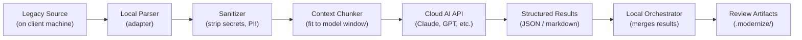

What the AI **receives**: sanitized code chunks, structural summaries, conventions, prompts. Never raw files wholesale.

What the AI **never sees**: credentials, connection strings, PII, API keys, environment variables, internal hostnames.

### Sanitizer

The sanitizer runs locally before any data is sent to the AI. It works in two layers: **auto-discovery** finds common sensitive patterns using deterministic regex scanning, then the user can **override** — adding categories the scanner missed or removing false positives.

#### How it works

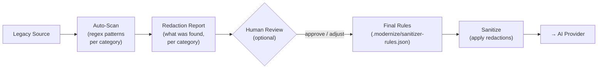

**Step 1 — Auto-discovery** (runs during `modernize init`):

The scanner applies deterministic regex patterns for each category against the codebase and produces a redaction report showing what it found:

```bash
modernize init ./legacy-app --target-stack react:frontend,go:backend

# Output:
# Scanning for sensitive data...
# Found: 12 datasource references, 3 credential patterns, 8 internal hostnames, 2 email addresses
# Categories enabled: datasource, credentials, hostnames, emails
# Review: modernize redact review
```

**Step 2 — Human review/override** (optional):

```bash
# See what was auto-detected
modernize redact review
# → Shows every match per category with file + line number

# Add a category the scanner missed
modernize redact add pii

# Remove a category (e.g., emails are not sensitive for this client)
modernize redact remove emails

# Add custom patterns for things the scanner can't know
modernize redact add-pattern "prod_oracle_*"
modernize redact add-pattern "*.corp.apple.com"
modernize redact add-literal "SpecificInternalTerm"
```

If the user provides `--redact` during init, it overrides auto-discovery entirely:

```bash
# Skip auto-discovery, use only these categories
modernize init ./legacy-app --redact datasource,credentials
```

#### Redaction categories

| Category | Auto-discovery regex | Example |
|----------|---------------------|---------|
| `datasource` | `datasource=`, JDBC strings, DSN patterns, `connectionString` | `datasource="prod_oracle_crm"` → `[DATASOURCE_1]` |
| `credentials` | `password=`, `apikey=`, `token=`, `secret=`, `.pem`/`.key` file refs | `password="Sup3r!"` → `[REDACTED_CREDENTIAL]` |
| `hostnames` | RFC 1918 IPs, `.internal`/`.local`/`.corp` domains, non-public URLs | `api.corp.internal` → `[INTERNAL_HOST_1]` |
| `emails` | Standard email regex | `john@company.com` → `[EMAIL_1]` |
| `pii` | Phone patterns, SSN patterns, common PII field names | `555-0123` → `[PHONE_1]` |
| `env` | `process.env.*`, `${}` env refs, `.env` file contents | `process.env.SECRET` → `[ENV_VAR]` |

Auto-discovery is conservative — it enables a category only if matches are found. The user can always add categories the scanner missed or remove false positives.

#### Custom rules

Final rules are saved to `.modernize/sanitizer-rules.json`:

```json
{
  "auto_discovered": ["datasource", "credentials", "hostnames", "emails"],
  "user_added": ["pii"],
  "user_removed": ["emails"],
  "active_categories": ["datasource", "credentials", "hostnames", "pii"],
  "custom_patterns": [
    "prod_oracle_*",
    "*.corp.apple.com"
  ],
  "literal_redactions": [
    "SpecificInternalTerm"
  ]
}
```

Redacted values are replaced with **stable placeholders** (`[DATASOURCE_1]`, `[DATASOURCE_2]`, etc.) so the AI can still reason about structure ("these two queries use the same datasource") without seeing actual values.

### Trust Levels

Configurable per client — set during `modernize init`:

| Level | Behavior | Best For |
|-------|----------|----------|
| **strict** | Human approves sanitized payload before every AI call | Highly sensitive codebases, first-time clients |
| **standard** | Human reviews and approves once per pipeline stage | Most engagements |
| **trust** | Auto-sanitize with rules, no manual approval needed | Trusted, long-running engagements |

```bash
modernize init ./legacy-app --trust-level standard
```

### Audit Log

Every piece of data sent to an AI API is logged locally:

```
.modernize/audit/
├── 2026-03-31T10-15-00_comprehend_module1.json
├── 2026-03-31T10-15-30_comprehend_module2.json
└── ...
```

Each entry records: timestamp, stage, what was sent (sanitized), what was redacted, which AI provider, response summary. Client can review the full audit trail at any time.

---

## Context Management & AI-Agnostic Design

### Problem

Clients may only have access to smaller AI models with limited context windows (8K-32K tokens). A single ColdFusion file can be thousands of lines. We can't dump the whole codebase into one prompt.

### Solution: Task Decomposition Engine

Every pipeline stage is broken into small, focused **sub-tasks**. Each sub-task gets exactly the context it needs — nothing more.

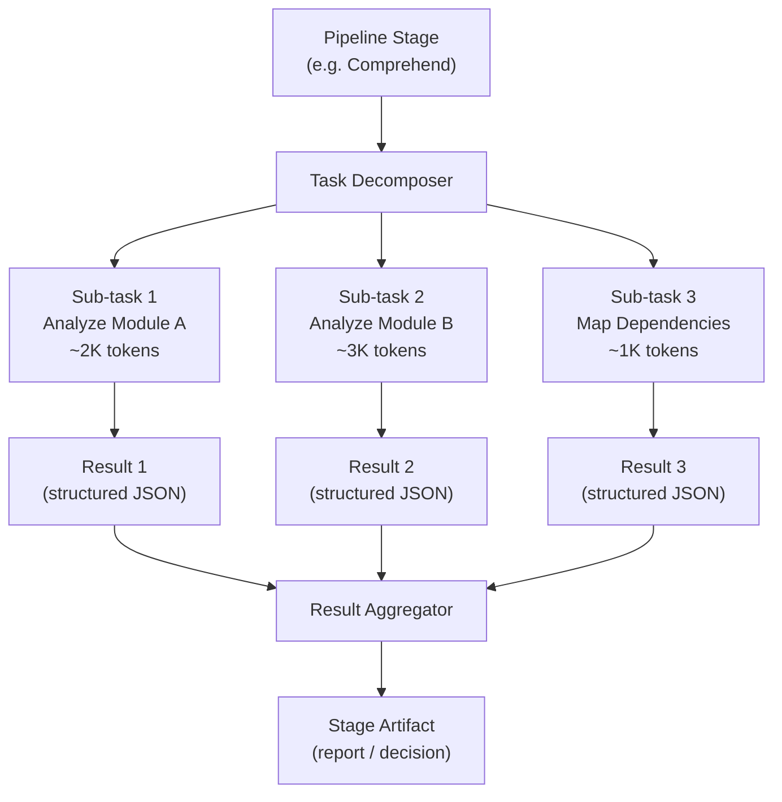

### Context Assembly

For each sub-task, the orchestrator assembles a **context packet**:

| Component | Example | Purpose |
|-----------|---------|---------|
| **Code chunk** | One module or function (sanitized) | The thing being analyzed |
| **Conventions** | "ColdFusion uses `<cfquery>` for SQL" | Language context from adapter |
| **Prior results** | "Module A depends on Module B" | Results from earlier sub-tasks |
| **Prompt** | "Extract business rules from this module" | Stage-specific instruction |
| **Budget** | 4096 tokens max response | Keeps output focused |

The context packet is sized to fit the model's window with room for the response.

### Context Budget System

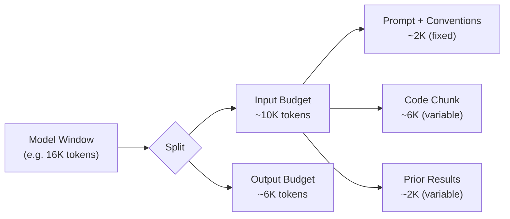

If a module exceeds the code budget, the chunker splits it into multiple sub-tasks (e.g., function-by-function).

### AI Provider Interface

The framework is **AI-agnostic**. Any cloud LLM can be used via a provider adapter:

```
┌────────────────────────────────────┐
│ Orchestrator                       │
│ (assembles context, collects       │
│  results, manages sub-tasks)       │
├────────────────────────────────────┤
│ AI Provider Interface              │
│                                    │
│  sendPrompt(context) → result      │
│  getModelInfo() → { maxTokens }    │
│  estimateTokens(text) → number     │
├─────────┬──────────┬───────────────┤
│ Claude  │ OpenAI   │ Gemini        │
│ Adapter │ Adapter  │ Adapter       │
└─────────┴──────────┴───────────────┘
```

| Method | Purpose |
|--------|---------|
| `sendPrompt(context)` | Send a context packet, get structured result |
| `getModelInfo()` | Return model name, max token window, capabilities |
| `estimateTokens(text)` | Estimate token count for context budgeting |

```bash
# Configure provider and target stack during init
modernize init ./legacy-app --provider claude --model claude-sonnet-4-6 \
  --target-stack react:frontend,go:backend
modernize init ./legacy-app --provider openai --model gpt-4o \
  --target-stack react:frontend,node:backend
```

The provider is just a transport layer. All the intelligence is in the **prompts** (from adapters) and the **orchestration** (task decomposition + result aggregation).

---

## High-Level Architecture

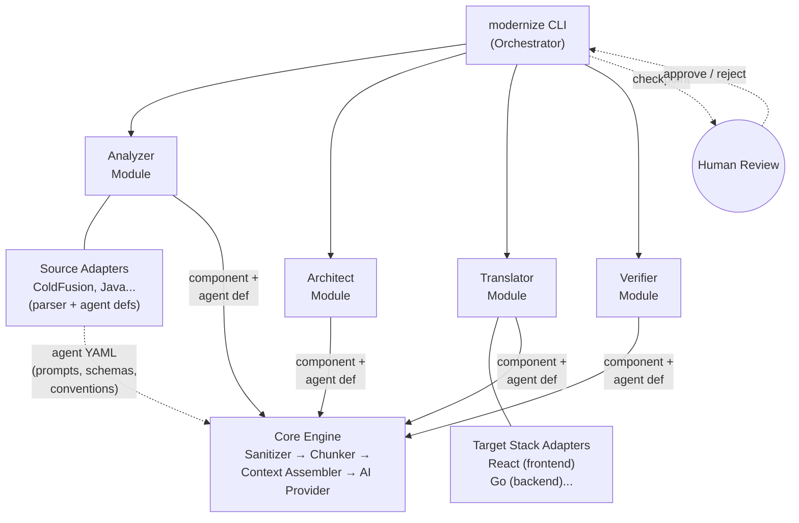

**Five layers:**

| Layer | Role | AI-Powered? |
|-------|------|-------------|
| **CLI Orchestrator** | Pipeline flow, state tracking, human checkpoints | No — deterministic |
| **Pipeline Modules** | Analyzer, Architect, Translator, Verifier — each runs a fixed pipeline of local steps, calling AI only when reasoning is needed | Partially — most steps local |
| **Agent Definitions** | Language-specific prompt templates + output schemas + conventions, declared by source adapters (YAML files) | No — configuration only |
| **Core Engine** | Sanitizer, chunker, context assembler (merges agent def + task + code), result aggregator | No — deterministic |
| **AI Provider** | Abstract interface to any cloud LLM | Pluggable — Claude, GPT, Gemini |

The CLI controls *when* each stage runs. The pipeline modules control *what* happens at each stage. The agent definitions control *how* the AI thinks about each component type. The core engine controls *how much* context each AI call gets and *what* the AI sees. Humans review artifacts between stages.

---

## Pipeline Stages & Checkpoints

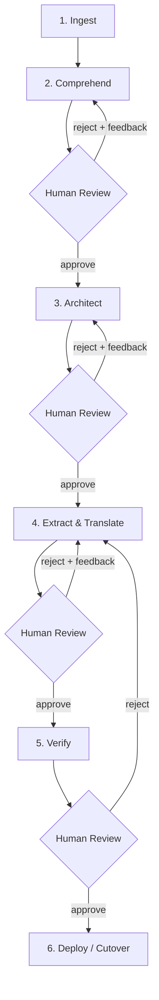

| Stage | What Happens | Output Artifact |
|-------|-------------|-----------------|
| **Ingest** | Detect language, parse files, create project state | `migration.json` |
| **Comprehend** | AI reads legacy code, produces structured docs | Module reports with mermaid diagrams |
| **Architect** | AI recommends target stack + extraction plan | Architecture decision doc |
| **Extract & Translate** | Migrate one module at a time (strangler fig) | New service code + proxy wiring |
| **Verify** | Behavioral equivalence testing | Verification report + test suite |
| **Deploy** | Incremental cutover behind proxy | Routing config |

Each review checkpoint produces **templated, diagram-heavy artifacts** — not AI prose walls. A human should be able to review a module in 30 minutes.

### Execution Modes

Trust levels (strict/standard/trust) control **data security** — what data reaches the AI. Execution modes control **pipeline flow** — whether humans gate each stage.

| Mode | Behavior | Best For |
|------|----------|----------|
| **guided** | Human reviews and approves at every checkpoint (default) | Consulting engagements, first-time migrations |
| **supervised** | AI auto-proceeds when confidence ≥ 85%, pauses below | Client has own models/components, wants speed with safety net |
| **auto** | AI runs entire pipeline end-to-end, no human checkpoints | Client's own infra, trusted models, CI/CD integration |

```bash
modernize init ./legacy-app --execution-mode auto --trust-level trust
```

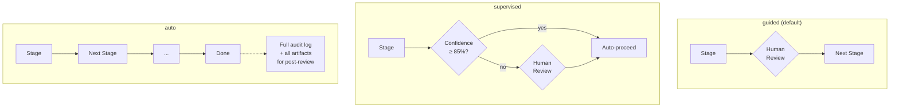

In **auto mode**:
- All stages run sequentially without pausing for human review
- Every artifact is still generated (comprehend reports, architecture blueprint, translation spec, verification reports)
- Confidence scores are still computed — low-confidence decisions are **flagged** in the final summary, not skipped
- The full audit log is available for post-run review
- If verification fails (behavioral diffs detected), the pipeline **stops** — auto mode doesn't deploy broken code

Auto mode is designed for scenarios where the client has their own AI models and component libraries plugged in, and wants to run the pipeline as part of CI/CD or a batch process. The human reviews everything after the run completes, not between stages.

---

## Migration Strategy: Strangler Fig

We don't rewrite everything at once. We extract **service groups** incrementally, deploy them behind a proxy, and route traffic as each group is ready.

### Module ≠ Microservice

A legacy app with 40 ColdFusion files should **not** become 40 microservices. That trades one problem (legacy monolith) for another (distributed monolith that's impossible to operate).

The Architect stage (Stage 3) groups related modules into a small number of **service boundaries** based on:

| Signal | Example |
|--------|---------|
| **Shared data** | Modules that query the same tables belong together |
| **Call frequency** | Modules that constantly call each other should be one service |
| **Domain cohesion** | User management, auth, and profile are one "Users" service |
| **Independent lifecycle** | Reporting can deploy independently from order processing |

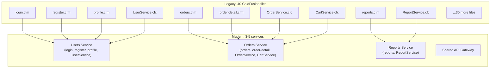

**The target is typically 3-7 services**, not one-per-module. The exact number is a recommendation from the Architect stage, reviewed and approved by the human.

### Strangler Fig Flow (Per Service Group)

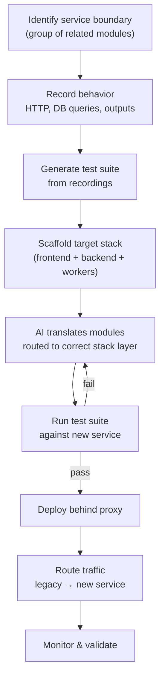

The proxy routes traffic based on which service groups have been migrated:


As service groups migrate, the legacy app shrinks until it can be decommissioned.

---

## Pipeline Module Design

### Why Local Modules, Not MCP Servers?

The pipeline is deterministic — the CLI knows exactly what stage to run and when. AI is only needed for *reasoning* (understanding business logic, generating code), not for deciding *what to do next*. So instead of MCP servers where AI discovers and calls tools interactively, we use **local modules** that call AI surgically when needed.

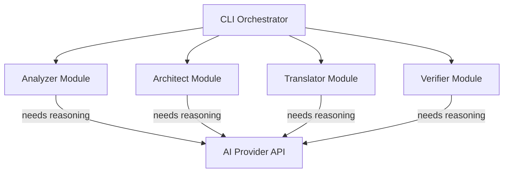

Each module runs a **fixed pipeline** of local steps, only calling the AI for the steps that genuinely require intelligence. This means fewer API calls, lower cost, smaller context requirements, and full control over what data reaches the AI.

### Analyzer Module (Stages 1-2: Ingest + Comprehend)

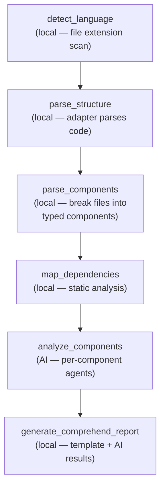

| Step | Local or AI? | What it does |
|------|-------------|-------------|
| `detect_language` | Local | Scan file extensions, match adapter |
| `parse_structure` | Local | Adapter parses modules, routes, DB queries |
| `parse_components` | Local | Break each file into typed components (methods, queries, templates, etc.) |
| `map_dependencies` | Local | Static analysis of includes/invokes/imports |
| `analyze_components` | **AI** | Each component routed to its language-specific agent (cf-logic-agent for CFCs, cf-query-agent for cfquery blocks, etc.) — see Agent System section |
| `generate_comprehend_report` | Local | Fill template with results + mermaid diagrams |

### Architect Module (Stage 3) — Dual-Purpose Output

The Architect stage is the most important consulting deliverable. Many engagements stop here — the client's own team implements. So the output must work for two audiences:

| Output | Audience | Format | Purpose |
|--------|----------|--------|---------|
| **Architecture Blueprint** | Humans (client dev team, stakeholders) | Markdown + mermaid diagrams | Standalone consulting deliverable — implementable without the framework |
| **Translation Spec** | Translator module (machine) | `translation-spec.json` | Drives automated translation when client wants AI-powered implementation |

**Consulting-only engagements**: deliver the blueprint, stop here.
**Full-pipeline engagements**: both are produced, Translator reads the spec.

| Step | Local or AI? | What it does |
|------|-------------|-------------|
| `group_service_boundaries` | **AI** | Analyze dependency graph + shared tables → group modules into 3-7 services |
| `recommend_target_stack` | **AI** | Suggest target stack (frontend + backend + workers) based on app characteristics |
| `map_components` | **AI** | Map legacy components → target stack layers (which goes to frontend vs backend) |
| `define_api_contracts` | **AI** | Define API contracts between services and between frontend/backend |
| `plan_data_migration` | **AI** | Legacy tables → new schema, migration scripts needed |
| `plan_migration_order` | **AI** | Sequence service groups by dependency + risk |
| `generate_architecture_blueprint` | Local | Fill template with recommendations + diagrams (human deliverable) |
| `generate_translation_spec` | Local | Produce structured JSON spec for Translator module (machine input) |

#### Architecture Blueprint (Human Deliverable)

The blueprint is a standalone document rich enough for a dev team to implement from:

```
┌──────────────────────────────────────────────────┐
│ Target Stack (table)                             │
│ Role | Technology | Rationale                    │
│ frontend: React + Vite                           │
│ backend: Go + Chi router                         │
│ workers: Go (cron jobs)                          │
├──────────────────────────────────────────────────┤
│ Service Boundaries (table + diagram)             │
│ Service | Modules | Shared Tables | Why          │
├──────────────────────────────────────────────────┤
│ Component Mapping (table)                        │
│ Legacy Component | Target | Stack Layer | Agent  │
│ login.cfm → LoginPage.tsx | frontend | UI Agent  │
│ UserService.cfc → user_handler.go | backend      │
│ <cfquery> → /api/users endpoint | backend        │
├──────────────────────────────────────────────────┤
│ API Contracts (per service)                      │
│ Endpoint | Method | Request | Response           │
├──────────────────────────────────────────────────┤
│ Data Model Migration (table + diagram)           │
│ Legacy Table | New Schema | Changes | Notes      │
├──────────────────────────────────────────────────┤
│ Migration Order (mermaid diagram)                │
│ Per service group, not per module                │
├──────────────────────────────────────────────────┤
│ Infrastructure Recommendations                   │
│ Hosting, CI/CD, monitoring, deployment strategy  │
└──────────────────────────────────────────────────┘
```

#### Translation Spec (Machine Input)

The `translation-spec.json` is consumed by the Translator module:

```json
{
  "targetStack": [
    { "role": "frontend", "adapter": "react", "framework": "vite+react" },
    { "role": "backend", "adapter": "go", "framework": "chi" },
    { "role": "workers", "adapter": "go", "framework": "cron" }
  ],
  "serviceGroups": [
    {
      "name": "users-service",
      "modules": ["login", "register", "profile", "UserService"],
      "componentRouting": [
        { "component": "login.cfm", "agent": "ui", "targetRole": "frontend" },
        { "component": "UserService.cfc", "agent": "logic", "targetRole": "backend" },
        { "component": "getUserQuery", "agent": "db", "targetRole": "backend" }
      ]
    }
  ],
  "apiContracts": [
    { "service": "users-service", "endpoint": "/api/users", "method": "GET", "response": "User[]" }
  ],
  "clientComponents": ".modernize/components/"
}
```

### Translator Module (Stage 4) — Specialized Agents

Translation is the most complex stage. A generic "translate this code" prompt won't work — translating a `<cfquery>` into an API endpoint requires different expertise than translating a ColdFusion page into a React component.

The translator module reads the **translation spec** from the Architect stage and routes each component to a **specialized agent**. Each agent targets a specific **stack layer** — UI Agent outputs to the frontend adapter (React), DB Agent outputs to the backend adapter (Go), etc.

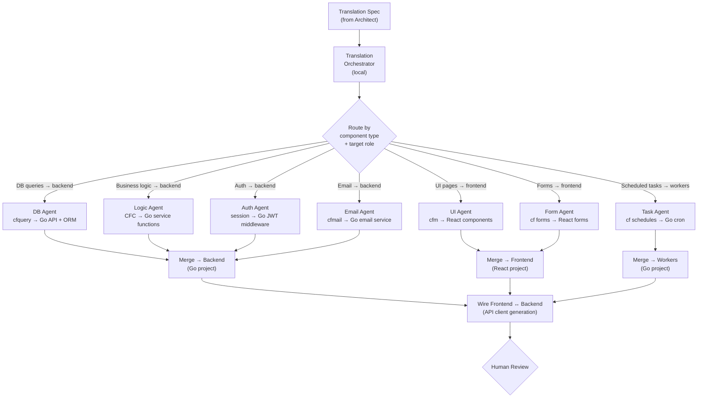

| Agent | Target Role | Translates | Domain Knowledge |
|-------|------------|-----------|-----------------|
| **DB Agent** | backend | `<cfquery>` → API endpoints + query layer | SQL dialects, parameterization, ORM patterns, N+1 prevention |
| **UI Agent** | frontend | `.cfm` pages → React components | Template → JSX, state management, routing |
| **Logic Agent** | backend | CFC methods → service functions | Business rule preservation, error handling |
| **Auth Agent** | backend | Session scope → auth middleware | Session → JWT, role-based access, middleware |
| **Form Agent** | frontend | CF form handling → React forms | Validation, file uploads, multi-step forms |
| **Task Agent** | workers | Scheduled tasks → cron / workers | CF scheduled tasks, `<cfschedule>` → job queues |
| **Email Agent** | backend | `<cfmail>` → email service | SMTP → transactional email API (SendGrid, SES, etc.) |

Each agent is an **AI call** with a specialized prompt. The routing and merging are **local** — the orchestrator reads the translation spec, classifies each component, sends it to the right agent with the right target adapter's conventions, and stitches the results together per stack layer.

#### Agent specializations are declared by adapters

Different language pairs need different agents. The **source adapter** declares which agent types exist and which **target role** each outputs to:

| Source Language | Specialized Agents | Target Roles |
|----------------|-------------------|-------------|
| **ColdFusion** | DB, UI, Logic, Auth, Form, Task, Email | frontend (React) + backend (Go) + workers (Go) |
| **Java** | DB, UI, Logic, Auth, Concurrency, DI | frontend + backend |
| **COBOL** | DB, Business Logic, File I/O, Reports | backend + batch |

#### Client Component Registry

Clients often have their own design systems, component libraries, and API patterns. The framework supports plugging these in so translation agents use client-specific components instead of generic ones.

```
.modernize/components/
├── manifest.json          # Registry of available client components
├── ui/                    # Frontend component specs
│   ├── AppleButton.md     # Props, usage examples, when to use
│   ├── AppleTable.md
│   └── AppleForm.md
└── api/                   # Backend patterns
    ├── auth-middleware.md  # Client's standard auth pattern
    └── db-access.md       # Client's preferred ORM / query patterns
```

```json
{
  "frontend": {
    "components": {
      "Button": { "use": "AppleButton", "import": "@apple-ds/components", "docs": "ui/AppleButton.md" },
      "Table": { "use": "AppleTable", "import": "@apple-ds/components" },
      "Form": { "use": "AppleForm", "import": "@apple-ds/forms" }
    }
  },
  "backend": {
    "patterns": {
      "auth": { "use": "apple-auth-middleware", "docs": "api/auth-middleware.md" },
      "db": { "use": "apple-db-client", "docs": "api/db-access.md" }
    }
  }
}
```

When the UI Agent translates a ColdFusion form, it receives the client's component registry as context: *"Use `<AppleForm>` from `@apple-ds/forms`, not generic HTML forms."* This works with any AI model — the components are just additional context in the prompt.

Client AI models are also supported — if the client has a fine-tuned model, it plugs in via the existing AI Provider Interface.

| Step | Local or AI? | What it does |
|------|-------------|-------------|
| `load_translation_spec` | Local | Read spec from Architect stage, load client components |
| `scaffold_stack` | Local | Create project skeletons for each stack layer via target adapters |
| `classify_components` | Local | Route each component to agent + target role per spec |
| `translate_*` (per agent) | **AI** | Specialized translation with target adapter conventions + client components |
| `merge_per_layer` | Local | Combine agent outputs per stack layer (frontend, backend, workers) |
| `wire_stack` | Local | Generate API client, proxy config, shared types between layers |

### Verifier Module (Stage 5)

| Step | Local or AI? | What it does |
|------|-------------|-------------|
| `record_behavior` | Local | Capture legacy app HTTP I/O and DB queries |
| `replay_against_new` | Local | Run same inputs against new service |
| `diff_outputs` | Local | Compare legacy vs new responses |
| `analyze_diffs` | **AI** | Diffs routed to language-specific agents (cf-query-agent for query diffs, cf-ui-agent for output diffs) to explain behavioral differences |
| `generate_test_suite` | Local + AI | Create permanent tests from recordings |

---

## Agent System — How AI Calls Work (Zoomed In)

Every AI call in the framework goes through a **language-specific agent**. An agent is not a running process or a server — it's a **configuration** (prompt template + output schema + conventions) that shapes how the AI thinks about a specific type of component in a specific language.

### Why Language-Specific Agents?

A generic "analyze this code" prompt with some conventions sprinkled in won't produce quality output. Different languages have fundamentally different paradigms:

| Language | Query Pattern | UI Pattern | Business Logic | State Model |
|----------|--------------|-----------|---------------|-------------|
| **ColdFusion** | `<cfquery>` inline SQL with var interpolation | `.cfm` HTML templates with embedded CF tags | CFC components with scope hierarchy | session/application/request scopes |
| **Java** | JDBC / JPA / Hibernate annotations | JSP / Thymeleaf / Swing | Spring beans, dependency injection | HttpSession, application context |
| **COBOL** | Embedded SQL, VSAM, DB2 calls | CICS screens, BMS maps | PROCEDURE DIVISION paragraphs | WORKING-STORAGE, FILE SECTION |

These aren't just syntax differences — they're **different mental models**. The AI needs to think differently about ColdFusion scope management than COBOL copybook structures. Specialized agents provide that focused expertise.

### Agent = Configuration, Not Code

Each agent is a declarative definition stored in the source adapter:

```
adapters/source/coldfusion/agents/
├── cf-query-agent.yaml        # Understands cfquery, datasources, stored procs
├── cf-ui-agent.yaml           # Understands cfm templates, cfoutput, cfform
├── cf-logic-agent.yaml        # Understands CFC services, scope hierarchy
├── cf-auth-agent.yaml         # Understands session management, access control
├── cf-form-agent.yaml         # Understands CF form handling, validation
├── cf-task-agent.yaml         # Understands cfschedule, background tasks
└── cf-email-agent.yaml        # Understands cfmail, SMTP integration
```

An agent definition contains:

```yaml
# cf-query-agent.yaml
name: cf-query-agent
appliesTo: ["cfquery", "cfstoredproc", "cfprocparam", "queryExecute"]

systemPrompt: |
  You are an expert in ColdFusion database access patterns.
  You understand cfquery tag syntax, datasource architecture,
  cfqueryparam for SQL injection prevention, query-of-queries,
  stored procedure calls via cfstoredproc, and the queryExecute()
  function in CFScript.

conventions: |
  - <cfquery name="qUsers" datasource="#dsn#"> defines a named query
  - <cfqueryparam cfsqltype="cf_sql_varchar" value="#id#"> = parameterized binding
  - query-of-queries: SELECT from an existing query result set (in-memory join)
  - returntype="query" on CFC methods = returns a query object
  - datasource names often reference JNDI or CF Admin configured DSNs

outputSchema:
  queries:
    - name: string           # query name attribute
      sql: string            # the SQL statement
      tables: string[]       # tables referenced
      operation: string      # SELECT / INSERT / UPDATE / DELETE
      parameterized: boolean # uses cfqueryparam?
      calledFrom: string     # which function/template
      businessRule: string   # what this query serves
      confidence: number     # 0-100

stages: [comprehend, translate, verify]  # which pipeline stages use this agent
```

### Agents Are Used Across ALL Stages

The same agent definitions serve both comprehension and translation — not just translation:

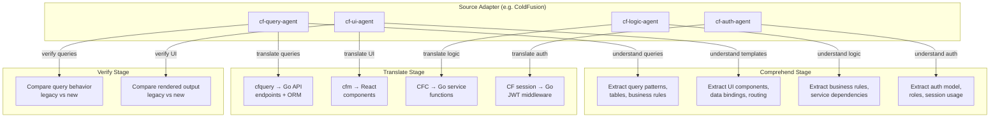

The agent's `systemPrompt` and `conventions` stay the same. The **task instruction** changes per stage:
- Comprehend: "Extract business rules from these queries"
- Translate: "Convert these queries to Go API endpoints"
- Verify: "Explain why these query results differ"

### Zoomed In: How a Single AI Call Works

When a pipeline module needs AI, here's the exact flow — tracing `extract_business_rules` for `UserService.cfc`:

```mermaid
flowchart TD
    subgraph "1. Module prepares"
        M1["Analyzer reads\nUserService.cfc"] --> M2["Adapter classifies:\ncfc → cf-logic-agent"]
        M2 --> M3["Load prior results\nfrom .modernize/\n(dependency map)"]
    end

    subgraph "2. Sanitize"
        M3 --> S1["Sanitizer scans code\nagainst redaction rules"]
        S1 --> S2["Replace matches\nwith stable placeholders"]
        S2 --> S3["Return sanitized code\n+ redaction map"]
    end

    subgraph "3. Budget & Chunk"
        S3 --> B1["Get model budget\nprovider.getModelInfo()\n→ e.g. 16K tokens"]
        B1 --> B2["Estimate token count\nprovider.estimateTokens()"]
        B2 --> B3{"Fits in\nbudget?"}
        B3 -->|yes| B4["1 context packet"]
        B3 -->|no| B5["Chunker splits\nby function/method\n→ N context packets"]
    end

    subgraph "4. Assemble Context Packet"
        B4 --> A1["Agent system prompt\n(cf-logic-agent)"]
        B5 --> A1
        A1 --> A2["+ Agent conventions\n(CFC patterns, scopes)"]
        A2 --> A3["+ Task instruction\n(from pipeline module)"]
        A3 --> A4["+ Prior results\n(from disk)"]
        A4 --> A5["+ Sanitized code chunk"]
        A5 --> A6["+ Output schema\n(expected JSON shape)"]
    end

    subgraph "5. AI Call"
        A6 --> P1["provider.sendPrompt(\ncontextPacket)"]
        P1 --> P2["AI returns\nstructured JSON"]
        P2 --> P3["Validate against\noutput schema"]
        P3 --> P4["Log to audit\n(.modernize/audit/)"]
    end

    subgraph "6. Aggregate & Store"
        P4 --> G1{"Multiple\nchunks?"}
        G1 -->|yes| G2["Aggregator merges\nchunk results"]
        G1 -->|no| G3["Use result directly"]
        G2 --> G4["Write to disk\n(.modernize/comprehend/\nUserService.md)"]
        G3 --> G4
    end
```

### Context Packet Assembly (Detail)

The context packet is assembled from multiple sources. Here's what it looks like for the cf-logic-agent analyzing `UserService.cfc`:

```
┌─────────────────────────────────────────────────────────┐
│ CONTEXT PACKET                                          │
├─────────────────────────────────────────────────────────┤
│                                                         │
│ ┌─── Agent System Prompt (from cf-logic-agent) ───────┐ │
│ │ "You are an expert in ColdFusion business logic.    │ │
│ │  You understand CFC components, cffunction,         │ │
│ │  variables/this/session scope hierarchy..."          │ │
│ └─────────────────────────────────────────────────────┘ │
│                                                         │
│ ┌─── Agent Conventions (from cf-logic-agent) ─────────┐ │
│ │ "- CFCs use <cffunction> with access=public/private │ │
│ │  - variables scope = instance state (private)       │ │
│ │  - this scope = public properties                   │ │
│ │  - init() = constructor pattern..."                 │ │
│ └─────────────────────────────────────────────────────┘ │
│                                                         │
│ ┌─── Task Instruction (from pipeline module) ─────────┐ │
│ │ "Extract business rules from this CFC service.      │ │
│ │  For each rule, identify: name, description,        │ │
│ │  inputs, outputs, and which method implements it."  │ │
│ └─────────────────────────────────────────────────────┘ │
│                                                         │
│ ┌─── Prior Results (from .modernize/ on disk) ────────┐ │
│ │ "UserService depends on: DatabaseService,           │ │
│ │  EmailService. It queries tables: users, sessions,  │ │
│ │  roles. Called by: login.cfm, register.cfm."        │ │
│ └─────────────────────────────────────────────────────┘ │
│                                                         │
│ ┌─── Sanitized Code (from sanitizer) ─────────────────┐ │
│ │ <cfcomponent>                                       │ │
│ │   <cffunction name="authenticate">                  │ │
│ │     <cfquery datasource="[DATASOURCE_1]">           │ │
│ │       SELECT * FROM users                           │ │
│ │       WHERE email = <cfqueryparam value="#email#">   │ │
│ │     </cfquery>                                      │ │
│ │     ...                                             │ │
│ │   </cffunction>                                     │ │
│ │ </cfcomponent>                                      │ │
│ └─────────────────────────────────────────────────────┘ │
│                                                         │
│ ┌─── Output Schema (from cf-logic-agent) ─────────────┐ │
│ │ Return JSON: { rules: [{ name, description,         │ │
│ │   inputs, outputs, method, confidence }] }          │ │
│ └─────────────────────────────────────────────────────┘ │
│                                                         │
│ Token budget: ~10K input / ~6K output                   │
└─────────────────────────────────────────────────────────┘
```

### Agent Resolution: How the Right Agent Is Selected

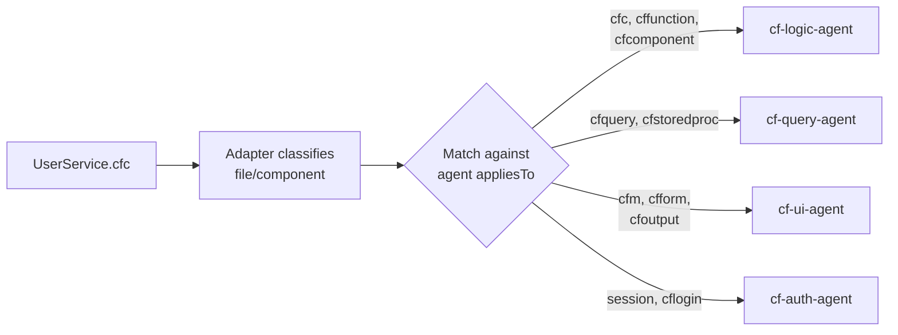

A single file can match **multiple agents**. `UserService.cfc` might contain both business logic (cffunction methods) and inline queries (cfquery blocks). The adapter classifies each **component within the file** separately:

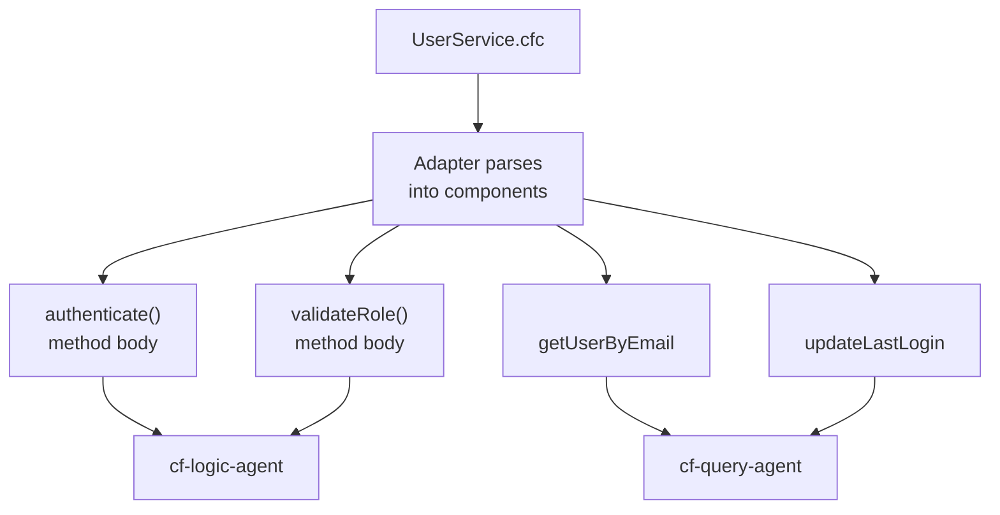

### Team Ownership

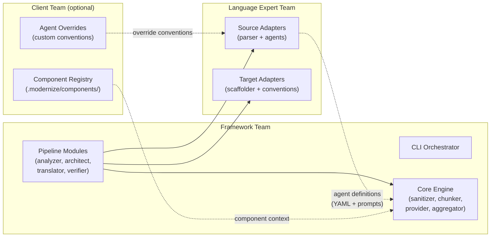

| Team | Owns | Changes when... |
|------|------|-----------------|
| **Framework team** | CLI, core engine, pipeline modules | New pipeline features, execution modes, provider support |
| **Language experts** | Source adapters (parsers + agent definitions), target adapters | New language support, improved agent prompts, new agent types |
| **Client team** (optional) | Component registry, agent convention overrides | Client-specific design system, unusual legacy patterns |

Adding a new language = writing agent YAML files + a parser. No framework code changes required.

---

## Adapter Plugin System

Adapters are the language-specific modules. The pipeline stages are the same regardless of source/target — adapters provide the language-specific parsing, agent definitions, and conventions.

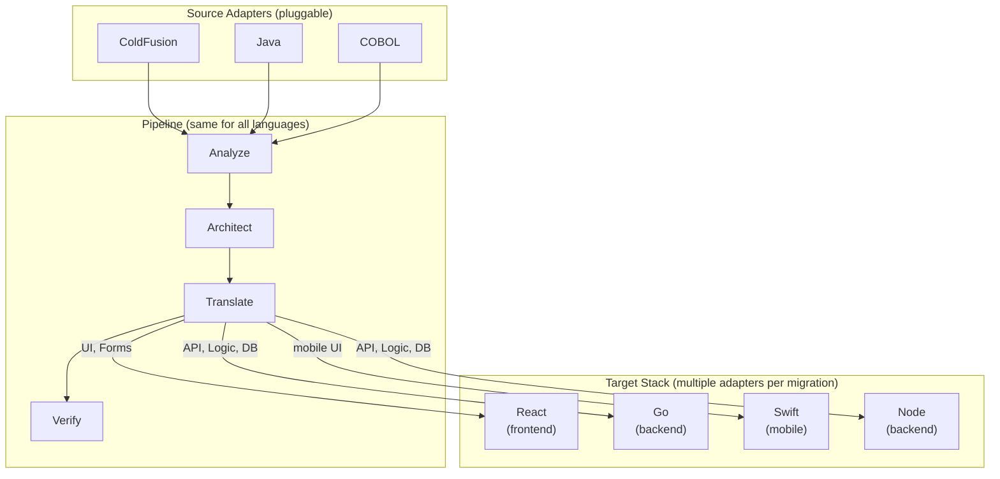

A migration uses **one source adapter** and **multiple target adapters** (one per stack layer). For example, ColdFusion → React (frontend) + Go (backend) activates both the React and Go target adapters simultaneously.

### Source Adapter Contract

A source adapter knows how to **read** a legacy language and provides the agent definitions for AI analysis:

| Method | Purpose |
|--------|---------|
| `detect(files)` | Does this codebase use my language? |
| `parseStructure(path)` | Extract modules, routes, DB queries |
| `parseComponents(file)` | Break a file into typed components (methods, queries, templates, etc.) |
| `getAgentDefinitions()` | Returns all agent YAML definitions for this language |
| `classifyComponent(component)` | Match a component to the right agent via `appliesTo` rules |
| `getConventions()` | General framework patterns (used as fallback if no agent matches) |

### Target Adapter Contract

A target adapter knows how to **write** in a modern language. Each adapter declares its **role** in the stack:

| Method | Purpose |
|--------|---------|
| `role()` | Stack layer this adapter handles: `frontend`, `backend`, `workers`, `mobile` |
| `scaffold(config)` | Set up project skeleton (build tools, folder structure) |
| `getConventions()` | Idiomatic patterns as context for the AI |
| `getPrompts()` | Language-tuned AI prompts for each stage |
| `generateProxy(module)` | Strangler fig proxy wiring for this module |
| `getClientComponents()` | Load client component registry for this stack layer (if provided) |

### Adding a New Language Pair

To add ColdFusion → React + Go support:
1. Create a `ColdFusionAdapter` implementing `SourceAdapter` (declares 7 agents, maps each to a target role)
2. Create a `ReactAdapter` implementing `TargetAdapter` with `role: frontend`
3. Create a `GoAdapter` implementing `TargetAdapter` with `role: backend`
4. Register all three — the pipeline handles the rest

To add Java → Node support:
1. Create a `JavaAdapter` implementing `SourceAdapter`
2. Create a `NodeAdapter` implementing `TargetAdapter` with `role: backend`
3. If Java app has a web UI: also create/reuse `ReactAdapter` with `role: frontend`

The adapters provide **context and prompts** to the AI. The AI does the actual comprehension and translation, guided by language-specific knowledge. Multiple target adapters work together — each receives output only from the agents mapped to its stack role.

---

## Review Artifact Templates

The key design constraint: **reviewable in 30 minutes per module**. Tables and diagrams, not paragraphs.

### Comprehend Report (per module)

```
┌─────────────────────────────────────────┐
│ Module: CustomerService                 │
├─────────────────────────────────────────┤
│ Purpose: 2-3 sentences max              │
├─────────────────────────────────────────┤
│ Component Inventory (table)             │
│ Name | Type | Purpose | Dependencies    │
├─────────────────────────────────────────┤
│ Data Flow (mermaid diagram)             │
├─────────────────────────────────────────┤
│ Business Rules (numbered list)          │
├─────────────────────────────────────────┤
│ Database Interactions (table)           │
│ Query | Tables | Operation | Called From │
├─────────────────────────────────────────┤
│ Risk Areas (bullet list)                │
├─────────────────────────────────────────┤
│ AI Confidence: 87%                      │
└─────────────────────────────────────────┘
```

### Architecture Blueprint (Human Deliverable)

This is the **standalone consulting deliverable** — the most important output of the framework. It must follow a **strict template** to ensure consistency across engagements and prevent AI-generated prose walls.

**Design principle: diagrams first, tables second, prose last.** Since the AI generates this document, the template enforces structure — every section either requires a diagram or a table. Free-text is limited to 2-3 sentence summaries. Diagrams can be generated via mermaid (inline) or via diagramming tools like Excalidraw (exported as images and embedded).

> **TODO**: The architecture blueprint template is a separate deliverable that needs detailed design. It defines the exact sections, required diagram types, table schemas, and formatting rules. The template ensures the AI produces a consistent, scannable document regardless of the source language or target stack.

The template should cover at minimum:

```
┌──────────────────────────────────────────────────┐
│ 1. Executive Summary                             │
│    2-3 sentences. What was found, what is         │
│    recommended, estimated effort.                 │
├──────────────────────────────────────────────────┤
│ 2. Legacy Application Overview                   │
│    DIAGRAM: Application structure (modules,       │
│    dependencies, data flow)                       │
│    TABLE: Module inventory with complexity scores │
├──────────────────────────────────────────────────┤
│ 3. Target Stack Recommendation                   │
│    TABLE: Role | Technology | Rationale           │
│    DIAGRAM: Target stack layer diagram            │
├──────────────────────────────────────────────────┤
│ 4. Service Boundary Design                       │
│    DIAGRAM: Which legacy modules → which services │
│    TABLE: Service | Modules | Shared Tables | Why │
├──────────────────────────────────────────────────┤
│ 5. Component Mapping                             │
│    TABLE: Legacy Component → Target Component     │
│    → Stack Layer → Translation Agent              │
├──────────────────────────────────────────────────┤
│ 6. API Contracts                                 │
│    TABLE: Per service — endpoints, methods,       │
│    request/response shapes                        │
│    DIAGRAM: Service-to-service communication      │
├──────────────────────────────────────────────────┤
│ 7. Data Model Migration                          │
│    DIAGRAM: Legacy schema → new schema (ER)       │
│    TABLE: Legacy Table | New Schema | Changes     │
├──────────────────────────────────────────────────┤
│ 8. Migration Order & Sequencing                  │
│    DIAGRAM: Service group dependency + order       │
│    TABLE: Phase | Service Group | Risk | Effort   │
├──────────────────────────────────────────────────┤
│ 9. Strangler Fig Strategy                        │
│    DIAGRAM: Proxy routing — what migrates when    │
├──────────────────────────────────────────────────┤
│ 10. Infrastructure Recommendations               │
│     TABLE: Hosting, CI/CD, monitoring, deployment │
├──────────────────────────────────────────────────┤
│ 11. Risk Register                                │
│     TABLE: Risk | Impact | Mitigation | Owner     │
├──────────────────────────────────────────────────┤
│ 12. AI Confidence Summary                        │
│     TABLE: Section | Confidence | Flagged Items   │
└──────────────────────────────────────────────────┘
```

For consulting-only engagements, this is the final deliverable. For full-pipeline engagements, a `translation-spec.json` is also produced alongside it (see Architect Module above) that drives automated translation.

### Verification Report

```
┌─────────────────────────────────────────┐
│ Module: CustomerService                 │
├─────────────────────────────────────────┤
│ Test Results Summary (table)            │
│ Endpoint | Status | Legacy | New | Match │
├─────────────────────────────────────────┤
│ Behavioral Diffs (if any)               │
├─────────────────────────────────────────┤
│ Generated Test Count                    │
├─────────────────────────────────────────┤
│ Verdict: PASS / FAIL / NEEDS REVIEW     │
└─────────────────────────────────────────┘
```

---

## AI Confidence & Auto-Proceed

Each stage output includes a confidence score (0-100%):

| Confidence | guided mode | supervised mode | auto mode |
|-----------|------------|----------------|-----------|
| 85-100% | Human skims, approves quickly | Auto-proceed | Auto-proceed |
| 60-84% | Human must review and approve | Human must review and approve | Auto-proceed (flagged in summary) |
| < 60% | Mandatory expert review | Mandatory expert review | Auto-proceed (flagged as **high risk** in summary) |

In all modes, low-confidence decisions are **logged** — never silently skipped. In auto mode, the final summary highlights every decision below 85% so the human can review them post-run.

---

## Human Expert Input

Not all knowledge lives in the code. The framework provides channels for human input:

| Command | Purpose |
|---------|---------|
| `modernize annotate <module> --note "..."` | Add domain knowledge to a module |
| `modernize override <module> --field <x> --value <y>` | Override an AI decision |
| `modernize context --file business-rules.md` | Feed domain docs into AI context |

Human notes are attached to modules and included in the AI context for all subsequent stages.

---

## CLI Workflow

```bash
# 1. Point at legacy codebase (configure provider, trust level, target stack)
modernize init ./coldfusion-app \
  --provider claude \
  --trust-level standard \
  --target-stack react:frontend,go:backend
# → Detects ColdFusion, parses structure, creates .modernize/
# → Trust levels: strict (approve each AI call), standard (approve per stage), trust (auto)
# → Target stack: react for frontend, go for backend API layer

# 2. AI analyzes the code
modernize comprehend
# → Produces module reports with diagrams

# 3. Human reviews
modernize review comprehend
# → Approve: modernize review comprehend --approve
# → Reject:  modernize review comprehend --reject --feedback "..."

# 4. AI designs target architecture (uses target stack from init)
modernize architect
# → Uses target stack configured during init (react:frontend + go:backend)
# → Produces architecture blueprint (human deliverable) + translation spec (machine input)

# 5. Human reviews architecture
modernize review architect

# 6. Migrate one service group at a time
modernize extract users-service
# → Reads translation spec, scaffolds React frontend + Go backend for this service
# → Routes each module to specialized agents → correct stack layer
# → login.cfm → UI Agent → React, UserService.cfc → Logic Agent → Go, etc.

# 6a. (Optional) Register client components before translation
modernize components register ./our-design-system/
# → Loads client component manifest into .modernize/components/
# → Translation agents use client components instead of generic ones

# 7. Human reviews translated code
modernize review extract users-service

# 8. Verify behavioral equivalence
modernize verify users-service

# 9. Check overall progress
modernize status

# 10. Add human knowledge at any time
modernize annotate user-service --note "Also handles CSV bulk imports"

# 11. Review what data was sent to AI
modernize audit
# → Shows summary of all AI API calls, what was sent, what was redacted

# --- Auto Mode (run entire pipeline without human checkpoints) ---

# Run everything end-to-end
modernize run --all
# → Runs: ingest → comprehend → architect → extract (all groups) → verify
# → All artifacts generated, confidence scores computed, audit log written
# → Pauses ONLY if verification fails (behavioral diffs)

# Review everything after the run
modernize summary
# → Shows: what was migrated, confidence scores, flagged decisions, verification results

# Review a specific stage's output post-run
modernize review comprehend
modernize review architect
```

---

## State Management

All state lives in `.modernize/` within the project directory:

```
.modernize/
├── migration.json          # Project config, target stack, service group statuses
├── config.json             # Provider, trust level, model settings
├── sanitizer-rules.json    # Custom redaction rules (client-specific)
├── audit/                  # Log of every AI API call (what was sent/redacted)
├── components/             # Client component registry (optional)
│   ├── manifest.json       # Component → import mappings per stack layer
│   ├── ui/                 # Frontend component docs (props, usage)
│   └── api/                # Backend pattern docs (auth, DB access)
├── comprehend/             # Comprehend stage reports
│   ├── comprehend-report.md
│   └── modules/
│       ├── CustomerService.md
│       └── login.md
├── architecture/           # Architecture stage artifacts
│   ├── architecture-blueprint.md   # Human deliverable (consulting doc)
│   └── translation-spec.json       # Machine input (for Translator)
├── services/               # Per-service translation state (multi-target)
│   └── user-service/
│       ├── frontend/       # React output for this service
│       ├── backend/        # Go output for this service
│       ├── translation-report.md
│       └── source-mapping.json
└── recordings/             # Behavior recordings for verification
    └── user-service/
        ├── recording-001.json
        └── test-suite.spec.ts
```

`migration.json` tracks the overall state:

```json
{
  "project": "legacy-crm",
  "source": {
    "language": "coldfusion",
    "framework": "coldbox",
    "path": "./legacy-app"
  },
  "targetStack": [
    { "role": "frontend", "adapter": "react", "framework": "vite+react", "path": "./modern-app/frontend" },
    { "role": "backend", "adapter": "go", "framework": "chi", "path": "./modern-app/backend" },
    { "role": "workers", "adapter": "go", "framework": "cron", "path": "./modern-app/workers" }
  ],
  "clientComponents": ".modernize/components/",
  "serviceGroups": [
    {
      "name": "users-service",
      "modules": ["login", "register", "profile", "UserService"],
      "sharedTables": ["users", "sessions", "roles"],
      "status": "migrated",
      "confidence": 91
    },
    {
      "name": "orders-service",
      "modules": ["orders", "order-detail", "OrderService", "CartService"],
      "sharedTables": ["orders", "order_items", "cart"],
      "status": "in_progress",
      "confidence": 67,
      "humanNotes": [
        "Complex tax calculation — needs domain expert"
      ]
    },
    {
      "name": "reports-service",
      "modules": ["reports", "ReportService"],
      "sharedTables": ["orders", "customers"],
      "status": "pending",
      "confidence": 0
    }
  ],
  "checkpoint": "extract:orders-service"
}
```

---

## Project Structure

```
modernize/
├── cli/                        # CLI orchestrator
│   ├── commands/               # One file per command
│   └── state/                  # State management logic
│
├── core/                       # Core engine (AI-agnostic)
│   ├── decomposer/             # Task decomposition engine
│   │   ├── chunker             # Splits code to fit context windows
│   │   └── assembler           # Builds context packets per sub-task
│   ├── sanitizer/              # Data redaction before AI calls
│   │   ├── rules               # Built-in redaction patterns
│   │   └── audit               # Logs every AI API call
│   ├── providers/              # AI provider adapters
│   │   ├── interface            # Abstract provider contract
│   │   ├── claude               # Anthropic Claude adapter
│   │   ├── openai               # OpenAI GPT adapter
│   │   └── gemini               # Google Gemini adapter
│   └── aggregator/             # Merges sub-task results into stage artifacts
│
├── pipeline/                   # Pipeline modules (one per stage)
│   ├── analyzer/               # Ingest + Comprehend (mostly local, AI for business rules)
│   ├── architect/              # Architecture design (AI for grouping + recommendations)
│   ├── translator/             # Code generation (AI via specialized agents)
│   └── verifier/               # Behavior comparison (mostly local, AI for diff analysis)
│
├── adapters/                   # Language-specific adapters
│   ├── source/                 # Source adapters (ColdFusion, Java, ...)
│   │   └── coldfusion/
│   │       ├── parser           # CFML/CFC parsing + component classification
│   │       ├── conventions      # General framework patterns (fallback)
│   │       └── agents/          # Agent definitions (YAML + prompt templates)
│   │           ├── cf-query-agent.yaml
│   │           ├── cf-ui-agent.yaml
│   │           ├── cf-logic-agent.yaml
│   │           ├── cf-auth-agent.yaml
│   │           ├── cf-form-agent.yaml
│   │           ├── cf-task-agent.yaml
│   │           └── cf-email-agent.yaml
│   └── target/                 # Target stack adapters (role-based)
│       ├── react/              # role: frontend
│       │   ├── scaffolder       # Vite + React project setup
│       │   ├── conventions      # Component patterns, hooks, routing
│       │   └── prompts/         # React-specific AI prompts
│       └── go/                 # role: backend / workers
│           ├── scaffolder       # Go module + Chi router setup
│           ├── conventions      # Go idioms, error handling, packages
│           └── prompts/         # Go-specific AI prompts
│
└── templates/                  # Review artifact templates
```

---

## Implementation Phases

### Phase 1: Foundation + Core Engine
- CLI orchestrator with `init` and `status` commands
- State management (`.modernize/` directory)
- Adapter interface definitions (source, target, AI provider)
- AI provider interface + Claude adapter (first provider)
- Sanitizer with built-in redaction rules
- Trust level configuration (strict / standard / trust)
- Audit logging for all AI API calls
- Task decomposer + context budget system
- Result aggregator

### Phase 2: Analyzer Module + ColdFusion Adapter
- Analyzer pipeline module (local parsing + AI for business rule extraction)
- ColdFusion source adapter (CFML parser, query extraction, dependency mapping)
- Comprehend report generator (templated markdown + mermaid)
- `comprehend` and `review comprehend` commands

### Phase 3: Architect Module (Dual-Purpose Output)
- Architect pipeline module (AI for service boundary grouping, stack recommendations, component mapping, API contracts)
- Architecture blueprint generator (human consulting deliverable)
- Translation spec generator (`translation-spec.json` for Translator module)
- Service boundary grouping logic
- `architect` and `review architect` commands

### Phase 4: Translator Module + React/Go Adapters
- Translator pipeline module with specialized agents (DB, UI, Logic, Auth, Form, Task, Email)
- Multi-target routing: agents → correct stack layer per translation spec
- React target adapter (Vite scaffolder, role: frontend)
- Go target adapter (Chi scaffolder, role: backend)
- Client component registry support (`.modernize/components/`)
- Cross-layer wiring (API client generation, shared types)
- Strangler fig proxy generator
- `extract`, `components register`, and `review extract` commands

### Phase 5: Verifier Module
- Behavior recorder (HTTP interception, DB query capture)
- Replay + diff engine (local)
- AI-powered diff analysis for behavioral differences
- Test suite generator from recordings
- `verify` command

### Phase 6: Polish
- Human annotation system (`annotate`, `context`, `override`)
- Confidence scoring and auto-proceed logic
- Migration dashboard
- End-to-end test with real ColdFusion codebase
