# Modernize — AI-Powered Legacy App Modernization Framework

## Problem

Legacy applications (ColdFusion, Java, COBOL, etc.) need to be rewritten in modern stacks (React, Go, Swift, etc.). The core challenges:

- **No documentation** — code has poor naming, no comments, no specs
- **Obscure languages** — scarce human expertise available
- **High stakes** — downtime during migration means revenue loss
- **Scale** — full app rewrites are massive, error-prone projects

## Solution

An AI-powered modernization pipeline with a CLI orchestrator and local pipeline modules. The AI is called surgically — only for tasks that require reasoning (understanding business logic, generating code). Everything else (parsing, dependency mapping, report generation) runs locally with zero AI involvement. Humans gate every critical decision through structured review checkpoints.

**First target:** ColdFusion → React

---

## Data Security & Processing Model

### Threat Model

Clients have NDAs. Source code is sensitive. The framework must ensure clients feel secure about what leaves their machine.

**Principle: Local-first.** All parsing, state management, and file operations run on the client's machine. Code never leaves the machine in raw form.

### Data Flow

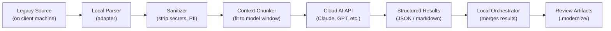

What the AI **receives**: sanitized code chunks, structural summaries, conventions, prompts. Never raw files wholesale.

What the AI **never sees**: credentials, connection strings, PII, API keys, environment variables, internal hostnames.

### Sanitizer

The sanitizer runs locally before any data is sent to the AI. Rather than trying to auto-detect secrets (which leads to false positives and missed items), the **user declares what to redact** during project setup.

```bash
modernize init ./legacy-app --redact datasource,credentials,hostnames,emails
```

This is fully deterministic — the user is accountable for what they declare, and the audit log proves only declared-safe data left the machine.

#### Redaction categories (user selects during init)

| Category | What gets redacted | Example |
|----------|-------------------|---------|
| `datasource` | DB connection names, JDBC strings, DSN references | `datasource="prod_oracle_crm"` → `[DATASOURCE_1]` |
| `credentials` | Passwords, API keys, tokens, secrets in config | `password="Sup3r!"` → `[REDACTED_CREDENTIAL]` |
| `hostnames` | Internal hosts, IPs, private domains | `api.corp.internal` → `[INTERNAL_HOST_1]` |
| `emails` | Email addresses | `john@company.com` → `[EMAIL_1]` |
| `pii` | Phone numbers, SSNs, names in data fixtures | `555-0123` → `[PHONE_1]` |
| `env` | Environment variable references, `.env` contents | `process.env.SECRET` → `[ENV_VAR]` |

#### Custom rules

Clients add project-specific patterns via `.modernize/sanitizer-rules.json`:

```json
{
  "redact_categories": ["datasource", "credentials", "hostnames"],
  "custom_patterns": [
    "prod_oracle_*",
    "*.corp.apple.com"
  ],
  "literal_redactions": [
    "SpecificInternalTerm"
  ]
}
```

Redacted values are replaced with **stable placeholders** (`[DATASOURCE_1]`, `[DATASOURCE_2]`, etc.) so the AI can still reason about structure ("these two queries use the same datasource") without seeing actual values.

### Trust Levels

Configurable per client — set during `modernize init`:

| Level | Behavior | Best For |
|-------|----------|----------|
| **strict** | Human approves sanitized payload before every AI call | Highly sensitive codebases, first-time clients |
| **standard** | Human reviews and approves once per pipeline stage | Most engagements |
| **trust** | Auto-sanitize with rules, no manual approval needed | Trusted, long-running engagements |

```bash
modernize init ./legacy-app --trust-level standard
```

### Audit Log

Every piece of data sent to an AI API is logged locally:

```
.modernize/audit/
├── 2026-03-31T10-15-00_comprehend_module1.json
├── 2026-03-31T10-15-30_comprehend_module2.json
└── ...
```

Each entry records: timestamp, stage, what was sent (sanitized), what was redacted, which AI provider, response summary. Client can review the full audit trail at any time.

---

## Context Management & AI-Agnostic Design

### Problem

Clients may only have access to smaller AI models with limited context windows (8K-32K tokens). A single ColdFusion file can be thousands of lines. We can't dump the whole codebase into one prompt.

### Solution: Task Decomposition Engine

Every pipeline stage is broken into small, focused **sub-tasks**. Each sub-task gets exactly the context it needs — nothing more.

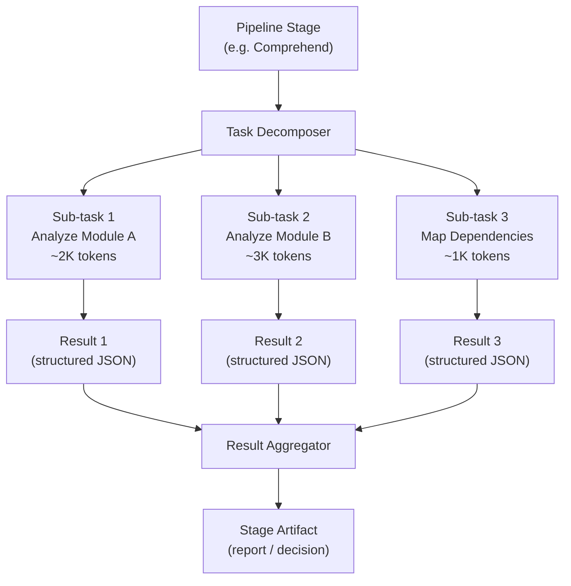

### Context Assembly

For each sub-task, the orchestrator assembles a **context packet**:

| Component | Example | Purpose |
|-----------|---------|---------|
| **Code chunk** | One module or function (sanitized) | The thing being analyzed |
| **Conventions** | "ColdFusion uses `<cfquery>` for SQL" | Language context from adapter |
| **Prior results** | "Module A depends on Module B" | Results from earlier sub-tasks |
| **Prompt** | "Extract business rules from this module" | Stage-specific instruction |
| **Budget** | 4096 tokens max response | Keeps output focused |

The context packet is sized to fit the model's window with room for the response.

### Context Budget System

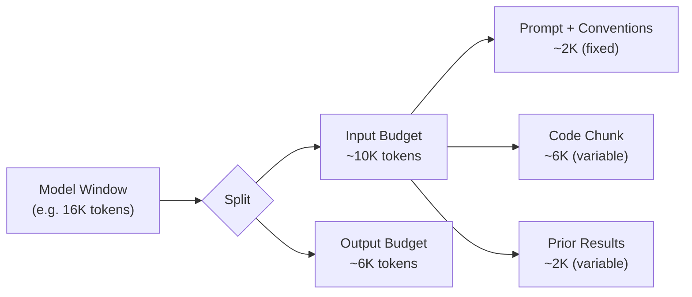

If a module exceeds the code budget, the chunker splits it into multiple sub-tasks (e.g., function-by-function).

### AI Provider Interface

The framework is **AI-agnostic**. Any cloud LLM can be used via a provider adapter:

```
┌────────────────────────────────────┐
│ Orchestrator                       │
│ (assembles context, collects       │
│  results, manages sub-tasks)       │
├────────────────────────────────────┤
│ AI Provider Interface              │
│                                    │
│  sendPrompt(context) → result      │
│  getModelInfo() → { maxTokens }    │
│  estimateTokens(text) → number     │
├─────────┬──────────┬───────────────┤
│ Claude  │ OpenAI   │ Gemini        │
│ Adapter │ Adapter  │ Adapter       │
└─────────┴──────────┴───────────────┘
```

| Method | Purpose |
|--------|---------|
| `sendPrompt(context)` | Send a context packet, get structured result |
| `getModelInfo()` | Return model name, max token window, capabilities |
| `estimateTokens(text)` | Estimate token count for context budgeting |

```bash
# Configure provider during init or globally
modernize init ./legacy-app --provider claude --model claude-sonnet-4-6
modernize init ./legacy-app --provider openai --model gpt-4o
```

The provider is just a transport layer. All the intelligence is in the **prompts** (from adapters) and the **orchestration** (task decomposition + result aggregation).

---

## High-Level Architecture

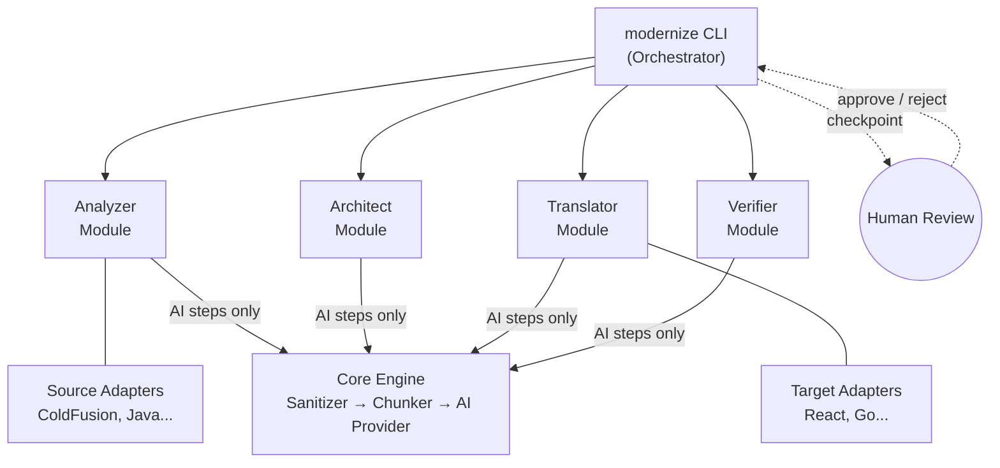

**Four layers:**

| Layer | Role | AI-Powered? |
|-------|------|-------------|
| **CLI Orchestrator** | Pipeline flow, state tracking, human checkpoints | No — deterministic |
| **Pipeline Modules** | Analyzer, Architect, Translator, Verifier — each runs a fixed pipeline of local steps, calling AI only when reasoning is needed | Partially — most steps local |
| **Core Engine** | Task decomposer, sanitizer, context assembler, result aggregator | No — deterministic |
| **AI Provider** | Abstract interface to any cloud LLM | Pluggable — Claude, GPT, Gemini |

The CLI controls *when* each stage runs. The pipeline modules control *what* happens at each stage. The core engine controls *how much* context each AI call gets and *what* the AI sees. Humans review artifacts between stages.

---

## Pipeline Stages & Checkpoints

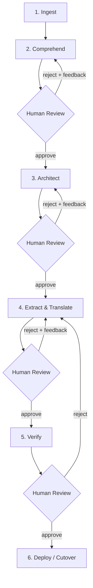

| Stage | What Happens | Output Artifact |
|-------|-------------|-----------------|
| **Ingest** | Detect language, parse files, create project state | `migration.json` |
| **Comprehend** | AI reads legacy code, produces structured docs | Module reports with mermaid diagrams |
| **Architect** | AI recommends target stack + extraction plan | Architecture decision doc |
| **Extract & Translate** | Migrate one module at a time (strangler fig) | New service code + proxy wiring |
| **Verify** | Behavioral equivalence testing | Verification report + test suite |
| **Deploy** | Incremental cutover behind proxy | Routing config |

Each review checkpoint produces **templated, diagram-heavy artifacts** — not AI prose walls. A human should be able to review a module in 30 minutes.

---

## Migration Strategy: Strangler Fig

We don't rewrite everything at once. We extract **service groups** incrementally, deploy them behind a proxy, and route traffic as each group is ready.

### Module ≠ Microservice

A legacy app with 40 ColdFusion files should **not** become 40 microservices. That trades one problem (legacy monolith) for another (distributed monolith that's impossible to operate).

The Architect stage (Stage 3) groups related modules into a small number of **service boundaries** based on:

| Signal | Example |
|--------|---------|
| **Shared data** | Modules that query the same tables belong together |
| **Call frequency** | Modules that constantly call each other should be one service |
| **Domain cohesion** | User management, auth, and profile are one "Users" service |
| **Independent lifecycle** | Reporting can deploy independently from order processing |

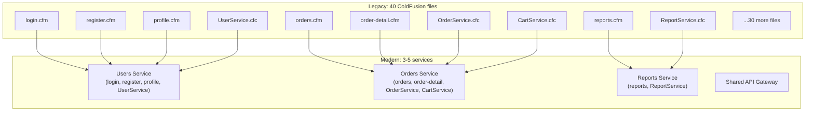

**The target is typically 3-7 services**, not one-per-module. The exact number is a recommendation from the Architect stage, reviewed and approved by the human.

### Strangler Fig Flow (Per Service Group)

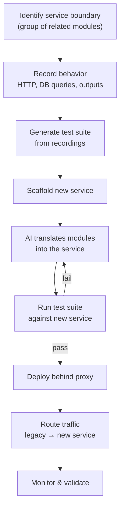

The proxy routes traffic based on which service groups have been migrated:

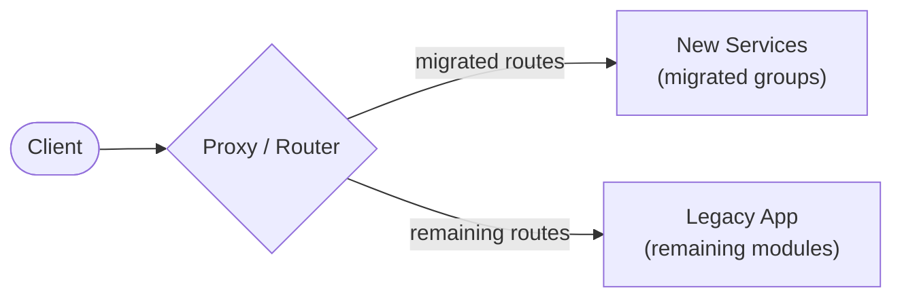

As service groups migrate, the legacy app shrinks until it can be decommissioned.

---

## Pipeline Module Design

### Why Local Modules, Not MCP Servers?

The pipeline is deterministic — the CLI knows exactly what stage to run and when. AI is only needed for *reasoning* (understanding business logic, generating code), not for deciding *what to do next*. So instead of MCP servers where AI discovers and calls tools interactively, we use **local modules** that call AI surgically when needed.

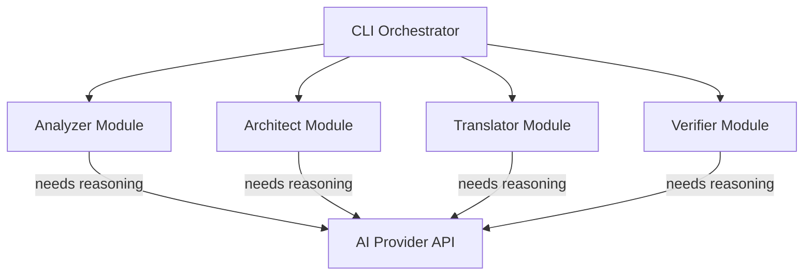

Each module runs a **fixed pipeline** of local steps, only calling the AI for the steps that genuinely require intelligence. This means fewer API calls, lower cost, smaller context requirements, and full control over what data reaches the AI.

### Analyzer Module (Stages 1-2: Ingest + Comprehend)

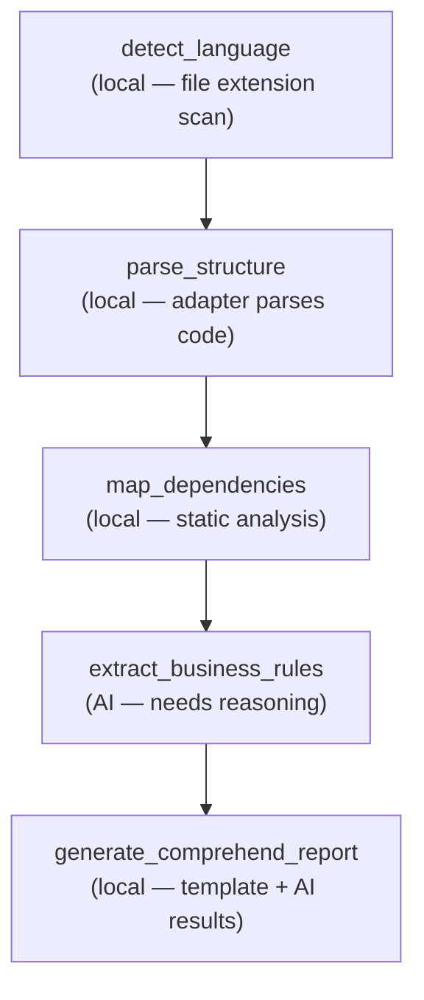

| Step | Local or AI? | What it does |
|------|-------------|-------------|
| `detect_language` | Local | Scan file extensions, match adapter |
| `parse_structure` | Local | Adapter parses modules, routes, DB queries |
| `map_dependencies` | Local | Static analysis of includes/invokes/imports |
| `extract_business_rules` | **AI** | Read sanitized code, identify business logic |
| `generate_comprehend_report` | Local | Fill template with results + mermaid diagrams |

### Architect Module (Stage 3)

| Step | Local or AI? | What it does |
|------|-------------|-------------|
| `group_service_boundaries` | **AI** | Analyze dependency graph + shared tables → group modules into 3-7 services |
| `recommend_stack` | **AI** | Suggest target tech based on app characteristics |
| `plan_migration_order` | **AI** | Sequence service groups by dependency + risk |
| `generate_architecture_report` | Local | Fill template with recommendations + diagrams |

### Translator Module (Stage 4) — Specialized Agents

Translation is the most complex stage. A generic "translate this code" prompt won't work — translating a `<cfquery>` into an API endpoint requires different expertise than translating a ColdFusion page into a React component.

The translator module routes each component to a **specialized agent** — each agent is a focused AI call with domain-specific prompts and conventions:

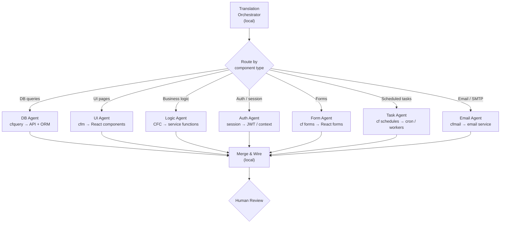

| Agent | Translates | Domain Knowledge |
|-------|-----------|-----------------|
| **DB Agent** | `<cfquery>` → API endpoints + query layer | SQL dialects, parameterization, ORM patterns, N+1 prevention |
| **UI Agent** | `.cfm` pages → React components | Template → JSX, state management, routing |
| **Logic Agent** | CFC methods → service functions | Business rule preservation, error handling |
| **Auth Agent** | Session scope → auth system | Session → JWT, role-based access, middleware |
| **Form Agent** | CF form handling → React forms | Validation, file uploads, multi-step forms |
| **Task Agent** | Scheduled tasks → cron / workers | CF scheduled tasks, `<cfschedule>` → job queues |
| **Email Agent** | `<cfmail>` → email service | SMTP → transactional email API (SendGrid, SES, etc.) |

Each agent is an **AI call** with a specialized prompt. The routing and merging are **local** — the orchestrator reads the comprehend report, classifies each component, sends it to the right agent, and stitches the results together.

#### Agent specializations are declared by adapters

Different language pairs need different agents. The **source adapter** declares which agent types exist:

| Source Language | Specialized Agents |
|----------------|-------------------|
| **ColdFusion** | DB, UI, Logic, Auth, Form, Task, Email |
| **Java** | DB, UI, Logic, Auth, Concurrency, Dependency Injection |
| **COBOL** | DB, Business Logic, File I/O, Report Generation |

| Step | Local or AI? | What it does |
|------|-------------|-------------|
| `scaffold_service` | Local | Create project skeleton via target adapter |
| `classify_components` | Local | Route each component to the right agent |
| `translate_*` (per agent) | **AI** | Specialized translation with focused context |
| `merge_and_wire` | Local | Combine agent outputs, wire imports, generate proxy |

### Verifier Module (Stage 5)

| Step | Local or AI? | What it does |
|------|-------------|-------------|
| `record_behavior` | Local | Capture legacy app HTTP I/O and DB queries |
| `replay_against_new` | Local | Run same inputs against new service |
| `diff_outputs` | Local | Compare legacy vs new responses |
| `analyze_diffs` | **AI** | Explain behavioral differences, suggest fixes |
| `generate_test_suite` | Local + AI | Create permanent tests from recordings |

---

## Adapter Plugin System

Adapters are the language-specific modules. The pipeline stages are the same regardless of source/target — adapters provide the language-specific parsing, conventions, and prompts.

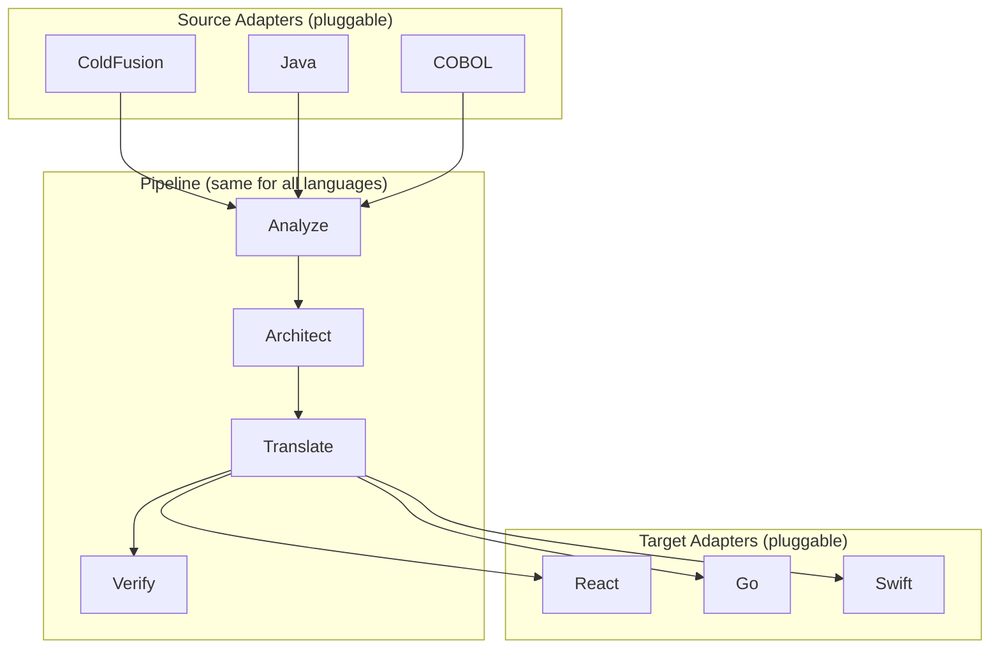

### Source Adapter Contract

A source adapter knows how to **read** a legacy language:

| Method | Purpose |
|--------|---------|
| `detect(files)` | Does this codebase use my language? |
| `parseStructure(path)` | Extract modules, routes, DB queries |
| `extractBusinessRules(module)` | Identify business logic as structured rules |
| `getConventions()` | Framework patterns as context for the AI |
| `getPrompts()` | Language-tuned AI prompts for each stage |
| `getTranslationAgents()` | Declares which specialized agents this language needs + their prompts |
| `classifyComponent(component)` | Routes a component to the right translation agent type |

### Target Adapter Contract

A target adapter knows how to **write** in a modern language:

| Method | Purpose |
|--------|---------|
| `scaffold(config)` | Set up project skeleton (build tools, folder structure) |
| `getConventions()` | Idiomatic patterns as context for the AI |
| `getPrompts()` | Language-tuned AI prompts for each stage |
| `generateProxy(module)` | Strangler fig proxy wiring for this module |

### Adding a New Language Pair

To add Java → Go support:
1. Create a `JavaAdapter` implementing `SourceAdapter`
2. Create a `GoAdapter` implementing `TargetAdapter`
3. Register both adapters — the pipeline handles the rest

The adapters provide **context and prompts** to the AI. The AI does the actual comprehension and translation, guided by language-specific knowledge.

---

## Review Artifact Templates

The key design constraint: **reviewable in 30 minutes per module**. Tables and diagrams, not paragraphs.

### Comprehend Report (per module)

```
┌─────────────────────────────────────────┐
│ Module: CustomerService                 │
├─────────────────────────────────────────┤
│ Purpose: 2-3 sentences max              │
├─────────────────────────────────────────┤
│ Component Inventory (table)             │
│ Name | Type | Purpose | Dependencies    │
├─────────────────────────────────────────┤
│ Data Flow (mermaid diagram)             │
├─────────────────────────────────────────┤
│ Business Rules (numbered list)          │
├─────────────────────────────────────────┤
│ Database Interactions (table)           │
│ Query | Tables | Operation | Called From │
├─────────────────────────────────────────┤
│ Risk Areas (bullet list)                │
├─────────────────────────────────────────┤
│ AI Confidence: 87%                      │
└─────────────────────────────────────────┘
```

### Architecture Decision

```
┌──────────────────────────────────────────────────┐
│ Recommended Stack (table)                        │
│ Layer | Technology | Rationale                    │
├──────────────────────────────────────────────────┤
│ Service Boundaries (table)                       │
│ Service | Modules Included | Shared Tables | Why │
├──────────────────────────────────────────────────┤
│ Service Boundary Diagram (mermaid)               │
│ Shows which modules group into which service     │
├──────────────────────────────────────────────────┤
│ Migration Order (mermaid diagram)                │
│ Per service group, not per module                │
├──────────────────────────────────────────────────┤
│ Strangler Fig Strategy (mermaid diagram)         │
└──────────────────────────────────────────────────┘
```

### Verification Report

```
┌─────────────────────────────────────────┐
│ Module: CustomerService                 │
├─────────────────────────────────────────┤
│ Test Results Summary (table)            │
│ Endpoint | Status | Legacy | New | Match │
├─────────────────────────────────────────┤
│ Behavioral Diffs (if any)               │
├─────────────────────────────────────────┤
│ Generated Test Count                    │
├─────────────────────────────────────────┤
│ Verdict: PASS / FAIL / NEEDS REVIEW     │
└─────────────────────────────────────────┘
```

---

## AI Confidence & Auto-Proceed

Each stage output includes a confidence score (0-100%):

| Confidence | Review Depth | Action |
|-----------|-------------|--------|
| 85-100% | Skim | Human can approve quickly |
| 60-84% | Standard | Human must review and approve |
| < 60% | Deep | Mandatory expert review, AI flags specific uncertainties |

When no human expert is available, the AI proceeds but **logs all low-confidence decisions** for later audit. Nothing is silently skipped.

---

## Human Expert Input

Not all knowledge lives in the code. The framework provides channels for human input:

| Command | Purpose |
|---------|---------|
| `modernize annotate <module> --note "..."` | Add domain knowledge to a module |
| `modernize override <module> --field <x> --value <y>` | Override an AI decision |
| `modernize context --file business-rules.md` | Feed domain docs into AI context |

Human notes are attached to modules and included in the AI context for all subsequent stages.

---

## CLI Workflow

```bash
# 1. Point at legacy codebase (configure provider + trust level)
modernize init ./coldfusion-app --provider claude --trust-level standard
# → Detects ColdFusion, parses structure, creates .modernize/
# → Trust levels: strict (approve each AI call), standard (approve per stage), trust (auto)

# 2. AI analyzes the code
modernize comprehend
# → Produces module reports with diagrams

# 3. Human reviews
modernize review comprehend
# → Approve: modernize review comprehend --approve
# → Reject:  modernize review comprehend --reject --feedback "..."

# 4. AI designs target architecture
modernize architect --target react

# 5. Human reviews architecture
modernize review architect

# 6. Migrate one service group at a time
modernize extract users-service
# → Translates all modules in the group (login, register, profile, UserService)
# → Each module routed to specialized agents (UI, Auth, Logic, DB, etc.)

# 7. Human reviews translated code
modernize review extract users-service

# 8. Verify behavioral equivalence
modernize verify users-service

# 9. Check overall progress
modernize status

# 10. Add human knowledge at any time
modernize annotate user-service --note "Also handles CSV bulk imports"

# 11. Review what data was sent to AI
modernize audit
# → Shows summary of all AI API calls, what was sent, what was redacted
```

---

## State Management

All state lives in `.modernize/` within the project directory:

```
.modernize/
├── migration.json          # Project config, module statuses, checkpoint
├── config.json             # Provider, trust level, model settings
├── sanitizer-rules.json    # Custom redaction rules (client-specific)
├── audit/                  # Log of every AI API call (what was sent/redacted)
├── comprehend/             # Comprehend stage reports
│   ├── comprehend-report.md
│   └── modules/
│       ├── CustomerService.md
│       └── login.md
├── architecture/           # Architecture decision artifacts
│   └── architecture-decision.md
├── modules/                # Per-module translation state
│   └── user-service/
│       ├── translation-report.md
│       └── source-mapping.json
└── recordings/             # Behavior recordings for verification
    └── user-service/
        ├── recording-001.json
        └── test-suite.spec.ts
```

`migration.json` tracks the overall state:

```json
{
  "project": "legacy-crm",
  "source": {
    "language": "coldfusion",
    "framework": "coldbox",
    "path": "./legacy-app"
  },
  "target": {
    "language": "react",
    "framework": "vite+react",
    "path": "./modern-app"
  },
  "serviceGroups": [
    {
      "name": "users-service",
      "modules": ["login", "register", "profile", "UserService"],
      "sharedTables": ["users", "sessions", "roles"],
      "status": "migrated",
      "confidence": 91
    },
    {
      "name": "orders-service",
      "modules": ["orders", "order-detail", "OrderService", "CartService"],
      "sharedTables": ["orders", "order_items", "cart"],
      "status": "in_progress",
      "confidence": 67,
      "humanNotes": [
        "Complex tax calculation — needs domain expert"
      ]
    },
    {
      "name": "reports-service",
      "modules": ["reports", "ReportService"],
      "sharedTables": ["orders", "customers"],
      "status": "pending",
      "confidence": 0
    }
  ],
  "checkpoint": "extract:orders-service"
}
```

---

## Project Structure

```
modernize/
├── cli/                        # CLI orchestrator
│   ├── commands/               # One file per command
│   └── state/                  # State management logic
│
├── core/                       # Core engine (AI-agnostic)
│   ├── decomposer/             # Task decomposition engine
│   │   ├── chunker             # Splits code to fit context windows
│   │   └── assembler           # Builds context packets per sub-task
│   ├── sanitizer/              # Data redaction before AI calls
│   │   ├── rules               # Built-in redaction patterns
│   │   └── audit               # Logs every AI API call
│   ├── providers/              # AI provider adapters
│   │   ├── interface            # Abstract provider contract
│   │   ├── claude               # Anthropic Claude adapter
│   │   ├── openai               # OpenAI GPT adapter
│   │   └── gemini               # Google Gemini adapter
│   └── aggregator/             # Merges sub-task results into stage artifacts
│
├── pipeline/                   # Pipeline modules (one per stage)
│   ├── analyzer/               # Ingest + Comprehend (mostly local, AI for business rules)
│   ├── architect/              # Architecture design (AI for grouping + recommendations)
│   ├── translator/             # Code generation (AI via specialized agents)
│   └── verifier/               # Behavior comparison (mostly local, AI for diff analysis)
│
├── adapters/                   # Language-specific adapters
│   ├── source/                 # Source adapters (ColdFusion, Java, ...)
│   │   └── coldfusion/
│   │       ├── parser           # CFML/CFC parsing
│   │       ├── conventions      # Framework pattern knowledge
│   │       └── prompts/         # Language-tuned AI prompts
│   └── target/                 # Target adapters (React, Go, ...)
│       └── react/
│           ├── scaffolder       # Vite + React project setup
│           ├── conventions      # Idiomatic patterns
│           └── prompts/         # Language-tuned AI prompts
│
└── templates/                  # Review artifact templates
```

---

## Implementation Phases

### Phase 1: Foundation + Core Engine
- CLI orchestrator with `init` and `status` commands
- State management (`.modernize/` directory)
- Adapter interface definitions (source, target, AI provider)
- AI provider interface + Claude adapter (first provider)
- Sanitizer with built-in redaction rules
- Trust level configuration (strict / standard / trust)
- Audit logging for all AI API calls
- Task decomposer + context budget system
- Result aggregator

### Phase 2: Analyzer Module + ColdFusion Adapter
- Analyzer pipeline module (local parsing + AI for business rule extraction)
- ColdFusion source adapter (CFML parser, query extraction, dependency mapping)
- Comprehend report generator (templated markdown + mermaid)
- `comprehend` and `review comprehend` commands

### Phase 3: Architect Module
- Architect pipeline module (AI for service boundary grouping + recommendations)
- Service boundary grouping logic
- Seam identification (dependency analysis → extraction candidates)
- `architect` and `review architect` commands

### Phase 4: Translator Module + React Adapter
- Translator pipeline module with specialized agents (DB, UI, Logic, Auth, Form, Task, Email)
- React target adapter (Vite scaffolder, component generator)
- Strangler fig proxy generator
- `extract` and `review extract` commands

### Phase 5: Verifier Module
- Behavior recorder (HTTP interception, DB query capture)
- Replay + diff engine (local)
- AI-powered diff analysis for behavioral differences
- Test suite generator from recordings
- `verify` command

### Phase 6: Polish
- Human annotation system (`annotate`, `context`, `override`)
- Confidence scoring and auto-proceed logic
- Migration dashboard
- End-to-end test with real ColdFusion codebase
