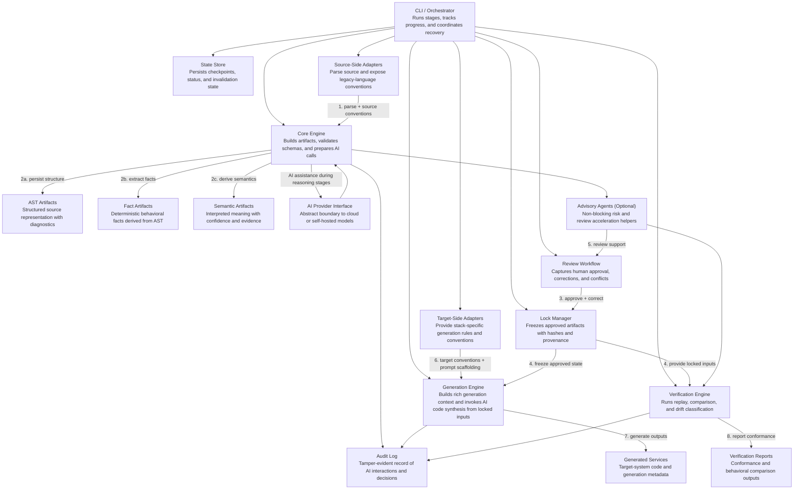
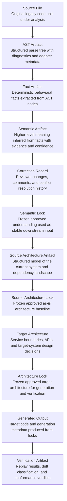
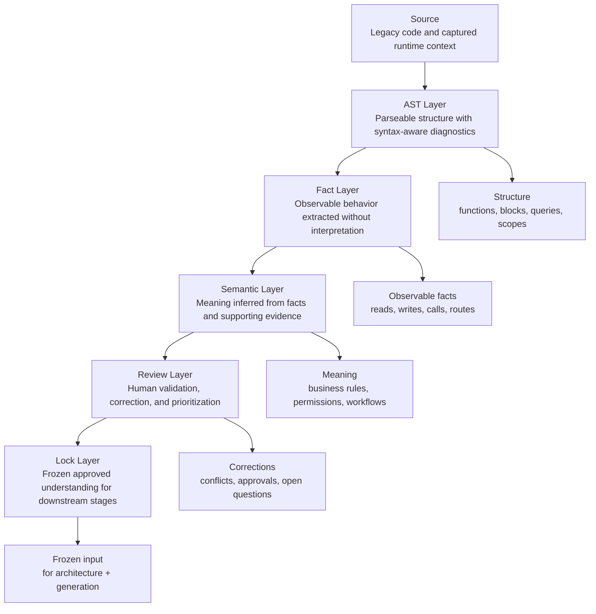
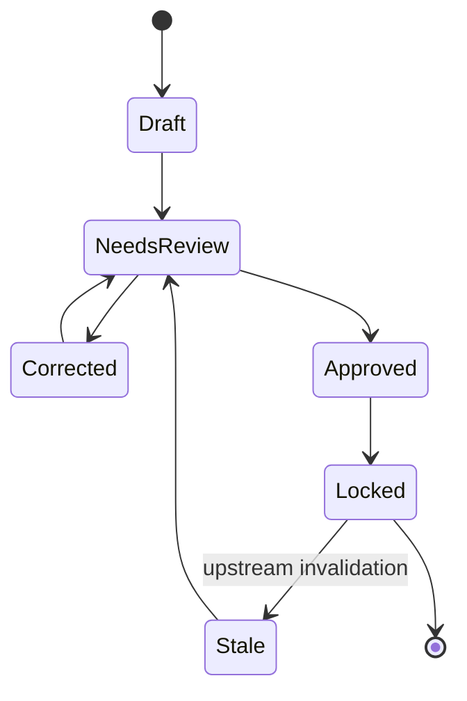
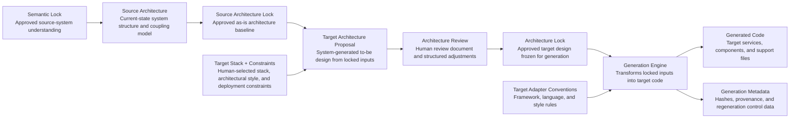
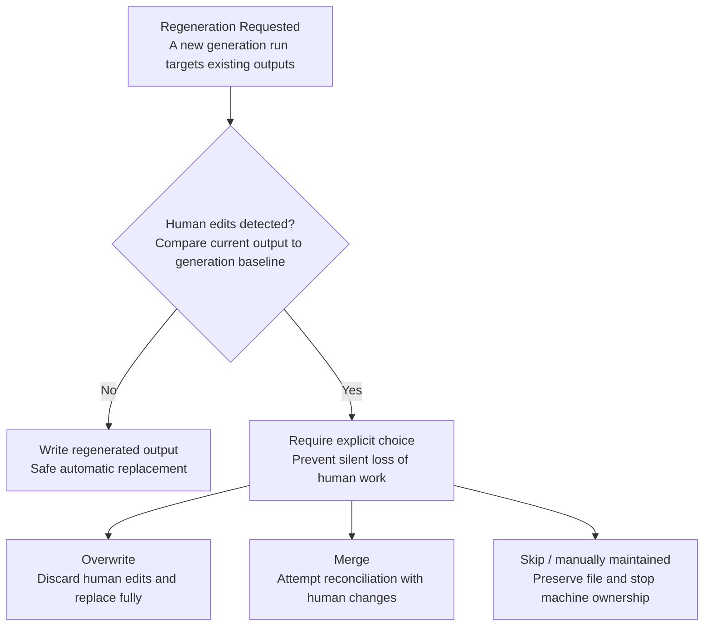
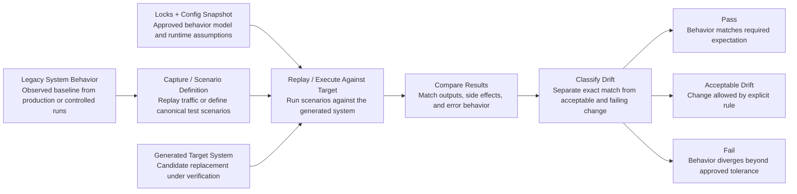
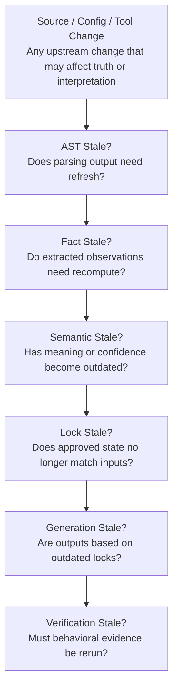

# Modernize — Canonical Technical Design

> This document supersedes `DESIGN.md`, `DESIGN-v2.md`, and `DESIGN-v3.md` as the primary technical design reference. Those documents remain historical context. This document is the builder-focused implementation baseline.

## 1. Overview

Modernize is a governed modernization platform for legacy applications. It transforms legacy systems into modern architectures using a deterministic artifact pipeline, human review gates, and tightly scoped AI assistance where reasoning is required.

The design goal is not autonomous migration. The design goal is controlled modernization with:

- persistent state
- resumable execution
- explicit review boundaries
- auditable AI usage
- safe regeneration
- risk-aware verification

The platform is intentionally designed so that understanding and generation are separated. Raw source is parsed once into structured artifacts. Downstream stages consume those artifacts instead of repeatedly reinterpreting source code.

Generation should be AI-driven only after understanding has been converted into typed, reviewed, and locked artifacts. The generation model should therefore consume the richest approved context available rather than relying on target architecture alone.

The platform is also intentionally AI-enhanced. AI is expected to improve comprehension, architecture proposal quality, code generation, review support, and verification support within controlled stage boundaries. The working modernization repository should therefore include the required agent guidance and configuration artifacts, such as repository-level `AGENTS.md` instructions and adapter-specific agent definitions used by the pipeline.

## 2. Goals and Non-Goals

### Goals

- Produce reviewable understanding of legacy behavior before generating code
- Keep deterministic mechanics separate from non-deterministic AI reasoning
- Support partial progress on imperfect legacy systems
- Make pipeline state resumable, inspectable, and invalidation-aware
- Enable safe regeneration when generated outputs have been edited by humans
- Provide a verification layer tied to locked semantics, not just generated code

### Non-goals

- Fully autonomous end-to-end migration with no human review
- Perfect semantic understanding of all dynamic legacy constructs
- Database schema migration, data backfill, and data cutover automation in the MVP
- Broad multi-language parity in the MVP
- Replacing architectural decision-making with advisory agents
- Fully automated legacy-side cutover changes across all deployment environments

## 3. Design Principles

- Local-first processing for source, state, and audit artifacts
- Facts are extracted before meaning is inferred
- AI is narrow, explicit, and schema-constrained
- Human review is required where wrong interpretation creates migration risk
- Every important stage boundary produces a typed, persisted artifact
- Incremental recomputation is required; full reruns are the fallback
- The system must degrade gracefully under partial understanding

## 4. System Guarantees

### Deterministic guarantees

These behaviors must produce the same result given the same inputs, versions, and configuration:

- source discovery
- parsing into canonical AST artifacts
- deterministic fact extraction rules
- artifact hashing and lock generation
- checkpoint and state transitions
- invalidation and staleness detection
- audit integrity checks
- regeneration policy enforcement

### Non-deterministic but controlled behaviors

These behaviors are structured, schema-validated, and reviewable, but are not deterministic:

- business-rule naming
- implicit semantic interpretation
- architecture synthesis from locked semantics and source-architecture lock
- target code generation from locked rich artifacts
- AI-assisted code review and verification support
- advisory-agent reports

### Core control boundary

Human-approved locks convert reviewed, non-deterministic upstream output into deterministic downstream input. The lock is the trust boundary of the system.

## 5. High-Level Architecture

### Main components

| Component | Responsibility | Deterministic |
|---|---|---|
| CLI / Orchestrator | Stage execution, checkpoints, retries, status | Yes |
| Source Adapter | Parse source, emit AST, expose language conventions | Mostly |
| Core Engine | Sanitization, chunking, schema validation, artifact persistence | Yes |
| Review Workflow | Human review, correction capture, conflict handling | Human-controlled |
| Lock Manager | Freeze approved artifacts with hashes and provenance | Yes |
| Generation Engine | Build rich generation context, invoke target AI generation, persist code and metadata | No |
| Verification Engine | Replay, compare, classify drift, report conformance | Mixed |
| Advisory Agents | Optional risk and review acceleration | No |

For the MVP, the CLI is the primary execution surface because it is the fastest way to validate the pipeline state machine, artifact model, adapter composition, and recovery behavior. It should be treated as an interface to the modernization engine rather than as the engine itself. Future deployments may add API and UI layers on top of the same core orchestration model.

## 6. Adapter Library Model

Modernize should maintain adapters as a reusable library rather than embedding source-target combinations directly into the core pipeline.

### Adapter categories

- source-side adapters
- target-side adapters

### Source-side adapters

Source-side adapters understand the legacy system. They are responsible for:

- file discovery rules for the source platform
- parsing source files into AST artifacts
- source-language semantic conventions
- deterministic fact extraction helpers
- source-specific agent definitions and prompts where needed

Examples:

- ColdFusion source adapter
- COBOL source adapter
- legacy Java source adapter

### Target-side adapters

Target-side adapters understand the destination stack. They are responsible for:

- framework and language conventions
- generation templates, prompt scaffolding, and output validation rules
- target-specific schemas, code structure rules, and generation constraints
- stack constraints that shape target architecture and generation
- target-specific agent definitions where needed

Examples:

- Go backend target adapter
- React frontend target adapter
- Spring Boot target adapter
- Node/Nest target adapter

### Adapter library expectation

The platform should treat both adapter categories as a maintained, versioned library that can be plugged into the pipeline per engagement.

This enables:

- reuse of one source adapter across many target stacks
- reuse of one target adapter across many source systems
- stable orchestration logic in the core platform
- independent versioning and improvement of adapter behavior

### Adapter packaging expectation

Each adapter should carry the artifacts required for its role, such as:

- parser or mapping logic
- conventions
- schemas
- prompts or agent definitions
- version and compatibility metadata

## 7. End-to-End Pipeline

The pipeline is stateful and resumable. Every stage consumes persisted upstream artifacts and writes versioned downstream artifacts.

```mermaid
flowchart LR
    S1["1. Discover Source + Config<br/>Inventory files, config, and environment inputs"] --> S2["2. Parse to AST<br/>Create canonical source structure artifacts"]
    S2 --> S3["3. Extract Facts<br/>Derive deterministic behavioral facts from AST"]
    S3 --> S4["4. Derive Semantics<br/>Infer higher-level meaning with targeted AI"]
    S4 --> S5["5. Generate Review Artifacts<br/>Present findings in human-reviewable form"]
    S5 --> S6["6. Human Review + Corrections<br/>Resolve ambiguity and apply structured fixes"]
    S6 --> S7["7. Semantic Lock<br/>Freeze approved understanding for downstream use"]
    S7 --> S8["8. Derive Source Architecture<br/>Model current boundaries, coupling, and flows"]
    S8 --> S9["9. Review Source Architecture<br/>Validate the as-is system model with stakeholders"]
    S9 --> S10["10. Source Architecture Lock<br/>Freeze approved current-state architecture"]
    S10 --> S11["11. Choose Target Stack + Constraints<br/>Human selects target technology direction"]
    S11 --> S12["12. Generate Target Architecture Proposal<br/>System proposes services, APIs, and boundaries"]
    S12 --> S13["13. Architecture Review + Lock<br/>Team reviews, adjusts, and freezes target design"]
    S13 --> S14["14. Generate Code<br/>Assemble rich locked context and generate target code with AI"]
    S14 --> S15["15. Verify<br/>Compare behavior and classify drift"]
    S15 --> S16["16. Controlled Cutover<br/>Release incrementally with rollback options"]
```

### Stage summary

| Stage | Primary input | Primary output | AI usage |
|---|---|---|---|
| Discover | Source tree, config files, environment snapshots | Inventory | None |
| Parse | Source files | AST artifacts | None |
| Extract Facts | AST artifacts | Fact artifacts | None |
| Derive Semantics | Facts, AST evidence | Semantic artifacts | Targeted |
| Review | Semantic artifacts + rendered review docs | Corrections | None |
| Semantic Lock | Reviewed semantics | Semantic lock | None |
| Source Architecture | Semantic lock | Source architecture doc + artifact | Targeted |
| Source Architecture Lock | Reviewed source architecture | Source architecture lock | None |
| Target Architecture | Semantic lock, source architecture lock | Target architecture draft | Targeted |
| Architecture Lock | Reviewed architecture | Architecture lock | None |
| Generate | Semantic lock, source architecture lock, architecture lock, AST/fact/semantic artifacts, target conventions | Generated code + metadata | Heavy |
| Verify | Locks, scenarios, replay data | Verification report | Light to moderate |

The pipeline composes source-side and target-side adapters rather than hardcoding end-to-end migrations. Source-side adapters shape parsing and understanding. Target-side adapters shape architecture constraints, generation conventions, prompt scaffolding, and output validation for AI code generation.

## 8. Artifact Model

The artifact chain is the backbone of the design. Each artifact must be typed, versioned, and traceable to its immediate inputs.

For architecture stages, the structured artifact is the source of truth. Human-readable Markdown is generated deterministically from that artifact and exists as the review surface, not as an independent canonical document.

### Artifact requirements

#### AST artifact

One artifact per source unit.

Required fields:

- `sourcePath`
- `sourceHash`
- `adapterName`
- `adapterVersion`
- `schemaVersion`
- `parseStatus`
- `nodes`
- `parseDiagnostics`

`parseStatus` must be one of:

- `complete`
- `partial`
- `failed`

#### Fact artifact

Deterministic facts extracted from AST.

Required fields:

- `sourcePath`
- `sourceHash`
- `astArtifactRef`
- `extractionVersion`
- `facts`
- `coverageSummary`

Facts include:

- function signatures
- call graph edges
- table/query access
- state reads and writes
- endpoint and routing facts
- config references
- external dependency references

#### Semantic artifact

Higher-level meaning built from facts and evidence.

The canonical persisted files should be per-module semantic JSON artifacts. Human review should happen through deterministic rendered review documents generated from those artifacts, not by manually inspecting raw JSON at scale. For large estates, the review surface should be partitioned into one document per module or slice plus a lightweight index document rather than a single monolithic Markdown file.

Required fields:

- `sourcePath`
- `factArtifactRef`
- `semanticVersion`
- `fields`
- `sourceTags`
- `confidence`
- `corrections`
- `openQuestions`

Every non-deterministic field must record:

- `source`: `rule`, `ai`, or `human`
- confidence
- evidence reference

Recommended review surfaces:

- `semantic-review/index.md`
- `semantic-review/modules/<module>.md`

#### Source architecture artifact

System-level model of the current application derived from locked semantics.

The source architecture artifact is graph-shaped even when persisted as JSON. It should model nodes, edges, clusters, and hotspots explicitly rather than embedding relationships in deeply nested document structures.

The canonical persisted file should be `source-architecture.json`. A deterministic `source-architecture.md` review document must be generated from that JSON using templates and fixed rendering rules. The Markdown file is not hand-authored and must not be treated as a second source of truth.

Architecture diagrams are necessary but not sufficient. For large estates, no single diagram remains readable enough to serve as the primary review surface. The system should therefore generate multiple architecture views from the same artifact, such as:

- high-level subsystem diagrams
- focused dependency views for hotspots
- sequence or workflow views for critical paths
- integration and shared-state views

Those views exist to orient reviewers and expose structure. They are not the main business-validation artifact.

Required fields:

- `semanticLockRef`
- `architectureVersion`
- `nodes`
- `edges`
- `subsystems`
- `dependencyGraph`
- `sharedState`
- `dataOwnership`
- `externalIntegrations`
- `migrationHotspots`
- `reviewNotes`
- `derivedRequirementRefs`

#### Business requirements artifact

Business-readable requirements derived from reviewed semantics and the source architecture artifact.

This artifact is the primary stakeholder review surface for behavior validation. It should express what the system does today in clear business language, with links back to supporting semantics and architecture evidence. The architecture views explain how the system is organized; the business requirements explain what must be preserved or intentionally changed.

The canonical persisted files should be partitioned requirement artifacts plus a deterministic review pack, for example:

- `business-requirements/index.json`
- `business-requirements/modules/<module>.json`
- `business-requirements/index.md`
- `business-requirements/modules/<module>.md`

Required fields:

- `requirementId`
- `title`
- `moduleRef`
- `requirementType`
- `statement`
- `preconditions`
- `triggers`
- `expectedOutcome`
- `exceptions`
- `evidenceRefs`
- `sourceSemanticRefs`
- `sourceArchitectureRefs`
- `confidence`
- `reviewStatus`
- `corrections`
- `openQuestions`

#### Target architecture artifact

Approved model of the future system derived from locked source understanding and target stack choices.

The canonical persisted file should be `target-architecture.json`. A deterministic `target-architecture.md` review document must be generated from that JSON artifact using templates and fixed rendering rules. The Markdown review file is not a separate source of truth.

Required fields:

- `semanticLockRef`
- `sourceArchitectureLockRef`
- `targetStackRef`
- `architectureVersion`
- `services`
- `interfaces`
- `dataOwnership`
- `integrationBoundaries`
- `deploymentConstraints`
- `migrationMappings`
- `reviewNotes`

#### Lock artifacts

Three lock types are mandatory:

- semantic lock
- source architecture lock
- architecture lock

Each lock records:

- included artifact hashes
- schema version
- tool and adapter versions
- reviewer attribution
- approval timestamp
- lock scope

#### Generation metadata

Generated outputs must persist:

- input lock references
- generator version
- target adapter version
- baseline output hash
- human-edit detection status

#### Verification artifact

Verification outputs must persist:

- scenario or replay identifier
- expected behavior source
- observed new behavior
- drift classification
- verdict
- linked config snapshot

## 9. Semantic Extraction Architecture

Semantic extraction is the hardest technical problem in the system. Code generation quality is downstream of semantic quality. This design therefore treats extraction as the central engineering concern.

### Layered extraction model

The extraction model is intentionally strict:

`Source -> AST -> Facts -> Semantics -> Review -> Lock`

This separation is mandatory. The system must not collapse parsing, fact extraction, and business interpretation into one opaque stage.

### Layer responsibilities

| Layer | Responsibility | Output quality expectation |
|---|---|---|
| AST | Capture parseable source structure | Must be deterministic, may be partial |
| Facts | Extract observable behavior without interpretation | Must be deterministic |
| Semantics | Infer meaning from facts and evidence | May be heuristic or AI-assisted |
| Review | Resolve ambiguity and correct interpretation | Human-controlled |
| Lock | Freeze approved understanding | Deterministic |

### Allowed AI usage

AI is required in the semantic layer for the following tasks:

- business-rule naming
- implicit-rule explanation
- summarizing complex validation chains
- architecture synthesis from locked semantics
- target code generation from locked AST, facts, reviewed semantics, source architecture, target architecture, and target adapter conventions

Outside the semantic layer, AI may optionally enhance later pipeline stages through bounded, review-oriented tasks such as code review assistance, test suggestion, verification support, and risk surfacing, provided those outputs do not bypass human approval or locked artifacts.

AI does not parse raw source directly in the canonical design. AI generation should consume structured artifacts and adapter conventions, not raw source alone.

### Confidence model

Confidence is required for all heuristic or AI-derived semantic fields.

Suggested confidence bands:

| Band | Meaning | Review behavior |
|---|---|---|
| `high` | Strong evidence, low ambiguity | Streamlined review |
| `medium` | Plausible but still interpretive | Normal review |
| `low` | Weak evidence or conflicting signals | Must be highlighted |

Confidence is advisory. It never replaces review for locked artifacts.

### Failure modes and mitigations

| Failure mode | Detection signal | Mitigation |
|---|---|---|
| Parser coverage gap | `parseStatus=partial` or diagnostics | Persist partial AST, continue where possible |
| Dynamic construct blocks meaning | Missing evidence or unresolved references | Record open question instead of inventing semantics |
| Cross-module inconsistency | Aggregation mismatch across artifacts | Run consistency checks before review and lock |
| Over-interpretation | Semantic field lacks evidence reference | Reject or downgrade confidence |

## 10. Review and Lock Workflow

The review system exists because semantic correctness is the highest-value human input in the pipeline.

### Review objectives

- let reviewers validate meaning, not decode generated prose
- focus attention on uncertainty, conflicts, and risk
- preserve reviewer attribution and correction history
- make partial progress possible across a large estate

### Review and lock state machine

### Review rules

- reviewers approve semantics, not AI prose walls
- low-confidence fields appear first
- conflicting corrections must be explicit
- corrections are stored as structured records, not comments only

### Lock rules

- only reviewed artifacts may be locked
- locks are immutable once created
- upstream invalidation marks locks stale rather than rewriting them
- downstream generation must fail fast when required locks are stale

### Reviewer conflict handling

If reviewers disagree on a field:

- preserve both attributions
- require explicit resolution before lock
- store the winning resolution and the rejected alternative in correction history

### Review throughput controls

To prevent review from becoming the bottleneck:

- batch by risk and coupling, not just file count
- prioritize low-confidence and high-dependency modules
- allow unaffected modules to continue while others wait on review

## 11. Architecture and Generation Workflow

Target architecture is produced from locked semantics and an approved source architecture model, not by re-reading source.

### Source architecture phase

The source architecture phase converts reviewed module semantics into a system-level description of the current application.

This stage exists for two reasons:

- humans need an understandable as-is architecture before approving a to-be design
- downstream target-architecture design needs a machine-consumable model of the current system

For complex systems, "understandable" cannot mean one dense diagram. The review output from this phase should be a package:

- architecture views for structure and dependency orientation
- sequence and workflow views for critical end-to-end behavior
- a business requirements pack that states the legacy system's obligations in reviewer-friendly language

The business requirements pack is the primary validation surface. Reviewers should spend most of their time confirming, correcting, and prioritizing those requirements. Diagrams support that review by showing where each requirement lives and what it touches.

Inputs:

- semantic lock
- cross-module dependency facts
- config and environment snapshots
- infrastructure and integration references

Outputs:

- source architecture review pack for stakeholder orientation
- business requirements review pack for stakeholder validation
- source architecture artifact for downstream pipeline consumption
- source architecture lock after approval

The source architecture artifact should capture:

- module and subsystem graph
- dependency clusters
- shared state and session coupling
- data ownership and shared table access
- external integrations
- migration hotspots and coupling risks

The source architecture document should be generated from the same underlying artifact and optimized for stakeholder review. It should explain:

- what the system is today
- where the major dependency boundaries are
- which modules are tightly coupled
- which areas are highest risk for extraction, migration, or cutover
- which architecture views correspond to which requirement groups

The business requirements pack should be generated from locked semantics plus the source architecture artifact. It should explain:

- what the business expects the system to do
- which workflows, validations, and exception paths are in scope
- which requirements are high-confidence versus open-question items
- which requirements map to which modules, interfaces, data stores, and hotspots

The target architecture and later verification stages should consume these reviewed business requirements as first-class downstream inputs, not just the architecture graph alone.

### Source architecture storage strategy

The default storage strategy is:

- partitioned JSON artifacts as the persisted source of truth
- graph-shaped schemas for architecture artifacts
- in-memory graph construction for analysis, clustering, and invalidation

The MVP does not require an external graph database.

This is intentional:

- JSON artifacts are easy to version, diff, hash, audit, and lock
- partitioned storage avoids giant document rewrites
- graph-shaped schemas preserve relationship semantics
- in-memory graph analysis is sufficient for most medium-size estates

For review and approval:

- `source-architecture.json` is canonical
- `source-architecture.md` is a deterministic rendered view
- business requirements JSON artifacts are canonical for reviewer-approved behavioral obligations
- business requirements Markdown documents are deterministic rendered views
- the Markdown must always be regenerable from the JSON artifact
- no separate freeform AI-written summary document is required

### Automated storage escalation policy

The system should measure architecture complexity and recommend storage escalation when JSON-backed analysis stops being operationally efficient.

This decision process can be automated as measurement and recommendation, but the storage-mode switch should remain explicit and human-approved.

The platform should track metrics such as:

- total node count
- total edge count
- average and peak dependency fan-out
- graph build time
- query latency for common architecture operations
- invalidation propagation time
- memory usage during graph construction and traversal
- size of global architecture summary artifacts

From these metrics, the system should derive:

- `storageMode`: `json` or `graph-db`
- `storageHealth`: `healthy`, `warning`, or `critical`
- `graphDbRecommendation`: boolean
- `complexityScore`: normalized architecture complexity score

Escalation should be recommended only when thresholds are exceeded consistently, for example across multiple runs or refresh cycles, rather than from a single transient spike.

Recommended policy:

- default to `json`
- continue using JSON while `storageHealth=healthy`
- emit warnings and recommendation artifacts when thresholds are exceeded repeatedly
- require an explicit operator decision to migrate to `graph-db`

The system must not silently switch storage mode.

### Target architecture phase

Inputs:

- semantic lock
- source architecture lock
- config and environment snapshots
- target stack selection

Outputs:

- target architecture draft
- service boundaries
- API contracts
- component/service mapping
- architecture lock

### Target stack and constraints input

The human target-selection step should be captured as a small structured artifact, for example `target-stack.yaml`.

This input should define only the high-value decisions needed to shape architecture generation, such as:

- target backend stack
- target frontend stack
- architectural style
  for example: modular monolith, service-oriented, or microservice
- deployment style
  for example: single deployable, multi-service deployment, or gateway + services
- deployment/runtime constraints
- integration constraints
- data or persistence constraints
- migration constraints that affect service boundaries or rollout

It is a decision input, not a hand-written architecture document.

### Generation phase

Generation reads only:

- semantic lock
- source architecture lock
- architecture lock
- target stack and constraints artifact
- target adapter conventions
- approved generation configuration

Generated outputs must remain traceable to the locks used to produce them.

### Human edits to generated code

Generated code is not assumed to remain machine-owned forever.

When regeneration detects human edits, the system must require an explicit choice:

- overwrite
- merge
- skip and mark manually maintained

Silent overwrite is prohibited.

## 12. Verification Strategy

Verification is a first-class stage, not a cleanup step after generation.

### Verification goals

Verification should establish:

- conformance to locked semantics and architecture
- behavioral equivalence for defined scenarios
- acceptable drift classification where exact equivalence is unrealistic

### Verification inputs

- locked artifacts
- recorded legacy requests or scenario definitions
- config snapshots
- target service outputs

### Verification limits

Verification does not prove:

- correctness for unobserved scenarios
- correctness beyond reviewed semantics
- safe data migration by itself

### High-risk behaviors that require explicit coverage

- database writes and transaction boundaries
- authorization and authentication logic
- feature-flag and config-driven branches
- locale and timezone behavior
- scheduled and background tasks
- external API integrations

## 12.5 Cutover Responsibility Boundary

The framework supports cutover planning, but it does not assume that all legacy-side cutover changes can or should be automated.

The framework may provide:

- suggested cutover points
- routing or proxy configuration templates
- rollout and rollback checklists
- compatibility guidance for phased migration
- verification support during gradual traffic movement

However, changes inside the original source system or production environment are engagement-specific. These may include:

- legacy routing changes
- delegation hooks from the old system to the new system
- feature flag wiring
- environment-specific proxy or gateway integration
- session or auth compatibility plumbing

Those changes should be treated as migration integration work, not as universally automated framework behavior.

## 13. Incremental Execution and Invalidation

Incremental operation is required for scale, cost control, and team usability.

### Invalidation sources

These changes must invalidate downstream artifacts:

- source hash change
- adapter version change affecting relevant constructs
- artifact schema version change
- config snapshot change
- human correction change
- target architecture change

### Invalidation behavior

Invalid artifacts become `stale`. They are never silently replaced.

The system must support:

- selective reparse
- selective fact re-extraction
- selective semantic regeneration
- selective review refresh
- selective verification reruns

### Dependency-aware propagation

Cross-module dependencies must be explicit so invalidation can propagate when:

- shared contracts change
- shared tables or endpoints change
- service-group boundaries change

## 14. Operational Controls

### Cost controls

The system should estimate before execution:

- expected AI calls
- expected token usage
- stage-level cost
- projected runtime

### Concurrency controls

Module-level work should run concurrently within provider and machine limits, while artifact writes and pipeline lock handling remain deterministic.

### Recovery controls

The system must survive:

- process interruption
- provider timeout
- partial module failure
- stale lock detection

Recovery resumes from persisted state rather than restarting the project.

### Audit controls

Every AI interaction must record:

- sanitized input summary
- output summary
- provider and model
- timestamp
- related artifact references

Audit integrity should be verifiable using hash chaining or equivalent tamper detection.

## 15. Advisory Agents

Advisory agents are optional, non-blocking analysis helpers.

The repository used to run the modernization workflow is expected to carry the agent guidance and configuration needed for these AI-assisted stages. In practice, this means repository-level agent instructions and adapter-level agent definitions should exist alongside the pipeline configuration so the AI layer is explicit, reviewable, and versioned with the engagement.

They may:

- prioritize review work
- surface architecture contradictions
- highlight migration risk
- propose tests
- flag security concerns

They may not:

- modify locks
- modify semantic artifacts directly
- modify generated code
- block the core pipeline by themselves

If all advisory agents are disabled, the extraction-review-lock-generate-verify core still functions.

## 16. MVP Scope

The MVP should prove one end-to-end modernization path on a difficult but bounded source domain.

### In scope

- one source adapter
- one target stack combination
- AST parsing with partial-parse support
- deterministic fact extraction
- targeted AI semantics
- structured review and semantic lock
- source architecture derivation, review, and lock
- architecture lock
- code generation
- regeneration safety for human-edited outputs
- scenario-based verification
- resumable state and invalidation

### Out of scope

- broad multi-language parity
- autonomous migration without review
- database schema migration
- data migration and backfill
- production data cutover orchestration
- multi-node distributed execution
- buyer-facing dashboard as a required MVP capability

## 17. Risk-Driven Constraints

| Risk | Constraint |
|---|---|
| Parser and AST complexity | Partial parsing must be a supported steady state |
| Semantic bottleneck | Facts and semantics must stay separate |
| Review bottleneck | Review artifacts must be prioritized and resumable |
| Verification gap | Scenarios must tie back to locked semantics |
| Config/environment drift | Config snapshots are first-class inputs |
| Regeneration safety | Human edits must always be detected before regeneration |

## 18. Implementation Baseline

The recommended implementation order is:

1. artifact model and state directory
2. parser and AST persistence
3. deterministic fact extraction
4. semantic extraction and review artifacts
5. semantic lock
6. architecture workflow and architecture lock
7. code generation with regeneration metadata
8. verification harness
9. optional advisory agents

This ordering is intentional. Advisory features come after the extraction-lock-generate-verify chain is reliable.
